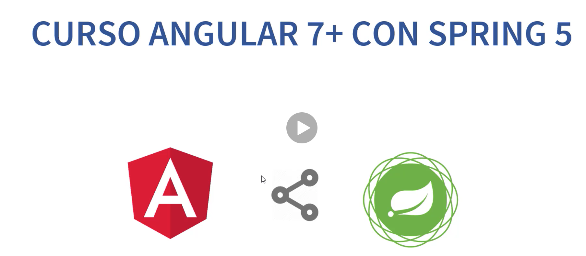
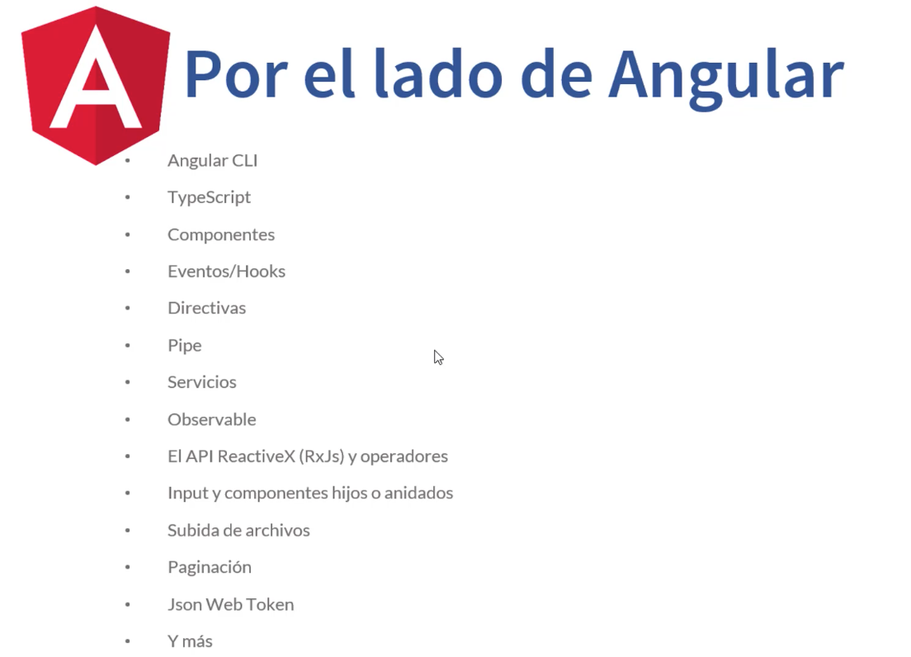
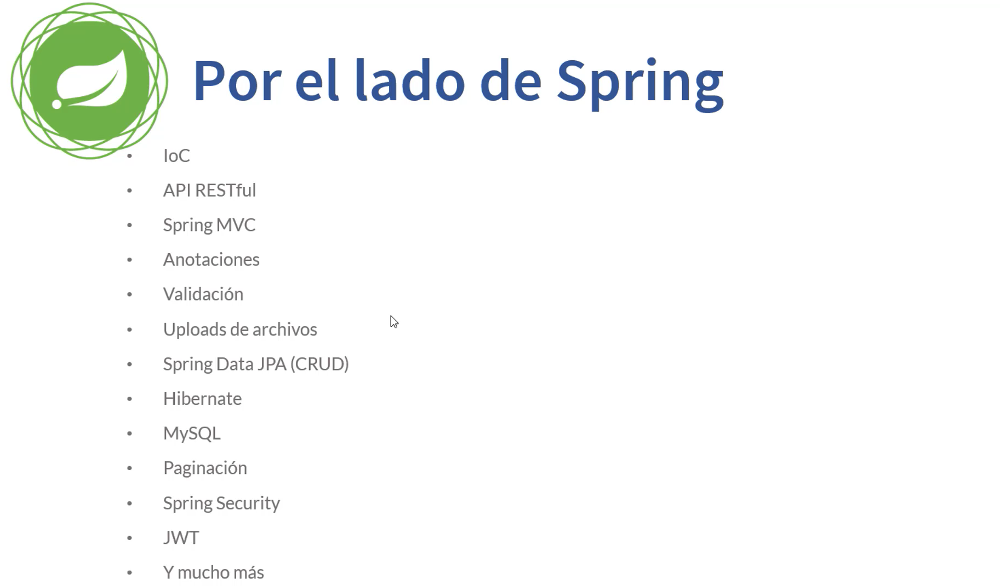

# 01. Introducción - 2 Clases - 9 min

* Introducción 05:24
* Antes de comenzar 03:19

## Introducción 05:24

Bienvenidos a este curso de angular 7 con 5.

Partiendo de introducción quería explicar el tema de las versiones. Acá aparece la última versión de angular 7 pero en realidad cuando hablamos de Angular comienza desde la versión 2, la versión 4 después salió la 5 la 6 y ahora la 7 pero sigue siendo Angular. Muy distinto era la versión 1 de Angular, prácticamente Frameworks completamente diferentes reescrito desde cero.

Pero ya hablando desde Angular 2 en adelante, cada cambio, cada actualización, que básicamente se repite cada 5 meses, cada 6 meses es bastante seguido pero son optimizaciones, son actualizaciones que mejoran el performans, la programación propia del Frameworks y no afecta nada a nuestras aplicaciones, al desarrollo, por lo tanto una aplicación en Angular 2 va a funcionar perfectamente bien en Angular 5, en Angular 7, no hay ningún problema con eso.

Este curso está completamente actualizado y todos los ejemplos están corriendo hasta la última versión 7 y en caso de que hubiera algún detallito, alguna mínima línea de código, se va a comentar en su oportunidad, prácticamente eso es nulo.

Bien comencemos entonces el Curso comprende dos grandes partes.

Nuestra aplicación por el lado de Angular y nuestra aplicación por el lado de Spring, cuando trabajamos con FrontEnd compactan una de las reglas más importante que se basa esta tecnología es tener dos proyectos completamente separados, uno que se encarga de todo el proceso de toda la lógica de negocio de todas las tareas que se llevan en el servidor en el BackEnd y el otro es toda la interfaz de usuario y todo lo relacionado con el cliente el navegador.

Dos mundos completamente separados pero que se integran, conversan a través del API Rest están conectados. Y otra característica, regla que tienen que tener nuestra aplicación, nuestro API REST, por el lado del BackEnd es **Stateless** *son aplicaciones sin Estado*, por lo tanto el estado de la sesión tiene que estar almacenado en el cliente por el lado de Angular, no se tienen que almacenar en el servidor, entre peticiones.

Por el lado de Angular vamos a ver muchas cosas, a trvés del curso, lo más importante vamos a partir con la instalación, vamos a ver **Angular CLI** que nos permite generar, crear proyectos de manera muy simple, prácticamente automatizado con un comando, también podemos crear componentes, nos permite crear directivas, servicios, pipes. 

El lenguaje que utilizamos para desarrollar es **TypeScript** pero eso se compila y se lleva a JavaScript puro, simplemente cuando construimos nuestra aplicación con Angular, todo este TypeScript se va a llevar al típico, al estándar JavaScript que es soportado por todos los navegadores.

Después vamos a entrar en detalle con cada uno de estos puntos, pero vamos a ver en el curso los **Componentes**, como se crean los componentes, cómo se integran los componentes unos con otros, cómo se anidan.

Vamos a ver también los **Eventos/Hooks** que es parte del ciclo de vida de cada componente en Angular.

**Directivas** en las vistas, **Routh o las Rutas**, los **Pipe** básicamente para formatear datos por ejemplo fechas.

Vamos a crear, implementar y ver en detalle las clases de **Servicios** que son muy importantes, porque nos proveen toda la lógica de negocio por el lado de Angular, por lo tanto a través de un *Servicio* nos vamos a conectar al BackEnd y vamos a obtener los datos en un tipo **Observable** utilizando el **API ReactiveX(RxJs)** de JavaScript, utilizando operadores para manipular este flujo, este stream reactivo y asíncrono.

Vamos a implementar **subida de archivos**, **paginación de resultados** para no tener una gran lista de registros en nuestra página.

Todo lo que es seguridad lo vamos a manejar con **Json Web Token JWT** y en fin vamos a ver muchas cosas más.

Ahora por el lado de Spring, es otro mundo por el lado del servidor.

Vamos a utilizar **Inversión de Control**, todo lo relacionado al contenedor y la **Inyección de Dependencia**, cómo implementar **API REST**, trabajar con **Spring MVC**.

Con las **Anotaciones** para poder mapear nuestros métodos del **Controlador de Acciones** que se le conoce como **Handler** a una ruta URL, básicamente es nuestro **EndPoint** con el cual se va a comunicar Angular con Spring a través de los verbos. Vamos a tener diferentes métodos para consultar usamos `GET`, para insertar o crear nuevo registro usamos `POST` para actualizar usamos `PUT` para eliminar usamos `DELETE`.

**Validación** de los datos que nos llegan desde Angular.

Cómo manejamos toda la subida archivo **Uploads** en el BackEnd.

Todo lo que es **Persistencia** utilizando **Spring Data JPA**, implementando CRUD, relaciones de tablas.

Como implementación como proveedor **Hibernate**

Utilizando la base de datos **MySQL**.

Vamos a páginar en el BackEnd y por supuesto esos datos que ya están páginados en rangos, esa lista la vamos a enviar de regreso al FrontEnd Angular en un formato **JSON** para que Angular se encargue de la paginación en la vsita, de crear los links.

Vamos a ver por supuesto todo lo que es **Spring Security** utilizando **JWT** y mucho más.

Pero después vamos a ir agregando nuevo contenido, más ejemplos, **un Sistema de Facturación** completo que vamos a desarrollar, **un Sistema de Chat**, utilizando **Sockets**.

Este curso promete mucho.

## Antes de comenzar 03:19

:+1: Explicaciones de la Plataforma de Enseñanza.

