# 02. Primeros Pasos en Angular - 13 Clases - 1 h 49 min

* Introducción a Angular 13:44
* Instalaciones y herramientas necesarias 11:37
* Una mirada al editor Atom e instalando algunos plugins 06:25
* Creando nuestra aplicación Angular 13:00
* Introducción a los Componentes 04:12
* Estructura de directorio del proyecto Angular 10:57
* Estructura de directorio del proyecto angular: Parte 2 el directorio src 06:47
* Integrar Bootstrap con Angular 06:54
* Creando nuevo componente HeaderComponent 10:37
* Separando el template del componente con TemplateUrl 02:31
* Creando nuevo componente FooterComponent 10:07
* Directiva estructural `*ngFor` 07:07
* Directiva estructural `*ngIf` 04:48

## Introducción a Angular 13:44

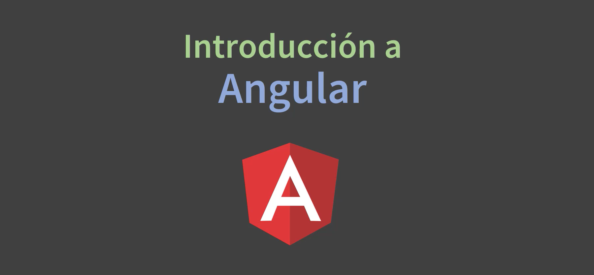

Antes comenzar con Angular y a ver las herramientas necesarias a comenzar la instalación, crear el proyecto, quería ver una introducción a Angular. ¿De qué se trata Angular? 

Bueno, la idea de esta parte del curso es aprender paso a paso cómo crear una aplicación web. Justamente Angular es un Framework de JavaScript por el lado del cliente en el FrontEnd, para crear aplicaciones web interactivas y sobretodo amistosas al usuario es decir, con interfaz gráfica bonita, reactivas, instantáneas, dinámicas, en fin, enriquece nuestra aplicación por el cliente, nuestra aplicación web, pero Angular mucho más que eso, aparte de ser un Framework para JavaScript, también es uno de los más utilizados, más populares en el mercado y es el que más piden en la industria, en las empresas para desarrollar este tipo aplicación. Cada vez está más posicionado como el Framework estándar de JavaScript o de Typescript, porque en realidad se programa en tal Typescript, pero finalmente se traspilas se convierte a JavaScript. Bueno, es el más estándar para desarrollar este tipo aplicaciones del lado cliente, del lado del FrontEnd y además desarrollado por un gigante, por Google.

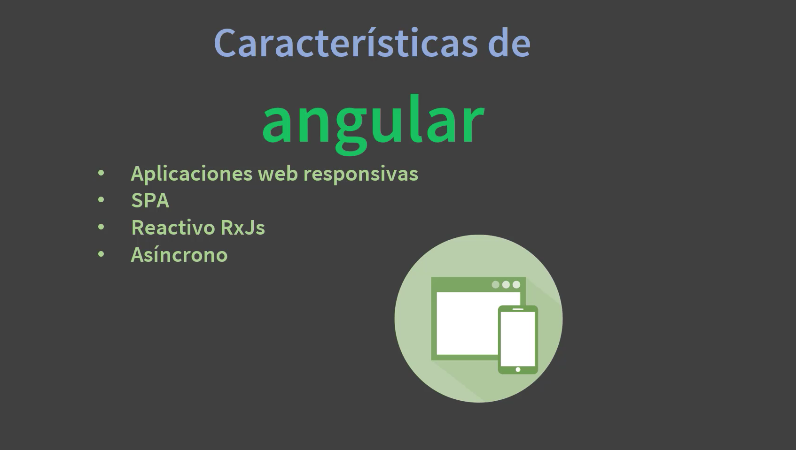

Características de Angular

Crea aplicaciones web responsivas, que se adaptan a diferentes dispositivos, equipos, tanto a equipos móviles de celular o navegador de un PC o notebook, tablets, en fin, y están preparada para que se adapten según la resolución y según nuestro equipo, ya sea utilizando **Bootstrap** o **Angular Material** que es propio de Angular, hay diferentes herramientas.

Otra característica muy importante que es la esencia de Angular es **SPA Single Page Application**, es decir, aplicación de una sola página, al final construimos una gran aplicación con Angular, varios componentes que forman esta aplicación, pero siempre el usuario va a estar interactuando dentro de la misma página del navegador, esta nunca se va a actualizar, nunca va a realizar un refresh donde el contenido va cambiando de forma dinámica pero sin recargar la página, es instantáneo de forma asíncrona y reactiva y justamente esa es una de las grandes diferencias con un monolito. Por ejemplo, si desarrollamos una aplicación con Spring Web MVC con vistas **JSP** o **Thymeleaf** todo dentro del servidor, en el BackEnd, todo se ejecuta en el BackEnd, al final se genera el HTML, todo ocurre en el servidor. 

Entonces el problema es que por cada *request* que estamos realizando a nuestro BackEnd, lo que hace el cliente es enviar todo el contenido HTML completo desde las primeras etiquetas del HTML, las hojas de estilos, los JavaScript, el contenido principal, el menú, los banner, menú lateral, las imágenes, todo se está enviando en cada request al BackEnd y finalmente retorna lo mismo. Devuelve exactamente lo mismo con el contenido dinámico que cambia según el controlador, según la ruta que estemos enviando o llamando, se fijan envía todo y devuelve todo, es una carga bastante pesada al servidor y eso multiplicado por la cantidad de usuarios concurrentes que usan la aplicación, el rendimiento podría ser menor, hay que tener en cuenta, mientras que en Angular todo ocurre en una sola página en el cliente, las hojas estilo todo permanece intacto en su mismo lugar. Por ejemplo, el componente del menú, el menú de navegación, menú lateral, los banner, imágenes, todo se queda en el cliente, solamente enviamos un JSON al BackEnd, los datos importantes nada más, enviamos los datos y nos regresan datos ya sea modificados o queremos hacer una consulta, nos retorna una lista de algo o el detalle de algo, pero solamente un JSON, no todo el HTML, no todo el CSS, JavaScript, entonces claro es mucho más rápido, se mantiene forma de una sola página estática en el cliente, lo que cambia bueno es la parte dinámica, el contenido principal que va variando según las rutas que invoquemos en nuestro API Rest en el BackEnd, por eso es SPA, simplemente cambia nuestro contenido principal, que son otros componentes que están enrutados a URLs de Angular y está mediante una clase Service de Angular, de forma reactiva, utilizando el API RxJs se comunica con el BackEnd, realiza esta comunicación con nuestro micro servicios mediante EndPoins y manejamos la respuesta de forma reactiva utilizando el **API Observable** ahí tenemos que suscribirnos y ahí implementa nuestro código, ahí se emite la respuesta que obtenemos del BackEnd y podemos mostrar está, en la vista de alguna forma ya sea con un `ngFor` iterando con un loop, por ejemplo, o mostrar los objetos de este JSON mediante extrapolación de `string`, pero bueno, son puras cosas que vamos a ver en el curso, así que no se preocupen, esto es solamente una introducción.

Entonces estas serían las cuatro características principales, por supuesto, hay muchas más.

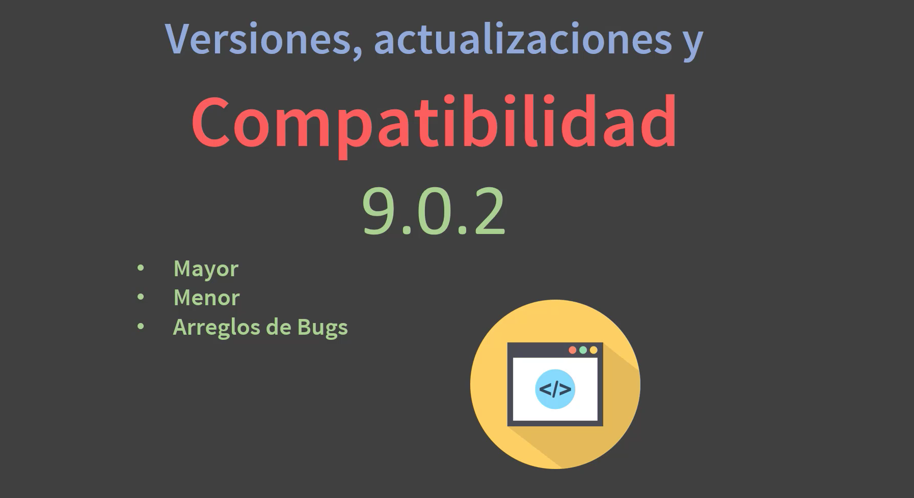

Otro tema importante son las versiones, cuando se actualiza o cambio una versión a otra, acá tenemos la versión 9.0.2 hasta el momento la última última versión, pero esto va cambiando día a día, semana a semana, incluso la versión mayor que la vamos a ver, cambia cada seis meses, esto es muy constante, pero no se preocupen, porque generalmente la mayoría de las veces no afecta nada a nuestro código.

***La versión consta de tres números***, de derecha a izquierda tenemos el **2**, esta versión es para ***arreglos de bugs***, mejoras, para solución el problema de versiones anteriores, pero solamente arregla algo y eso no afecta nada en nuestro código, nuestro código siempre va a seguir funcionando.

La segunda versión que tenemos acá, en este caso la **0**, es la ***versión menor*** que corresponde a nuevas características pero menores, nuevas funcionalidades, pero también nuestro código va a seguir funcionando sin ningún problema, solamente agrega nuevas características, nuevas función al framework, todo nuestro código que ya teníamos implementado, obviamente sigue funcionando tal cual, no afecta en nada.

Y por último, la versión **9** corresponde a la ***versión mayor***, esto más o menos ocurre cada seis meses a un año, pero lo típico 6 meses, 8 meses va cambiando la versión mayor que sí podrían afectar en nuestro código, pero las estadísticas, todos los cambio versiones que han ocurrido la verdad es que no ha afectado prácticamente en nada en las aplicaciones, pero también podría ocurrir cambios mayores, por ejemplo alguna librería que en alguna versión anterior estaba deprecated es decir obsoleta y está marcada como deprecated, puede que en una versión mayor posterior, esa clase o característica se elimine y ahí podríamos tener un problema, pero de momento no ha ocurrió de esa forma. Entonces, cualquier cambio de versión, incluso mayor, con cambio estructural o con cambio más robustos, por lo general no afecta al funcionamiento de nuestra aplicación que teníamos desarrollada con otra versió, la podemos emigrar sin ningún problema.

Si durante el curso llegan a tener algún problema con versiones posteriores, claro, porque ahora están en la 9, pero muy probable en el momento de que vean esta clase, quizá en qué versión esté Angular, quizá en la 10, 11, en fin, lo más probable que todo funcione tal cual, pero en caso de que cambie algo, algún import, alguna clase, bueno, simplemente me avisan y la actualiza, pero de todas formas, creo que es poco probable dado el historial de cambio de versiones. Por ejemplo, desde las 7 a la 8 y de la otra 9 no hubo ningún cambio en el código, ha funcionado de forma transparente.

Entonces, recuerden, de izquierda a derecha, la primera corresponde a la *versión mayor*, ambios estructurales podrían cambiar algunas clases, eliminar alguna clases deprecated, cambiar algún import, en fin, la *versión menor* nuevas característica y la última *arreglos de bugs*, de errores, optimizaciones del código, pero todo a nivel de Core del Framework.

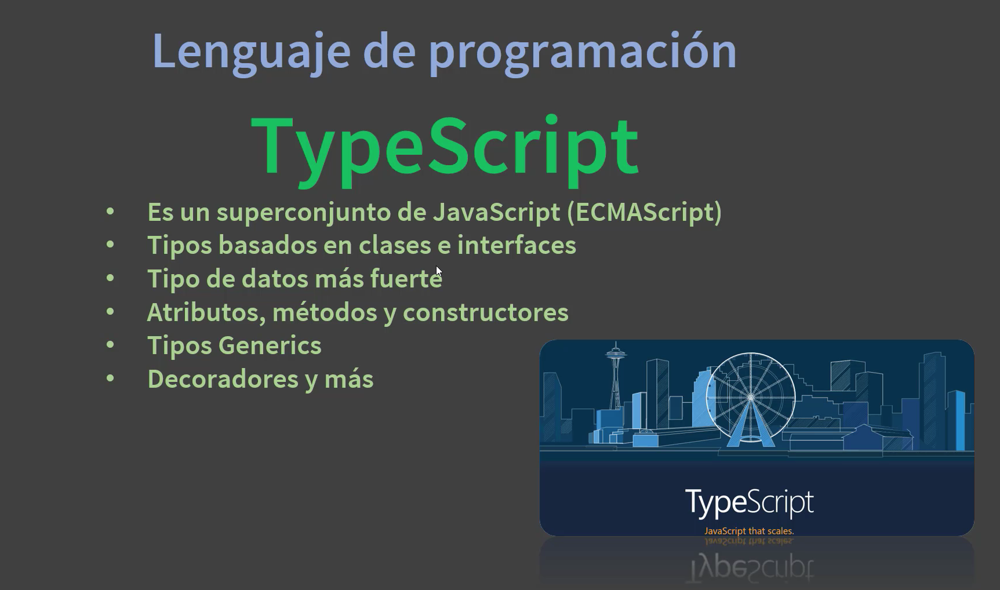

Bueno, Angular utiliza el lenguaje de programación **TypeScript**, que es un super conjunto de JavaScript, por supuesto también incluye ECMAScript 6, también ECMAScript 5, ECMAScript 5 es el JavaScript nativo que se ejecuta, interpreta en los navegadores, ECMAScript 6 es un poco más avanzado, más orientado a Objetos, nueva característica, creo que actualmente estamos en la versión 10 de ECMAScript o versión 2019, también muchas características, pero todo relacionado a la programación orientada a objetos, librerías mucho más robusto. Entonces lo que hace TypeScript es juntar todas estas versiones de JavaScript, este super conjunto y le agrega una abstracción mucho más robusta, mucho más orientada a objetos, mucho más al nivel de Java, por ejemplo, los tipos de datos se basan en clases e interfaces, podemos usar clases interface, clases abstractas, los principios orientados a objetos de Java o C++ acá se aplican exactamente igual. Tenemos modificadores, visibilidad, abstracción, polimorfismo, herencia, sobrecarga de  métodos, sobreescritura, interfaces, tipos de datos más fuertemente tipados, tenemos atributos, métodos, constructores, métodos GET, métodos SET, muy parecido también a los de Java, tenemos tipos **Generics**, podemos implementar nuestro generics para poder reutilizar mejor nuestra clases en la herencia, decoradores, anotaciones y mucho más, es un lenguaje robusto y por último **desarrollado por Microsoft** se utiliza en Angular, se integra en Angular como el lenguaje principal, pero por supuesto que cuando generamos el código de nuestro proyecto en producción con el comando:

```sh
ng build
```

Lo que hace es traducir, convertir, ***traspilar*** este código TypeScript a JavaScript nativo, HTML y hoja de estilos para que lo ejecuten los navegadores estándar y se puede interpretar.

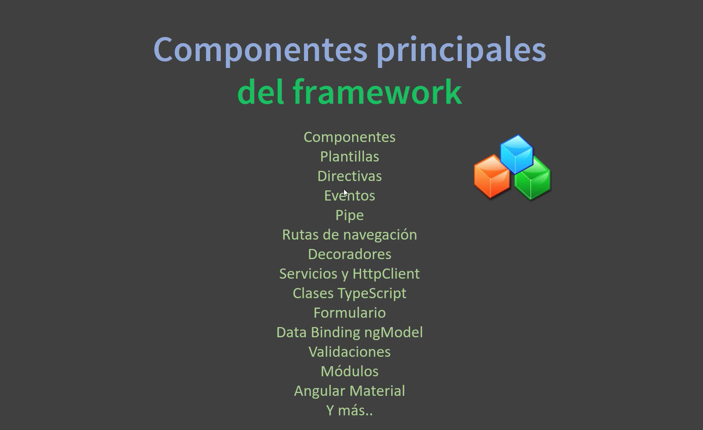

Componentes principales de Angular del framework, muchos entre ellos y los más importante, son los **Componentes**, los Componentes mismos de Angular, una aplicación de Angular está compuesta por muchos componentes, *básicamente  un componente es una página*, pero podemos tener un componente principal, que está formado por otros componentes, por sus componentes, por ejemplo, un menú de navegación, un banner, un calendario, alguna tabla con datos, algún gráfico, un pie de página, en fin, cada uno de estos elementos de nuestra aplicación es un componente, pero también tiene un componente principal que es dinámico, que va cambiando según rutas, según link que tengamos de Angular, entonces, a medida que hacemos un clic en algún botón, en el menú de navegación, nuestro contenido principal va cambiando.

Podemos enrutar un componente a una ruta URL en Angular, y estas cambian de forma dinámica y también muy importante sin recargar la página, la página jamás se actualiza, se refresca, no, siempre se mantiene en una sola página, hace que nuestra aplicación sea instantánea, asíncrona, por supuesto, con características reactivas.

En Angular una clase Componente, es una clase de TypeScript común y corriente, pero que tiene un decorador, una anotación específica **`component`** con algunas configuraciones, un selector con la plantilla que vamos a utilizar para reutilizar el contenido del componente, en fin, cosas que vamos a ver.

También puede implementar algunas interfaces, algunos contratos, ***otra característica del componente es que son asíncronos***, es decir, se ejecutan cada uno en su propio proceso, se ejecutan y se cargan, por lo tanto, entre sí no se interrumpen, un componente no tiene que estar esperando a que se carguen los demás componentes para poder iniciarse, no todos se ejecutan, se inicializan de forma paralela. 

**Las plantillas**, las plantillas también son parte del componente, el componente en la clase que hay por detrás y la plantilla, la presentación que se muestra al usuario, el HTML, ahí podemos imprimir variables de la vista que son atributos del componente y podemos mostrar, imprimir estos atributos mediante extrapolación de strings utilizando llaves, también podemos utilizar directivas como `ngIf` para evaluar una expresión booleana y de esa forma poder mostrar o no mostrar un componente, un elemento html, ocultarlo, por ejemplo, o mostrarlo según una condición, `ngFor` para iterar.

También los **Eventos** muy importantes, eventos para que el usuario pueda interactuar con la aplicación, eventos en los botones, en nuestras tablas, es decir, en las filas o registros en nuestros enlaces, en fin, por ejemplo, el evento típico `change` cuando cambia algún elemento en un campo del formulario o una lista desplegable en un check box, también el evento `click` cuando hacemos un clic en un botón para que llame o invoque un método de la clase componente en cuestión.

Los **Pipe** son filtros que nos permite modificar y dar formato a los datos de nuestra vista por ejemplo, dar formato a una fecha, a una moneda, a números y convertir en mayúsculas, minúsculas, podemos hacer muchas cosas y Angular trae varios Pipes por defecto.

**Rutas de Navegación** tal como explicaba, podemos mapear componentes a rutas para que nuestro contenido principal cambie de forma dinámica, a medida que hacemos clic en estas rutas, ejecute el contenido, muestre el contenido de forma instantánea sin recargar la página.

**Decoradores**, **Anotaciones**, **Servicios** que se encarga de la lógica negocio, se trabajan con datos que vienen desde el BackEnd utilizando el **HttpClient** de forma reactiva o utilizando el Observable, básicamente el HttpClient nos permite comunicarnos mediante verbos del request POST, PUT, GET, DELETE con el BackEnd para guardar datos, para eliminar, para enviar, en fin, subir imágenes y todo esto de forma asíncrona, orientado a eventos sin recargar la página.

También podemos crear nuestra propia clase TypeScript, ya sea de utilidad, **Helpers** o clases del modelo que representa nuestros datos mapeado a los JSon que corresponden a las **Entity**, por ejemplo, o a los POJOS en Java o Spring, manejo de **Formularios**, también muy importante **Data Binding** para poblar datos `ngModel` una directiva que nos permite mapear un formulario a una clase de TypeScript de forma automática, para que se vayan poblando los campos, los datos a medida que vayamos escribiendo, **Validar** también estos datos con sus respectivos mensaje de error.

**Módulos**, **Angular Material** para todo lo que es la vista, un montón de cosas, cosas que vamos a ver en el curso en detalle.

## Instalaciones y herramientas necesarias 11:37
## Una mirada al editor Atom e instalando algunos plugins 06:25
## Creando nuestra aplicación Angular 13:00

Ahora sí que estamos listos para comenzar para crear nuestra aplicación con Angular desde cero utilizando **Angular CLI**, lo primero es ir a la página  https://angular.io/ 

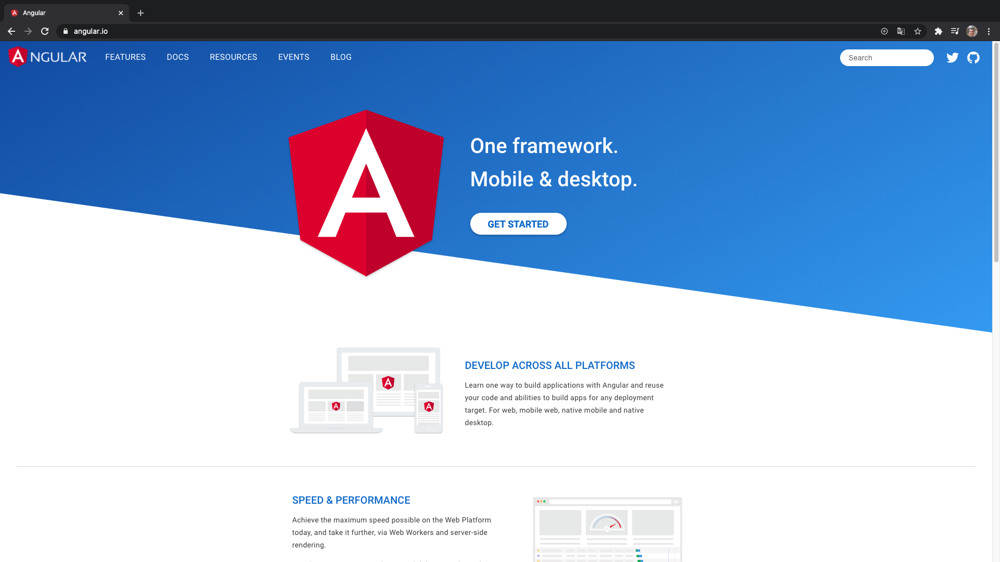
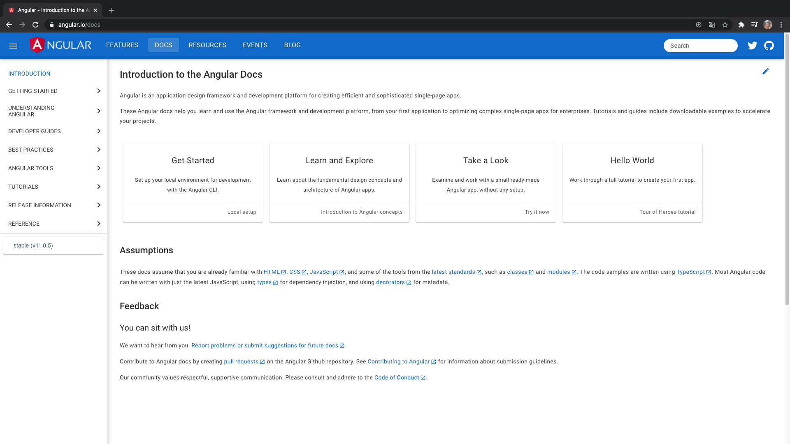
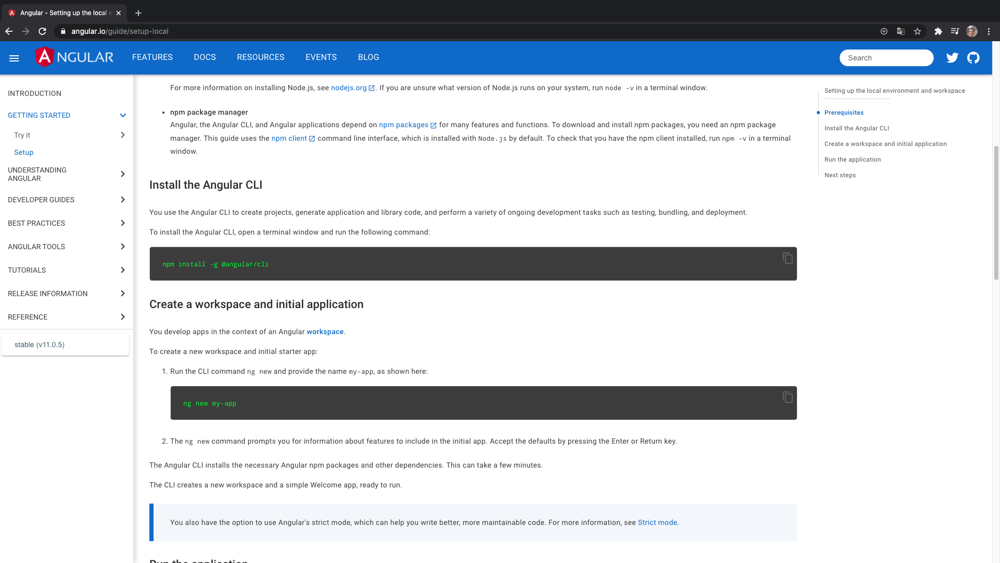

Para crear un proyecto usamos el comando 

```sh
ng new my-app
```

El comando `ng` de la consola de angular lo tenemos disponible con la instalación de Angular CLI que realizamos en la clase anterior, ahora simplemente vamos al terminal de nuestro sistema operativo y vamos a crear el proyecto, ***pero primero tenemos que crear un directorio en el cual vamos a guardar todos nuestros ejemplos y proyectos del curso***.

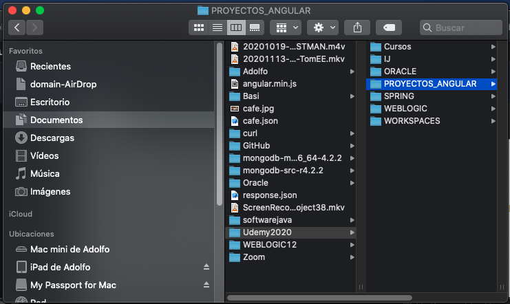

Ahí tenemos nuestro directorio raíz de Angular.

### :computer: Crear el Proyecto `clientes-app`

Vamos a crear el proyecto, le vamos a llamar `clientes-app` con el comando 

```sh
ng new clientes-app
```

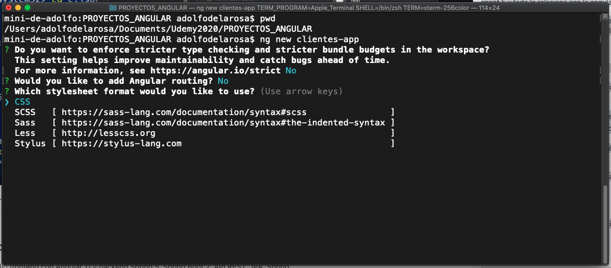

Lo primero que pregunta es...

Lo segundo que pregunta es si queremos agregar en nuestra aplicación Angular el componente `routing`, le indicamos que NO porque eso después lo vamos a agregar de forma manual, la idea es aprender cómo se configura, así que lo dejamos para después, por ahora simplemente no.

La tercer pregunta es qué formato de estilos vamos a querer utilizar, por defecto marca CSS, ese es más que suficiente y aceptamos simplemente con un Enter. 

Crear el proyecto, va a descargar todas las dependencias por lo tanto se puede demorar un buen rato.

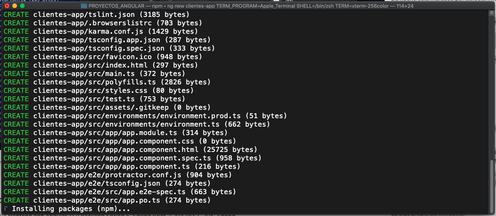

Una vez que haya finalizado en Windows pueden aparecer un par de warnings.

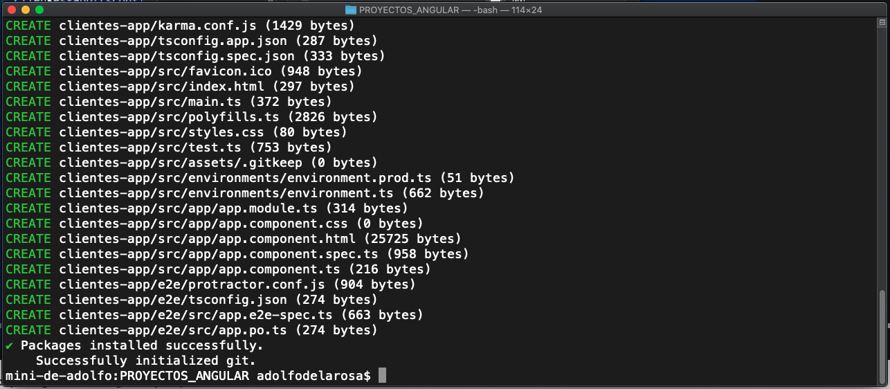

Se debe a que Windows no tiene soporte a esa librería pero sí en Mac en OS X y acá tenemos otro warning típico de Windows que no hay que dar ninguna importancia.

Una vez que se haya creado con éxito el siguiente paso es abrir con VSC. 

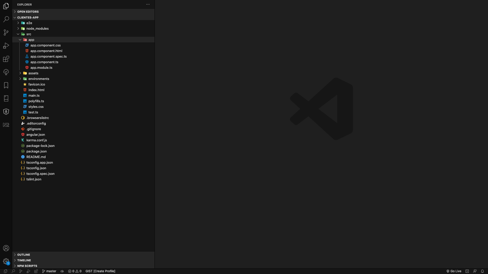

En la pestaña izquierda tenemos el proyecto con todos sus archivos, Si se fijan aparece un icono distinto por cada tipo de archivo eso es porque instalamos la Extensión.

Si vemos la carpeta `src` es el más importante es donde tenemos nuestra aplicación, todo nuestro código dentro de `app` donde tenemos nuestro ***componente principal***.

#### Ejecutar la Aplicación

Ahora vamos a ejecutar nuestra aplicación utilizando el comando:

```sh
ng serve --open
```

o la versión abreviada 

```sh
ng serve -o
```

Nos vamos a la consola y dentro del directorio angular donde tenemos creado nuestro proyecto `clientes-app` ejecutamos el comando.

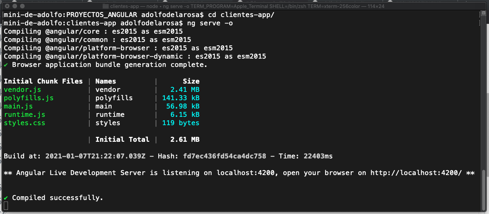

Es muy parecido a Spring Boot en el sentido que incluye un servidor embebido para desplegar nuestra aplicación Angular.

Tenemos nuestra página de bienvenida con un prototipo por defecto.

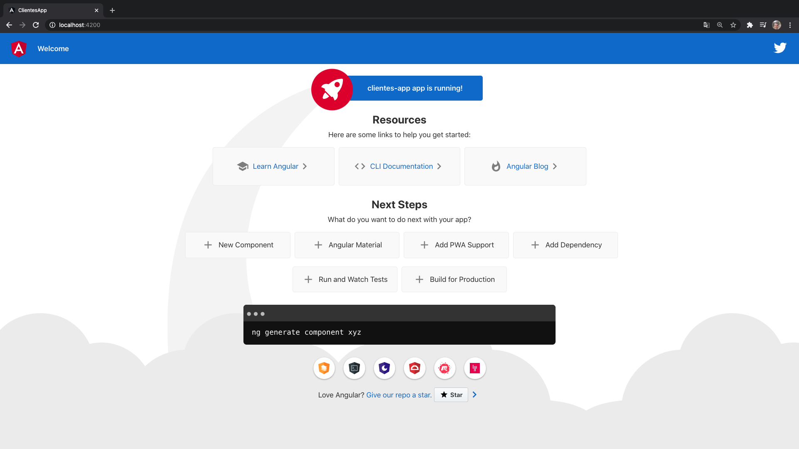

Este servidor `ng serve` es para desarrollar, no es para un ambiente de producción, cuando llevamos nuestra aplicación a producción lo que hacemos es transpirar, convertir todo nuestro TypeScript en JavaScript, en código estático HTML y JavaScript puro que es interpretado y lo entienden los navegadores y eso lo podemos subir a cualquier servidor que pueda publicar este contenido estático como por ejemplo **Google Storage**, o también tenemos **Amazon S3**, hay varias alternativas que más adelante vamos a ver, cómo llevar a producción y publicar nuestra aplicación. Incluso lo podríamos hacer con **NodeJS** con el servidor que trae NodeJS, con Apache, con cualquiera que pueda servir contenido estático, básicamente JavaScript, HTML y hojas de estilos.

#### Modificar la Plantilla HTML

Ya que levantamos nuestra aplicación el siguiente paso es modificar el contenido que tenemos, lo que está cargando es el componente principal el `app.component`.

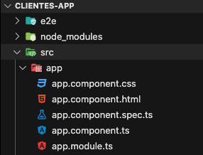

Tenemos la clase componente, vemos varias cosas pero antes de entrar en detalle, lo primero que observamos es que está asociada a un template a una vista HTML `app.component.html` que contiene todo el código (más de 500 líneas) que pinta la página de bienvenida que vimos anteriormente en el navegador. Vamos a quitar todo ese código y lo vamos a reemplazar con:

```html
 <h1>{{ title }}</h1>
```

Volvemos al navegador, observamos que aparecen solamente:

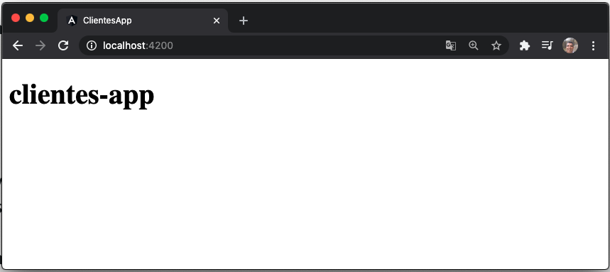

Vamos a abrir `app.component.ts`

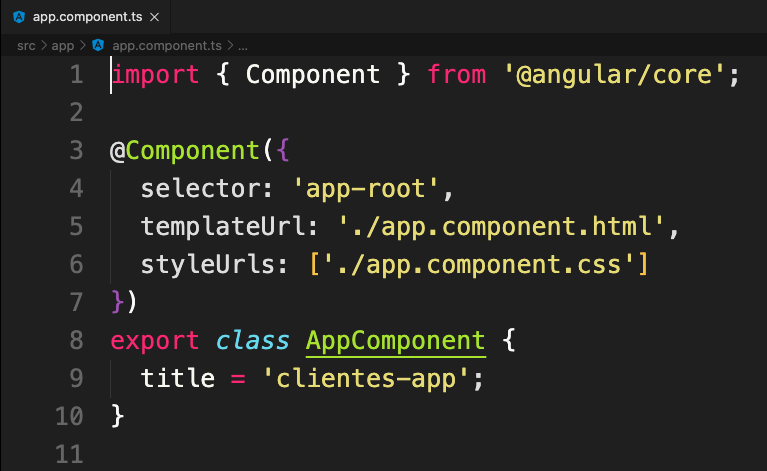

Analicemos el `Component`, es un decorador, una anotación con cierta configuración metadata muy parecido a las anotaciones de Sprint, es para lo mismo, para configurar, tenemos la clase `AppComponent` que está marcada con el decorador `@Component`, es una clase componente de Angular.

En primer lugar tiene un **selector**, el selector corresponde a una etiqueta HTML, esta etiqueta HTML la podemos incluir en otros componentes, en este caso como es el componente root o principal la tenemos que incluir en `index.html`.

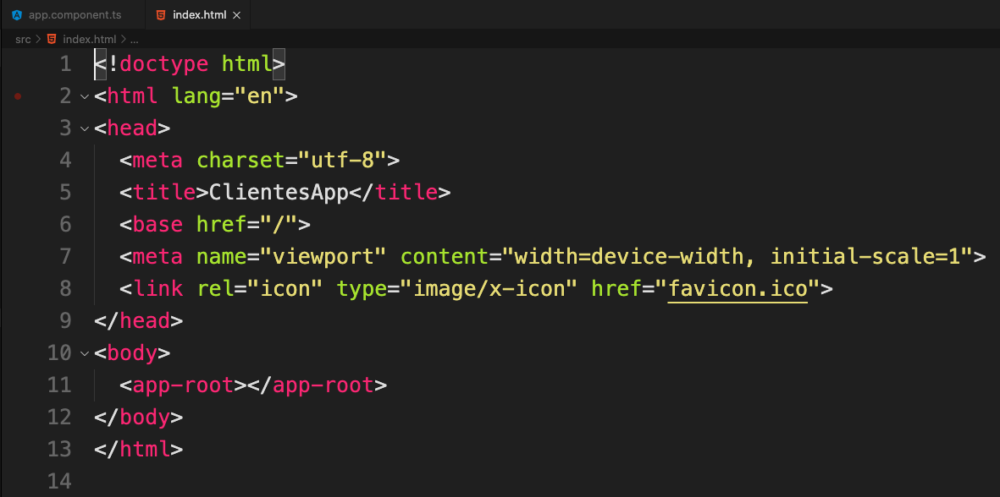

`index.html` es la página principal, es la puerta de entrada a nuestra aplicación. Si se fijan en el body la estamos incluyendo simplemente una etiqueta HTML que contiene el nombre del selector `app-root`, por lo tanto el nombre del selector en `app.component.ts` será el que se ponga en `index.html`. 

Lo que estamos haciendo es embeber todo el contenido de ese componente `app.component`, todo el HTML que tiene y toda la programación dinámica dentro de la clase, con toda la lógica que le queremos dar.

Lo segundo es que tiene un **templateUrl**, es la vista, el contenido HTML que está asociado a esta clase componente.

Luego tenemos **styleUrls** serían nuestras hojas estilos, podríamos tener una o más, por eso el corchete, se separan por comas, por defecto tenemos una sola que es `app.component.css`, donde tenemos solamente los estilos de este componente sin afectar a los demás componentes que tengamos en nuestra aplicación, sólo hacen efecto en el propio componente y no en los demás.

Después vamos a ver cómo aplicar estilos de forma global a todos nuestros componentes, por ejemplo agregando estilos en `styles.css`, cualquier estilo que coloquemos se va a aplicar a toda nuestra aplicación, a toda nuestras páginas y a todos los componentes.

Para resumir **`app.component` sería nuestro componente principal o raíz** se tiene que dejar tal y a partir de este componente podemos incluir, agregar otros componentes.

Un componente Angular son piezas de código que van a componer nuestra aplicación.

Un componente se puede anidar dentro de otro, con un componente hijo o bien un componente padre, podría estar formado por varios componentes hijos, esto se conoce como el ***Patrón de Diseño Composites o Compositor***. Por debajo implementa este patrón de diseño lo que lo hace bastante modular, escalable y también fácil de mantener.

Por ahora vamos a modificar un poco más nuestra clase, vamos a modificar el título de la aplicación y podemos meter más atributos:

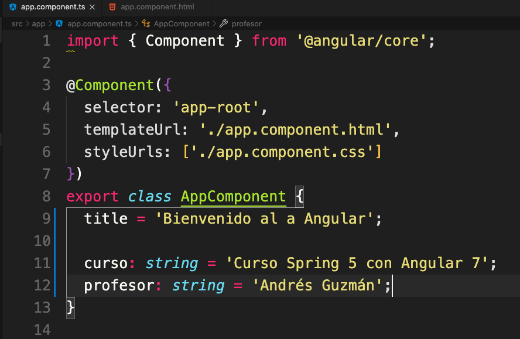

podemos usar comilla simples o dobles pero se usa más la simple con TypeScript. Como recomendación aunque no es obligación el punto y coma final se recomienda. En Angular 7 como había mencionado también una de las características que maneja es el tipado, si bien es opcional lo hemos puesto en nuestros dos atributos.

Vamos a ir a la vista para modificarla así:

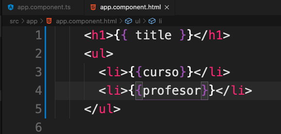

Usando doble llaves para interpolar las variables, interpolar es para que se imprima la variable en la salida, en el navegador, simplemente hacemos referencia al nombre del atributo.

Volvemos al navegador y vemos el cambio.

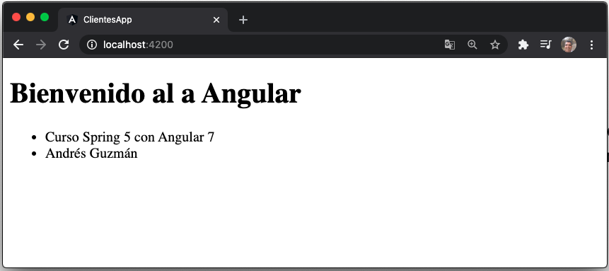

## Introducción a los Componentes 04:12


Veamos una introducción a los componentes.

¿Qué es lo que son? Son lo más importante de Angular, ya que Angular está compuesto por componentes, también hay otras cosas como los módulos, las directivas, los PIPES, hay muchas cosas, pero todo gira alrededor de los componentes.

Una aplicación de Angular tiene un módulo principal, pero este módulo principal carga un componente principal y este componente principal, también está compuesto por otros componentes esa es la gracia.

Los componentes son pequeñas partes o piezas, bloques de nuestra aplicación, en términos de programación son clases de TypeScript que tienen un decorador y también están asociados a una plantilla. Cada uno de estos componentes, de esta clases tiene su propia lógica, cumple una función, un rol muy específico dentro de esta aplicación.

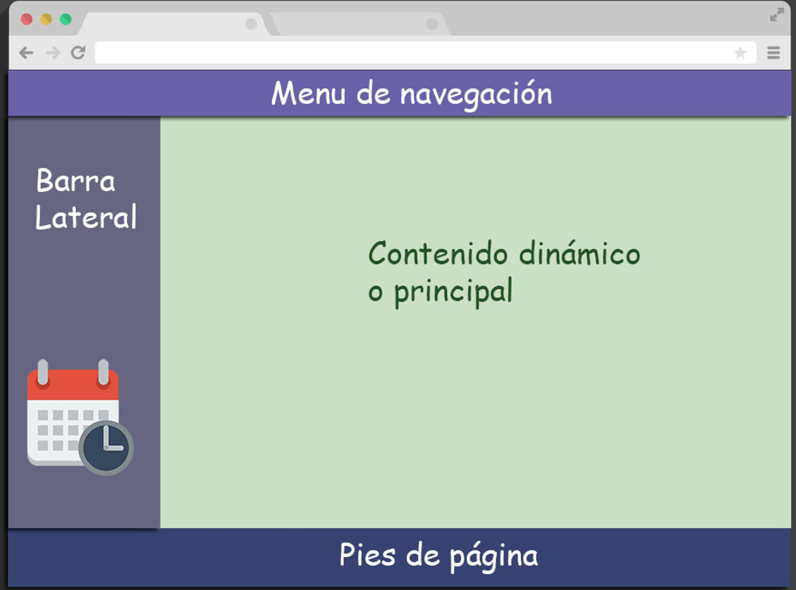

Por ejemplo, un componente pueden ser un menú de navegación, una barra lateral o sidebar, un calendario, un pie de página o un footer, pero también puede ser páginas, páginas dinámicas que van cambiando su contenido a través de rutas.

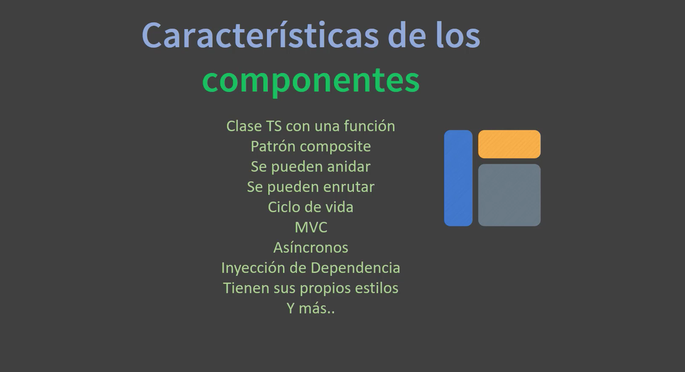

Veamos sus características.

* Una clase de TypeScript con una función específica dentro de la aplicación.
* Detrás de escena implementa el patrón de diseño composite.
* Los componentes se pueden anidar y puede estar formados unos con otros.
* Dentro de la clase de un componente se indica una anotación, se decora y esta anotación incluye metadata configuraciones. Una de ellas es el *selector*, la etiqueta que vamos a utilizar para cargar el componente en el HTML.
* Puede estar asociado a una ruta URL de Angular, cada que hacemos un clic en estas rutas el contenido de nuestra página va cambiando de forma dinámica y se muestra el contenido de ese componente que está mapeado a esa ruta.
* Muy parecido a lo que sucede con Spring, con Spring MVC cuando un controlador con un método Handler está asociado o está mapeado a una ruta.
* También tiene su propio ciclo de vida para inicializarce, para destruirse, hacer algo cuando cambie algún elemento hijo o padre de los componentes, realizar alguna tarea antes de renderizar la vista.
* MVC separa lógica de programación de la plantilla y por otro lado tenemos también la clases que representan lógica de negocio como los *Services* y la clase *Model* que representa los datos que estan mapeados a los JSON. Al final el componente es el controlador que interactúa con el Service, con la lógica negocio, el Service le retorna los datos en JSON y el Componente se lo pasa a la plantilla por eso es un MVC, el usuario interactúa con la plantilla, con la vista, con controles, con eventos, las cuales la clase componente, da soporte, recibe estos datos, interactúa con el Service, lógica negocio y después los datos se imprimen, se presentan en la vista.
* Otra característica muy importante es que son Asíncrono, cada componente se ejecuta en su propio proceso y no se interrumpen entre sí, por lo tanto, si un componente falla los demás se siguen ejecutando en un proceso diferente, no se afectan unos con otros, no se rompe la aplicación, se ejecutan de forma paralela y un componente tampoco nos tiene que estar esperando a que se inicialicen los demás para poder inicializace el mismo.
* Soportan inyección de dependencia vía constructor, podemos inyectar objetos que sean inyectables y además cada componente maneja sus propios estilos, cada uno está asociado a un HTML y también a una hoja de estilos.

Y mucha característica más.

## Estructura de directorio del proyecto Angular 10:57

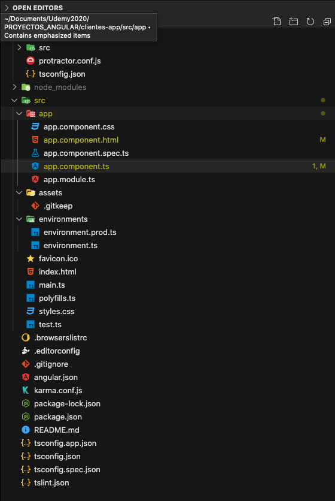

Vamos a ver la estructura de directorio del proyecto qué generamos con la consola de Angular con Angular CLI.

Vamos a comenzar desde el principio con el directorio `e2e`, básicamente contiene todas las herramientas necesarias para realizar pruebas unitarias, fuera del alcance de este curso.

El siguiente directorio es el `node_modules` donde están todas las librerías y dependencias del proyecto.

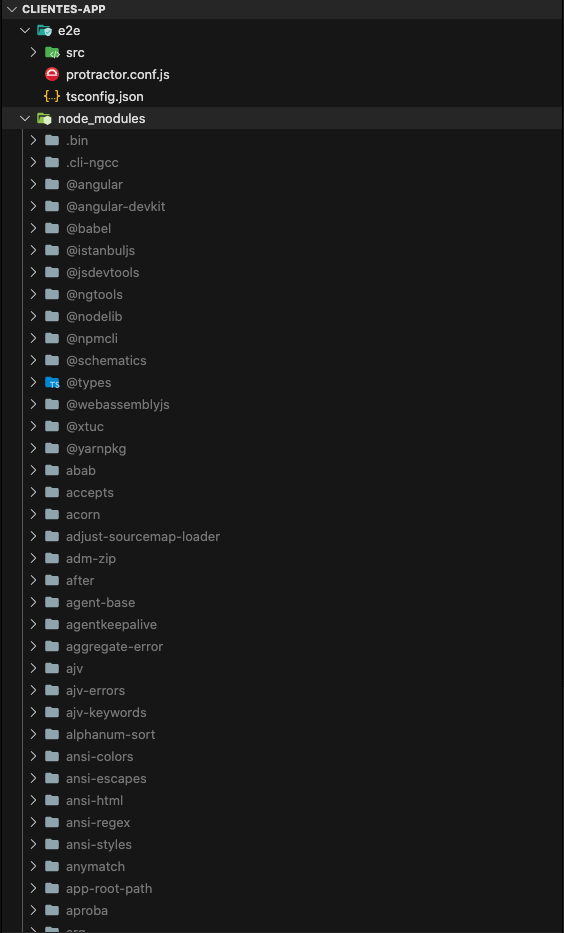

Todo se maneja de forma automática a través del NPM y todo esto se maneja y se registra dentro del archivo `package.json` donde están todas las dependencias, muy parecido a lo que sería el `pom.xml` en Java.

Luego tenemos `src` una carpeta muy importante contiene todo nuestro código, todo el código fuente de nuestra aplicación es bastante amplio así que lo vamos a dejar para la próxima leccción.

Luego tenemos el archivo `.editorconfig` en realidad no lo vamos a ocupar para nada en el curso, pero básicamente contiene toda la configuración del editor. 

Luego tenemos el `.gitignore` es un archivo de GitHub del repositorio GitHub donde podemos subir nuestro proyecto y compartirlo. Este archivo nos permite omitir, ocultar o ignorar archivos y carpetas que no queramos compartir en el repositorio


```sh
# See http://help.github.com/ignore-files/ for more about ignoring files.

# compiled output
/dist
/tmp
/out-tsc
# Only exists if Bazel was run
/bazel-out

# dependencies
/node_modules
...
```

como por ejemplo la carpeta de distribución `/dist` que contiene todo el código compilado cuando generamos el proyecto con `ng build`, el directorio `/tmp`, las dependencias `/node_modules` no tienen ningún sentido compartir todas las librerías y dependencia del proyecto. Lo importante es el código fuente y así un montón de carpetas y archivos que podemos ocultar.

**`angular.json`** es el archivo principal de configuración del proyecto, es el más importante, podemos configurar prácticamente todo.

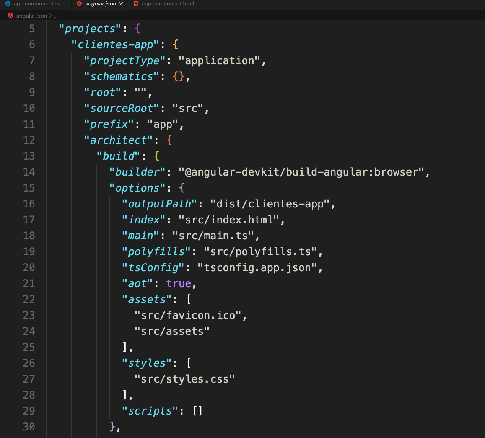

Para comenzar aparece en projects el nombre del proyecto como un atributo, con toda la configuración, por ejemplo cuál es la carpeta raíz del proyecto del código fuente `"sourceRoot": "src",`. Luego tenemos todo lo que es `"build": {` cuando generamos el proyecto, por ejemplo el directorio de salida `"outputPath": "dist/clientes-app",` todo el contenido que generamos cuando realizamos el deploy, todo se genera dentro del directorio `dist/clientes-app`. Luego tenemos el `"index": "src/index.html",` que sería la puerta de entrada a nuestra aplicación. Luego tenemos la clase principal `"main": "src/main.ts",` que básicamente lo que hace es cargar nuestro módulo por defecto, el módulo por defecto lo tenemos dentro de `app` llamado `app.module.ts`.


Vemos justamente `main.ts` justamente realiza el arranque de `AppModule`.

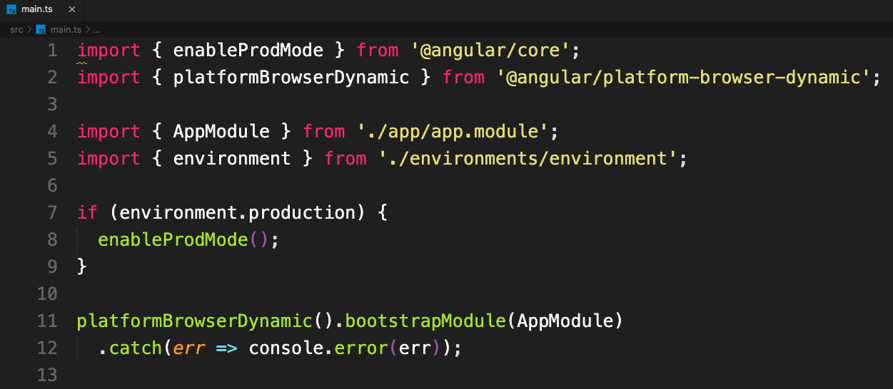

Luego regreseando a `angular.json` tenemos los `"polyfills": "src/polyfills.ts",` que es una herramienta que nos permite la compatibilidad con todos los navegadores.

La configuración de TypeScript `"tsConfig": "tsconfig.app.json",`.

Los `"assets": [` muy importante son todos los recursos estáticos de nuestra aplicación por ejemplo el Favicon, todo lo que son imágenes, cualquier recurso estático lo podemos tener dentro de los assets.

Luego podemos configurar hojas de estilos que se van a agregar 
`"styles": [ "src/styles.css" ],` cuando arranca nuestra aplicación dentro del `index.html` por defecto tiene `styles.css` pero podemos tener más separadas por comas, podemos agregar más hojas de estilos globales en nuestra aplicación y pasa lo mismo con los scripts que serían los JavaScript `"scripts": []` cualquier archivo js lo podemos registrar aquí, también separada por comas.

Luego tenemos configuraciones de ambiente de producción, desarrollo y un montón de cosas.

Continuamos con **`package.json`** otro archivo muy importante.

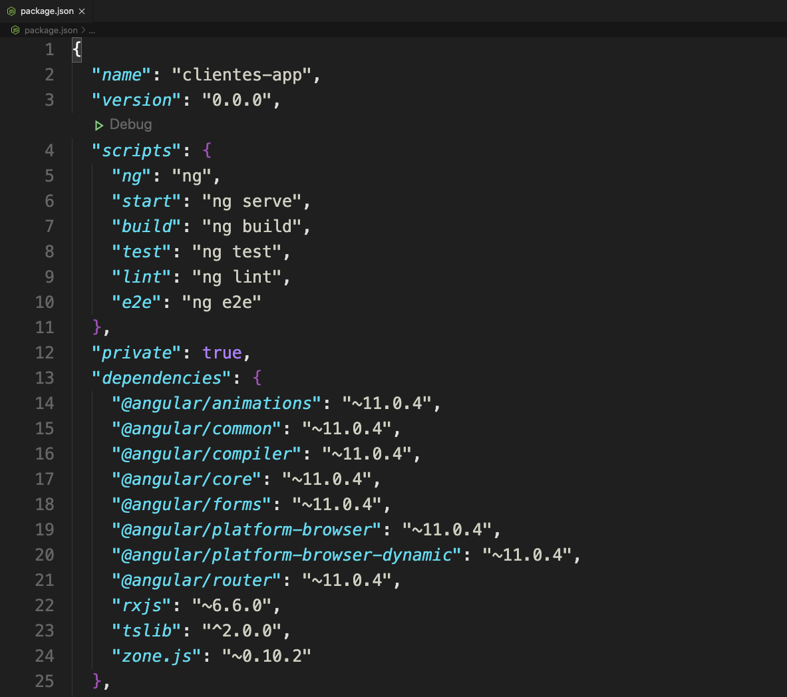

Contiene el nombre de la aplicación, la versión, scripts que son atajos para ejecutar comandos y las dependencias, en este archivo se manejan todas las dependencias con sus versiones. Por ejemplo todo lo que son `dependencies` son dependencias para producción, para ejecutar nuestra aplicación, como por ejemplo todos los paquetes de Angular y en `devDependencies` son todas las dependencias que están relacionadas al ambiente de desarrollo, todo lo que es escribir nuestro código, pruebas unitarias, el lenguaje TypeScript, el linter para detectar errores de sintaxis, está todo acá, por supuesto cuando generamos el proyecto, lo compilamos, todas estas librerías no se incluyen, solamente se van a incluir las de producción, en ningún caso las de desarrollo.

Por lo que cuando generemos nuestro proyecto con `ng build` se va a incluir en el directorio `dist` lo justo y necesario y va a quedar nuestra aplicación bastante liviana solamente el javascript necesario para correr la aplicación, hojas de estilos y HTML todo estático.

En caso de que se haya eliminado por ejemplo una librería de nuestro proyecto del directorio `node-modules` que se haya borrado o se haya corrompido, este archivo nos permite recuperar todas las dependencias, con el comando:

```sh
npm install
```

es nuestro salvavidas.

Luego tenemos el `README.md`, básicamente la documentación con varias instrucciones que podemos usar para construir elementos de nuestro proyecto.

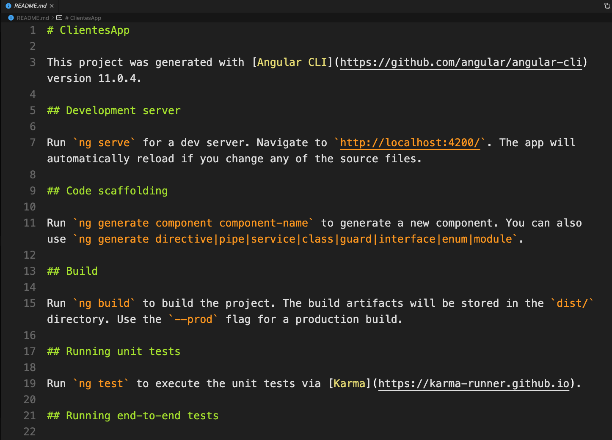

Este archivo `README.md` es una pequeña documentación resumida.

Luego tenemos el archivo `tsconfig.json` archivo de configuración de TypeScript que nos ayuda con las alertas, si estamos usando bien las variables en el código. Si estamos creando correctamente una clase, si estamos usando bien un decorador, una anotación y también nos permite activar la compilación que compile de forma automática, cada vez que guardemos nuestro código fuente, un archivo, lo cual no se recomienda porque cada vez que estemos guardando una clase del proyecto, un archivo va a estar compilando, la idea es compilar después que finalicemos nuestra aplicación, pero no ante cualquier cambio.

Luego tenemos el `tslint.json` que igual que el `tsconfig.json` no es necesario que lo toquemos ya que viene todo automático, se encarga de detectar errores de sintaxis en nuestro código y también nos ayuda a que todos los errores de sintaxis que puedan ocurrir a medida que estén escribiendo el código en el editor se muestren de forma correcta en el IDE, en el editor y no tenemos más.

## Estructura de directorio del proyecto angular: Parte 2 el directorio `src` 06:47

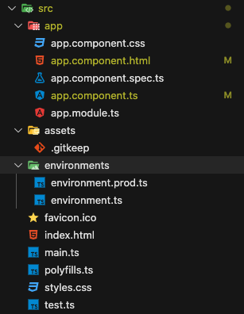

Continuamos con la segunda parte vamos al directorio `src` lo primero que tenemos es el `app` donde esta todo el contenido de nuestro componente principal el `app.component`, tenemos los directorios `assert`, `environments`  y también algunos archivos en la raíz del `src`.

Vamos a partir con el directorio `app`, primero tenemos nuestra hoja de estilo en `app.component.css` donde podemos tener todos los estilos que son exclusivamente y específicamente del componente `app.component` no hace efecto en los demás componentes solamente en el `app.component`. Como ya dijimos anteriormente si queremos agregar estilos globales tenemos que usar el `styles.css` que está en la raíz.

Luego tenemos la plantilla o la vista `app.component.html` que responde al componente `app.component`, contiene básicamente el HTML la Vista.

Luego tenemos el archivo `app.component.spec.ts` esto significa que son de prueba unitaria de testing que no veremos en el curso. Por lo tanto incluso lo podemos borrar, no lo vamos a utilizar.

Luego tenemos el `app.component.ts` que nuestro componente, una clase que representa una parte de nuestra aplicación web, que se puede comparar como si fuera un controlador de Spring, que controla con lógica ciertos contenidos y cómo se muestra este contenido utilizando el selector, donde usemos la etiqueta `<app-root>` es donde se va a mostrar, a desplegar el contenido dinámico de este componente que está asociado también a una vista a una plantilla. Por ejemplo como lo vimos dentro del `index.html` dentro de esta etiqueta se está insertando el contenido HTML de esta plantilla qué responde con la lógica del componente.

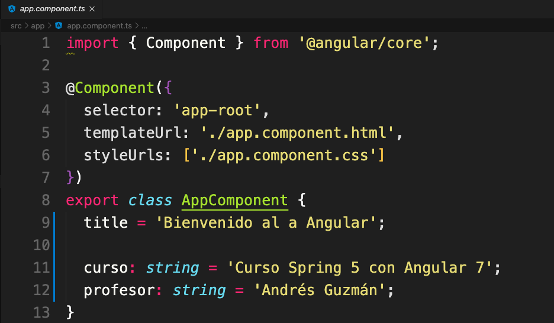

Es muy importante primero antes que nada importar el componente.

Después del decorador `@Component` se define la clase compone siempre con el `export` para que se pueda después registrar y configurar como un componente en el `app.module.ts`.

Luego tenemos precisamente `app.module.ts`, muy importante.

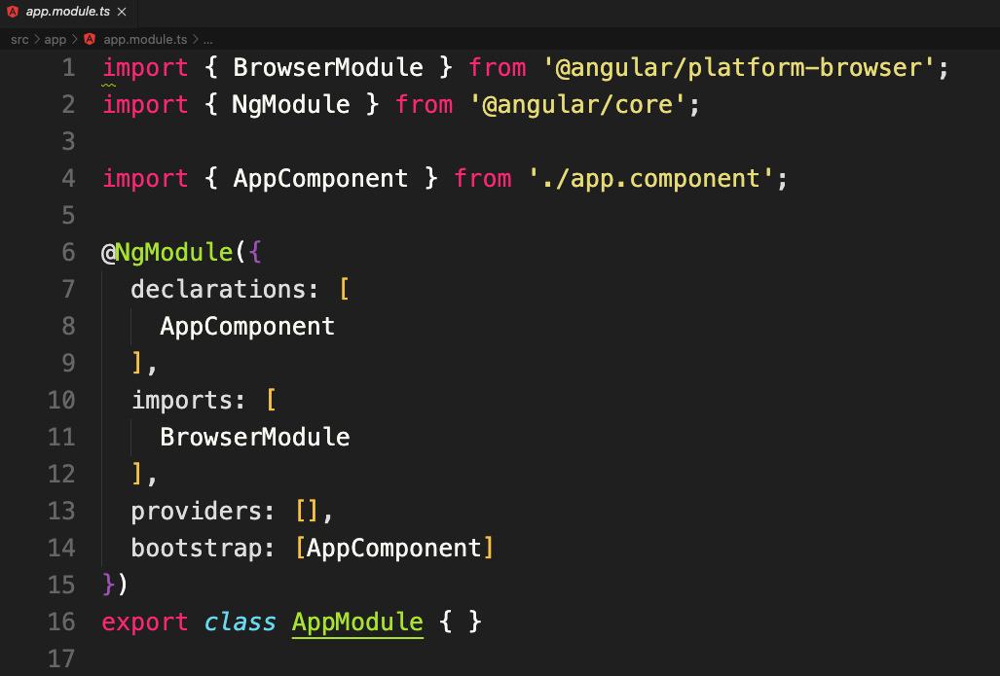

Este es como un repositorio donde se registran nuestros componentes, las clases Component donde se registran los PIPE, las clases del Servicio, aquí también se importan los diferentes módulos que vamos a utilizar por ejemplo, por defecto está el `BrowserModule` que incluye las directivas por ejemplo `ngIf` y `ngFor` y todas las directivas con las cuales trabajamos en la plantilla, en las vistas.

Pero además podríamos tener el `FormModule` para trabajar con formularios, el `HttpModule` para trabajar con peticiones HTTP para trabajar con REST y poder realizar peticiones asíncronas y obtener resultados JSON.

En `imports: [` podemos cargar configuraciones de la base datos por ejemplo con Memory Data, con Firebase, en fin importamos los diferentes módulos que vamos a utilizar. 

En `declarations: [` se registran todos nuestros componentes.

Dentro de `providers: [],` se registran nuestras clases de servicios, todas aquellas que tengan algún tipo de lógica de negocio o clases con algún tipo de funcionalidad, por ejemplo para trabajar con JSON que realizan consultas asíncrona a un servidor Rest o a una aplicación BackEnd por ejemplo con el Spring Framework.

Tenemos `bootstrap: [AppComponent]` donde se indica cuál es el componente principal que se va a cargar, tenemos el `AppComponent`.

Finalmente tenemos la clase `AppModule` y es justamente la clase que se carga, que arranca en el `main.ts`

Entonces resumiendo el `app.module.ts` es un repositorio, es un contenedor donde se registran nuestros componentes, nuestros módulos, nuestras clases de servicio muy parecido en el fondo a lo que sería un contenedor de Spring, también los providers, las clases servicio se puede inyectar a través de inyección de dependencia y se pueden pasar a los diferentes componentes, son globales.

Luego tenemos el `assets` donde se guardan todos los contenidos estáticos.

En `environments` tenemos el ambiente desarrollo y de produción esto se utiliza ya cuando se genera la carpeta de distribución y se publica a producción.

Luego tenemos el `favicon.ico` que se muestra en el navegador.

Luego tenemos `index.html` que muestra la página principal aquí se coloca el selector `<app-root>` del componente principal `app-component`.

La clase `main.ts`

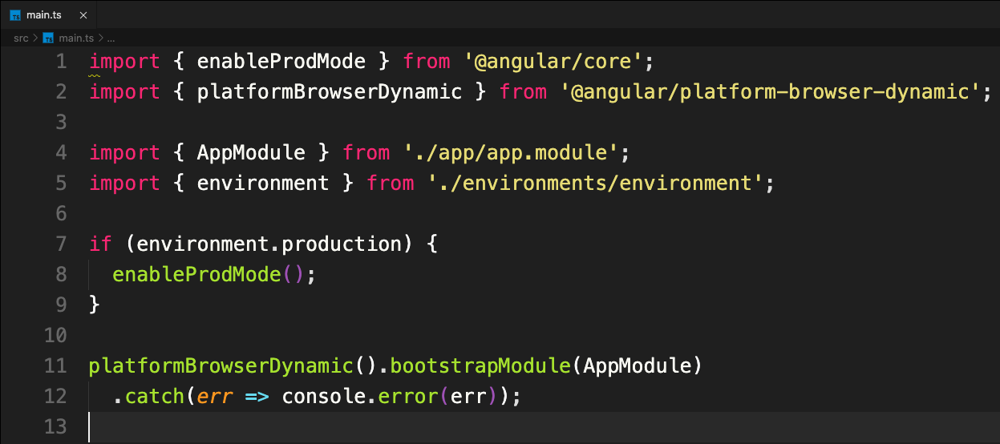

que levanta y arranca nuestra aplicación el `AppModule` por defecto estamos utilizando el `platformBrowserDynamic()` es decir podemos trabajar tanto con navegador, con aplicaciones web también con aplicaciones smartphone, aplicaciones móviles pero también podríamos utilizar otro tipo que sean solamente para aplicaciones móviles.

Pero durante el curso vamos a trabajar con aplicaciones web y utilizando Bootstrap se pueden hacer responsive para que nuestra creación web funcione perfectamente en un dispositivo smartphone o celular.

Luego tenemos el `polyfills` un archivo de configuración para aumentar la compatibilidad de nuestra aplicación.

Tenemos el `styles.css` para los estilos globales.

Luego tenemos `test.ts` para pruebas unitarias.

## Integrar Bootstrap con Angular 06:54

En esta clase vamos a ver la integración con el framework Bootstrap para trabajar con HTML5 y CSS para tener diseños bastante más robusto y atractivos, lo vamos a instalar de la forma más fácil posible.

Hay diferentes formas para poder instalar y configurar Bootstrap en nuestro proyecto, podemos utilizar una instalación a través de Angular CLI o bien podemos integrarlo de forma manual, copiar las hojas estilos y lo JavaScript correspondiente en nuestro `index.html` del proyecto que es justamente lo que vamos a hacer ahora.

Pero después más adelante vamos a configurar de otra forma Bootstrap 

Vamos a ir a la página oficial de Bootstrap https://getbootstrap.com/ nos vamos a downloads y vamos a copiar las librerías la hoja de estilo vostra CSS y JavaScript. 

```js
<link href="https://cdn.jsdelivr.net/npm/bootstrap@5.0.0-beta1/dist/css/bootstrap.min.css" rel="stylesheet" integrity="sha384-giJF6kkoqNQ00vy+HMDP7azOuL0xtbfIcaT9wjKHr8RbDVddVHyTfAAsrekwKmP1" crossorigin="anonymous">
<script src="https://cdn.jsdelivr.net/npm/bootstrap@5.0.0-beta1/dist/js/bootstrap.bundle.min.js" integrity="sha384-ygbV9kiqUc6oa4msXn9868pTtWMgiQaeYH7/t7LECLbyPA2x65Kgf80OJFdroafW" crossorigin="anonymous"></script>
```

```js
<script src="https://cdn.jsdelivr.net/npm/@popperjs/core@2.5.4/dist/umd/popper.min.js" integrity="sha384-q2kxQ16AaE6UbzuKqyBE9/u/KzioAlnx2maXQHiDX9d4/zp8Ok3f+M7DPm+Ib6IU" crossorigin="anonymous"></script>
<script src="https://cdn.jsdelivr.net/npm/bootstrap@5.0.0-beta1/dist/js/bootstrap.min.js" integrity="sha384-pQQkAEnwaBkjpqZ8RU1fF1AKtTcHJwFl3pblpTlHXybJjHpMYo79HY3hIi4NKxyj" crossorigin="anonymous"></script>
```

Ahora nos vamos a nuestro proyecto Angular cerramos y vamos a abrir el `index.html` dentro de `<head>` metemos los estilos y antes de `</body>` vamos a meter los JavaScript, todo lo que sea JavaScript es bueno tenerlo al final.

```html
<!doctype html>
<html lang="en">
<head>
  <meta charset="utf-8">
  <title>ClientesApp</title>
  <base href="/">
  <meta name="viewport" content="width=device-width, initial-scale=1">
  <link rel="icon" type="image/x-icon" href="favicon.ico">
  <link href="https://cdn.jsdelivr.net/npm/bootstrap@5.0.0-beta1/dist/css/bootstrap.min.css" rel="stylesheet" integrity="sha384-giJF6kkoqNQ00vy+HMDP7azOuL0xtbfIcaT9wjKHr8RbDVddVHyTfAAsrekwKmP1" crossorigin="anonymous">
</head>
<body>
  <app-root></app-root>
  <script src="https://cdn.jsdelivr.net/npm/@popperjs/core@2.5.4/dist/umd/popper.min.js" integrity="sha384-q2kxQ16AaE6UbzuKqyBE9/u/KzioAlnx2maXQHiDX9d4/zp8Ok3f+M7DPm+Ib6IU" crossorigin="anonymous"></script>
  <script src="https://cdn.jsdelivr.net/npm/bootstrap@5.0.0-beta1/dist/js/bootstrap.min.js" integrity="sha384-pQQkAEnwaBkjpqZ8RU1fF1AKtTcHJwFl3pblpTlHXybJjHpMYo79HY3hIi4NKxyj" crossorigin="anonymous"></script>
  <script src="https://cdn.jsdelivr.net/npm/bootstrap@5.0.0-beta1/dist/js/bootstrap.bundle.min.js" integrity="sha384-ygbV9kiqUc6oa4msXn9868pTtWMgiQaeYH7/t7LECLbyPA2x65Kgf80OJFdroafW" crossorigin="anonymous"></script>
</body>
</html>
```

Después obviamente lo vamos a hacer de la mejor forma posible, una manera mucho más optimizada y recomendada pero por ahora lo vamos a hacer de esta manera,  ya tenemos integrado nuestro Bootstrap.

El siguiente paso es ir a la documentación Bootstrap para buscar `Navbar` copiamos el siguiente ejemplo:

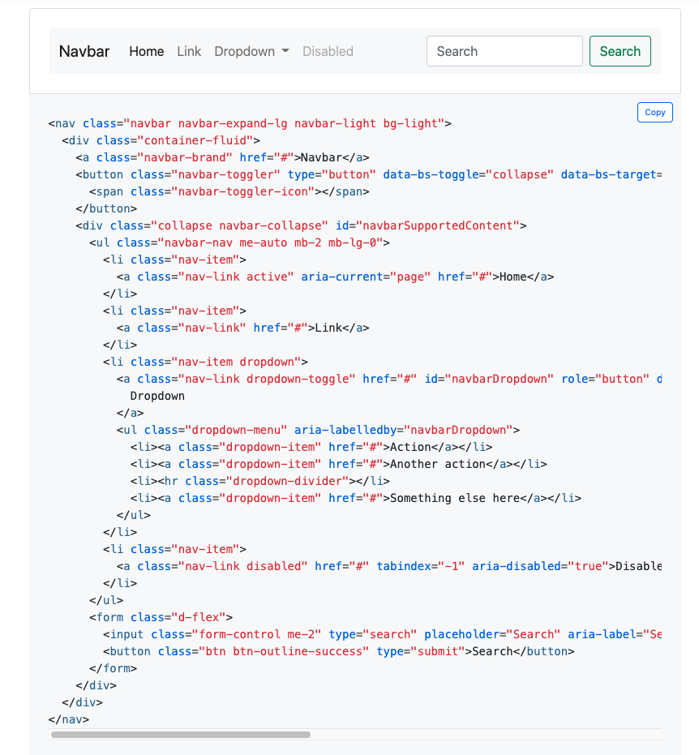

Esto lo vamos a insertar dentro de nuestro componente principal `app.component.html` justo al comienzo.

```html
<nav class="navbar navbar-expand-lg navbar-light bg-light">
  <div class="container-fluid">
    <a class="navbar-brand" href="#">Navbar</a>
    <button class="navbar-toggler" type="button" data-bs-toggle="collapse" data-bs-target="#navbarSupportedContent" aria-controls="navbarSupportedContent" aria-expanded="false" aria-label="Toggle navigation">
      <span class="navbar-toggler-icon"></span>
    </button>
    <div class="collapse navbar-collapse" id="navbarSupportedContent">
      <ul class="navbar-nav me-auto mb-2 mb-lg-0">
        <li class="nav-item">
          <a class="nav-link active" aria-current="page" href="#">Home</a>
        </li>
        <li class="nav-item">
          <a class="nav-link" href="#">Link</a>
        </li>
        <li class="nav-item dropdown">
          <a class="nav-link dropdown-toggle" href="#" id="navbarDropdown" role="button" data-bs-toggle="dropdown" aria-expanded="false">
            Dropdown
          </a>
          <ul class="dropdown-menu" aria-labelledby="navbarDropdown">
            <li><a class="dropdown-item" href="#">Action</a></li>
            <li><a class="dropdown-item" href="#">Another action</a></li>
            <li><hr class="dropdown-divider"></li>
            <li><a class="dropdown-item" href="#">Something else here</a></li>
          </ul>
        </li>
        <li class="nav-item">
          <a class="nav-link disabled" href="#" tabindex="-1" aria-disabled="true">Disabled</a>
        </li>
      </ul>
      <form class="d-flex">
        <input class="form-control me-2" type="search" placeholder="Search" aria-label="Search">
        <button class="btn btn-outline-success" type="submit">Search</button>
      </form>
    </div>
  </div>
</nav>

<h1>{{ title }}</h1>
<ul>
  <li>{{curso}}</li>
  <li>{{profesor}}</li>
</ul>
```

Después obviamente también lo vamos a mejorar, a optimizar, vamos a crear componentes por ejemplo un componente específico para el *Header* que contenga el menú de navegación, un *componente para el cuerpo*, el body, que sería el contenido principal dinámico que va cambiando según las rutas de los componentes y finalmente vamos a tener el *Footer*, también podríamos tener un *Sidebar*, por ahora en esta clase vamos a dejar el menú de navegación a secas en `app.component.html` que básicamente podría ser nuestro Layout lo vamos a guardar y ejecutamos.

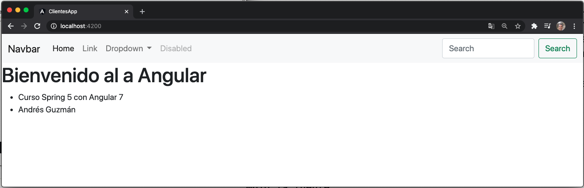

Es recomendable cuando trabajamos con Angular abrir las herramientas de desarrollo con F12.

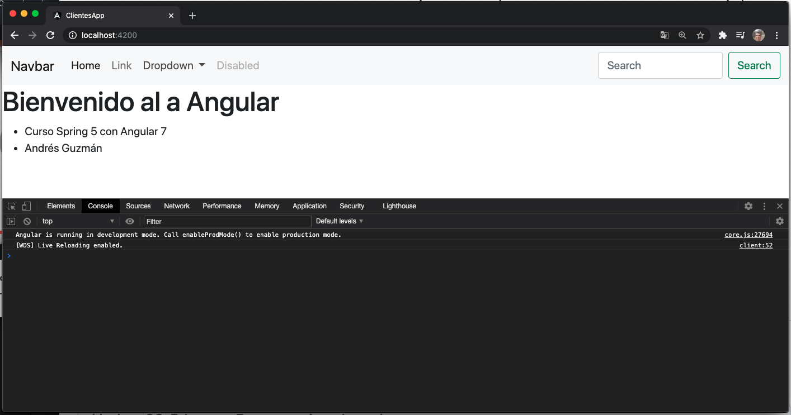

que nos va a permitir ver lo que sucede cuando ejecutamos nuestra aplicación y nos permitirá ver posibles errores que tengamos en nuestro código.

## Creando nuevo componente HeaderComponent 10:37

En el ejemplo anterior creamos nuestro Navbar, el menú para nuestra página pero la incluimos en duro dentro del `app.component.html`. La idea es tener un componente separado que no esté tan acoplado al componente principal, entonces la idea es crear desde cero.

Vamos a ver diferentes formas para crear componentes ya sea de forma automática utilizando la consola Angular CLI o bien crear cada componente, la clase, la vista de forma manual, archivo por archivo y por supuesto tenemos que configurar y registrarlo en Angular.

La idea es que en el archivo `app.component.html` donde insertamos el menú de navegación en vez de eso solo tener una etiquta `<app-header></app-header>`.


```html
<app-header></app-header>

<h1>{{ title }}</h1>
<ul>
  <li>{{curso}}</li>
  <li>{{profesor}}</li>
</ul>
```

Si ejecutamos la aplicación tenemos:

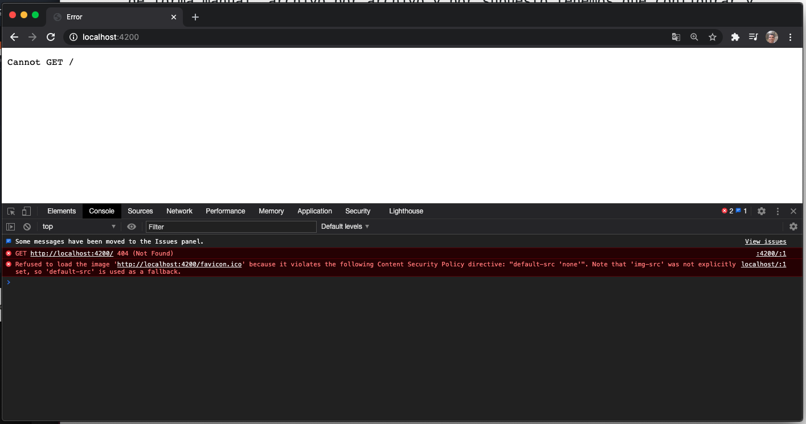

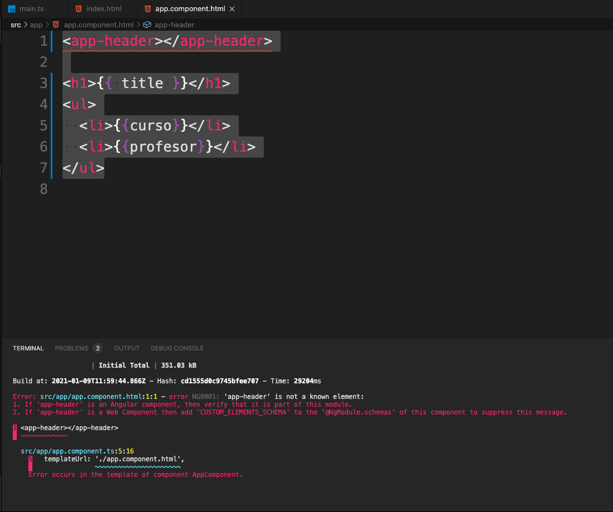

un error por que es componente aun no existe.

#### Crear el Componente `Header`

Vamos a crear el Componente `Header` de forma manual, lo primero es tener una carpeta `header` 

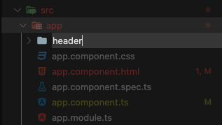

y dentro vamos a crear nuestra clase `header.component.ts`, este nombre responde a una nomenclatura a un estándar recomendado en Angular.

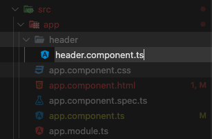

Lo primero es crear la clase, la sintaxis es usar `export` básicamente nos permite poder exportar esta clase para que se pueda utilizar, para que se pueda registrar, guardar en la configuración del `app.module.ts` el contenedor de angulas. Una clase de tipo component debería llevar el sufijo component.

```js
export class HeaderComponent {

}
```

La clase tiene que estar anotada con un decorador `@Component` para lo cual previamente debemos importar esa anotación. Dentro de `@Component` añadimos los atributos el *selector*, el *temple* o el *templateUrl*, por ahora usaremos `temple` y usamos el carácter de multilínea para colocar todo el contenido HTML en vez de usar una plantilla HTML.

Por supuesto vamos a ver las dos formas, primero con temple, se recomienda cuando son HTML muy básico de 3 a 5 líneas como máximo, pero si son más de 5 líneas es 
mucho mejor ya tener un archivo separado utilizando *templateUrl*.

Nuestro componente `header.component.ts` final nos queda así:

```js
import { Component } from '@angular/core';

@Component({
  selector: 'app-header',
  template: `
  <h1>Angular - Spring</h1>
  `
})
export class HeaderComponent {

}
```

Qué es lo que faltaría para que este componente funcione en nuestra aplicación ya que hasta el momento solamente hemos creado la clase nadamas una clase dentro de proyecto pero en ninguna parte le estamos diciendo a Angular que tenemos un nuevo componente, en ninguna parte lo hemos configurado.

Para eso nos vamos a `app.module.ts` lo primero es importar el componente, esto lo podemos hacer gracias a que cuando creamos la clase se define la firma como `export` para que después se pueda importar y utilizar.

```js
import { HeaderComponent } from './header/header.component';
```

Lo debemos registrar en:

```js
  declarations: [
    AppComponent,
    HeaderComponent
  ],
```

Nuestro `app.module.ts` completo nos queda así:


```js
import { BrowserModule } from '@angular/platform-browser';
import { NgModule } from '@angular/core';

import { AppComponent } from './app.component';
import { HeaderComponent } from './header/header.component';

@NgModule({
  declarations: [
    AppComponent,
    HeaderComponent
  ],
  imports: [
    BrowserModule
  ],
  providers: [],
  bootstrap: [AppComponent]
})
export class AppModule { }
```

Si volvemos a nuestro navegador tenemos:

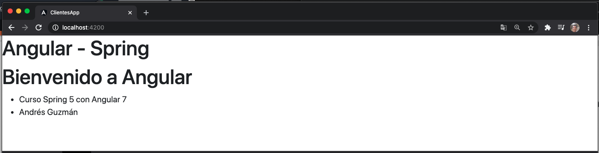

Ahora que ya vimos que funciona nuestro componente `header.component.ts` vamos a meter dentro de el todo el Navbar con un título personalizado.

```js
import { Component } from '@angular/core';

@Component({
  selector: 'app-header',
  template: `
  <nav class="navbar navbar-expand-lg navbar-light bg-light">
  <div class="container-fluid">
    <a class="navbar-brand" href="#">{{title}}</a>
    <button class="navbar-toggler" type="button" data-bs-toggle="collapse" data-bs-target="#navbarSupportedContent" aria-controls="navbarSupportedContent" aria-expanded="false" aria-label="Toggle navigation">
      <span class="navbar-toggler-icon"></span>
    </button>
    <div class="collapse navbar-collapse" id="navbarSupportedContent">
      <ul class="navbar-nav me-auto mb-2 mb-lg-0">
        <li class="nav-item">
          <a class="nav-link active" aria-current="page" href="#">Home</a>
        </li>
        <li class="nav-item">
          <a class="nav-link" href="#">Link</a>
        </li>
        <li class="nav-item dropdown">
          <a class="nav-link dropdown-toggle" href="#" id="navbarDropdown" role="button" data-bs-toggle="dropdown" aria-expanded="false">
            Dropdown
          </a>
          <ul class="dropdown-menu" aria-labelledby="navbarDropdown">
            <li><a class="dropdown-item" href="#">Action</a></li>
            <li><a class="dropdown-item" href="#">Another action</a></li>
            <li><hr class="dropdown-divider"></li>
            <li><a class="dropdown-item" href="#">Something else here</a></li>
          </ul>
        </li>
        <li class="nav-item">
          <a class="nav-link disabled" href="#" tabindex="-1" aria-disabled="true">Disabled</a>
        </li>
      </ul>
      <form class="d-flex">
        <input class="form-control me-2" type="search" placeholder="Search" aria-label="Search">
        <button class="btn btn-outline-success" type="submit">Search</button>
      </form>
    </div>
  </div>
</nav>
  `
})
export class HeaderComponent {
  title: string = 'App Angular'
}
```

Y vemos que pasa en el navegador.

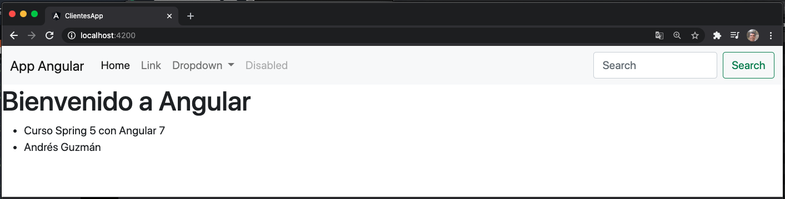

Ya tenemos nuestro NavBar en un componente independiente y funcionando.

## Separando el template del componente con TemplateUrl 02:31


```js
```
```js
```

```js
```

```js
```
```js
```
## Creando nuevo componente FooterComponent 10:07
## Directiva estructural `*ngFor` 07:07
## Directiva estructural `*ngIf` 04:48
