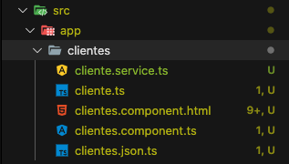

# 03. Angular: Componente Clientes - 11 Clases - 55 min

* Creando el componente clientes.component 03:28
* Listando los objetos del tipo Cliente 07:17
* Creando archivo clientes.json.ts con la lista de objetos 02:51
* Creando la clase de Servicio ClienteService y la Inyección de Dependencia 07:51
* Introducción a los Observables 09:56
* Implementando Observable en nuestra clase Servicio ClienteService 08:18
* Implementando Rutas en Angular y navegación 05:14
* Actualización: sobre el archivo angular.cli.json vs angular.json 00:39
* Configurando e integrando Bootstrap de forma local en nuestra app 05:32
* Actualización: configurando los styles y scripts en archivo angular.json 00:17
* Instalando Bootstrap utilizando el comando npm desde el terminal 03:55

## Creando el Componente `clientes.component` 03:28

Vamos a trabajar con nuestra aplicación Clientes, la idea es crear un nuevo componente `clientes.component`, vamos a crear una clase TypeScrip con los atributos `nombre`, `apellido`, `email` y la `fecha`.

Por ahora vamos a armar nuestro ejemplo de forma sencilla trabajando con angular en un archivo que contenga el listado de clientes en un formato JSON, luego después en vez de leer el listado de clientes de JSON estático desde un archivo vamos a obtener los clientes desde un API REST de Spring por el lado BackEnd. 

Vamos a ir a la consola para crear nuestro componente con el siguiente comando:

```sh
ng g c clientes
```


De forma automática crea la clase, la vista HTML, la hojas de estilos y la clase de test.

También vamos a crear la clase `cliente` para el modelo como sigue:


Con el siguiente comando creamos una clase. 

```sh
ng g class cliente
```

Aquí tenemos lo que hemos creado:


Vamos a borrar los archivos de de pruebas unitarias y la hoja de estilos.


Modificamos `clientes.component.ts` para eliminar la hoja de estilos.

En nuestra clase de modelo `Cliente` vamos a insertar los atributos necesarios:

```js
export class Cliente {
  id: number;
  nombre: string;
  apellido: string;
  createAt: string;
  email: string;
}
```

## Listando los objetos del tipo Cliente 07:17

Vamos a crear el listado de clientes en el componente `clientes.component`, vamos a `clientes.component.ts` y vamos a tener un atributo del tipo array de `Cliente`, para poder usar `Cliente` lo debemos importar.

```js
import { Component, OnInit } from '@angular/core';
import { Cliente } from './cliente'

@Component({
  selector: 'app-clientes',
  templateUrl: './clientes.component.html'
})
export class ClientesComponent implements OnInit {

  clientes: Cliente[] = [
    {id: 1,  nombre: 'Andrés', apellido: 'Guzmán', email: 'profesor@bolsadeideas.com', createAt: '2018-01-01'},
    {id: 2,  nombre: 'Mr. John', apellido: 'Doe', email: 'john.doe@gmail.com', createAt: '2018-01-02'},
    {id: 3,  nombre: 'Linus', apellido: 'Torvalds', email: 'linus.torvalds@gmail.com', createAt: '2018-01-03'},
    {id: 4,  nombre: 'Rasmus', apellido: 'Lerdorf', email: 'rasmus.lerdorf@gmail.com', createAt: '2018-01-04'},
    {id: 5,  nombre: 'Erich', apellido: 'Gamma', email: 'erich.gamma@gmail.com', createAt: '2018-02-01'},
    {id: 6,  nombre: 'Richard', apellido: 'Helm', email: 'richard.helm@gmail.com', createAt: '2018-02-10'},
    {id: 7,  nombre: 'Ralph', apellido: 'Johnson', email: 'ralph.johnson@gmail.com', createAt: '2018-02-18'},
    {id: 8,  nombre: 'John', apellido: 'Vlissides', email: 'john.vlissides@gmail.com', createAt: '2018-02-28'},
    {id: 9,  nombre: 'Dr. James', apellido: 'Gosling', email: 'james.gosling@gmail.com', createAt: '2018-03-03'},
    {id: 10, nombre: 'Magma', apellido: 'Lee', email: 'magma.lee@gmail.com', createAt: '2018-03-04'},
    {id: 11, nombre: 'Tornado', apellido: 'Roe', email: 'tornado.roe@gmail.com', createAt: '2018-03-05'},
    {id: 12, nombre: 'Jade', apellido: 'Doe', email: 'jane.doe@gmail.com', createAt: '2018-03-06'}
];

  constructor() { }

  ngOnInit(): void {
  }

}
```

El siguiente paso es implementar la vista para mostrar el listado de clientes, en `clientes.component.html` vamos a implementar los paneles de Bootstrap para renderizar la lista de clientes.

```html
<div class="card border-primary mb-3">
  <div class="card-header">Clientes</div>
  <div class="card-body text-primary">
    <h5 class="card-title">Listado de Clientes</h5>
    <table class="table table-border table-sprited">
      <thead>
        <tr>
          <td>Id</td>
          <td>Nombre</td>
          <td>Apellido</td>
          <td>Email</td>
          <td>Fecha</td>
        </tr>
      </thead>
      <tbody>
        <tr *ngFor="let cliente of clientes">
          <td> {{ cliente.id }}</td>
          <td> {{ cliente.nombre }}</td>
          <td> {{ cliente.apellido }}</td>
          <td> {{ cliente.email }}</td>
          <td> {{ cliente.createAt }}</td>
        </tr>
      </tbody>
    </table>
  </div>
</div>
```

Nos faltaría poner el selector `app-clientes` en `app.component.html` lo vamos a colocar en lugar de `app-directiva`.

El resultado es:


## Creando archivo `clientes.json.ts` con la Lista de Objetos 02:51

Vamos a desacoplar el listado de los clientes del componente Clientes ya que estamos mezclando datos con lógica.

* En la carpeta `clientes` creamos el archivo `clientes.json.ts`


y movemos el listado de clientes aquí, lo declaramos como una constante y le ponemos el calificador `export` para poderlo exportar (importar desde otras clases):
```js
import { Cliente } from './cliente';

export const CLIENTES : Cliente[] = [
    {id: 1,  nombre: 'Andrés', apellido: 'Guzmán', email: 'profesor@bolsadeideas.com', createAt: '2018-01-01'},
    {id: 2,  nombre: 'Mr. John', apellido: 'Doe', email: 'john.doe@gmail.com', createAt: '2018-01-02'},
    {id: 3,  nombre: 'Linus', apellido: 'Torvalds', email: 'linus.torvalds@gmail.com', createAt: '2018-01-03'},
    {id: 4,  nombre: 'Rasmus', apellido: 'Lerdorf', email: 'rasmus.lerdorf@gmail.com', createAt: '2018-01-04'},
    {id: 5,  nombre: 'Erich', apellido: 'Gamma', email: 'erich.gamma@gmail.com', createAt: '2018-02-01'},
    {id: 6,  nombre: 'Richard', apellido: 'Helm', email: 'richard.helm@gmail.com', createAt: '2018-02-10'},
    {id: 7,  nombre: 'Ralph', apellido: 'Johnson', email: 'ralph.johnson@gmail.com', createAt: '2018-02-18'},
    {id: 8,  nombre: 'John', apellido: 'Vlissides', email: 'john.vlissides@gmail.com', createAt: '2018-02-28'},
    {id: 9,  nombre: 'Dr. James', apellido: 'Gosling', email: 'james.gosling@gmail.com', createAt: '2018-03-03'},
    {id: 10, nombre: 'Magma', apellido: 'Lee', email: 'magma.lee@gmail.com', createAt: '2018-03-04'},
    {id: 11, nombre: 'Tornado', apellido: 'Roe', email: 'tornado.roe@gmail.com', createAt: '2018-03-05'},
    {id: 12, nombre: 'Jade', apellido: 'Doe', email: 'jane.doe@gmail.com', createAt: '2018-03-06'}
  ];
```

* En `clientes.component.ts` declaramos el Array vacío: `clientes: Cliente[];`
* En `clientes.component.ts` importaremos la constante CLIENTES por eso la definimos con `export`: 
`import { CLIENTES } from './clientes.json';`
* En el método `ngOnItit()` que es cuando se inicia el componente asignaremos `CLIENTES` a nuestra propiedad `clientes`.
```js
ngOnInit() {
  this.clientes = CLIENTES;
}
```

La clase `clientes.component.ts` completa queda así:

```js
import { Component, OnInit } from '@angular/core';
import { Cliente } from './cliente';
import { CLIENTES } from './clientes.json';

@Component({
  selector: 'app-clientes',
  templateUrl: './clientes.component.html'
})
export class ClientesComponent implements OnInit {

  clientes: Cliente[];

  constructor() { }

  ngOnInit(): void {
    this.clientes = CLIENTES;
  }

}
```

Este es todo el cambio, todo sigue funcionando igual,


pero queda más limpio, los datos quedan en un archivo separado **SIMULANDO COMO SI FUERA UN JSON QUE OBTENEMOS DE UN API REST O DE UNA BD**

## Creando la clase de Servicio ClienteService y la Inyección de Dependencia 07:51

Aun que sacamos los datos del componente, aun quedan rastros de los datos dentro del componente, como la importación del archivo `clientes.json` y el uso de la constante `CLIENTES`, **la idea es DESACOPLAR COMPLETAMENTE TODO LO REFERENTE A LOS DATOS, MODELO O LÓGICA DE NEGOCIOS DE LA CLASE Component** por lo que tenemos que **mover `CLIENTES` a una clase especializada en la Lógica de Negocios** que sería **nuestra clase ClienteService**

* Dentro de la carpeta `clientes` crear el **servicio** cliente con el comando: `ng g service cliente` se crea una clase de tipo `service`:


Se ha creado dos archivos la clase `service` y el archivo de pruebas unitarias que lo vamos a eliminar y además se a registrado en `app.module.ts`.



Este es el esqueleto de la clase `ClienteService`:

```js
import { Injectable } from '@angular/core';

@Injectable({
  providedIn: 'root'
})
export class ClienteService {

  constructor() { }
}
```
El decorador `@Injectable` representa lógica de negocios por lo que las clases de servicio llevaran este decorador, lo que nos permite **INYECTAR EN OTRO COMPONENTE VÍA INYECCION DE DEPENDENCIAS**.
Otra cosa muy importante es que dentro de `@Injectable` tenemos el atributo `providedIn: 'root'` lo que permite usar el servicio en cualquier componente, **ANTES TENIAMOS QUE DECLARAR EL SERVICIO EN EL `app.module.ts` DENTRO DEL APARTADO `providers: []`.

* Mover el import de CLIENTES del `clientes.component.ts` y lo llevamos a `cliente.service.ts`
* Crear el método `getClientes()` de tipo array de clientes, que va a retornar los clientes, debemos importar la clase `Cliente`.

```js
...
import { Cliente } from './cliente';
...
getClientes(): Cliente[] {
    return CLIENTES;
}
...
```

Nuestra clase de servicio `cliente.service.ts` completa nos queda así:

```js
import { Injectable } from '@angular/core';
import { CLIENTES } from './clientes.json';
import { Cliente } from './cliente';

@Injectable({
  providedIn: 'root'
})
export class ClienteService {

  constructor() { }

  getClientes(): Cliente[] {
    return CLIENTES;
  }
}
```

* Inyectar la clase service `cliente.service.ts` (debemos importarla) a través de la inyección de dependencias en `cliente.component.ts` esto se hace en el constructo:
`constructor(private clienteService: ClienteService) { }`
* Y en el método `ngOnInit()` le asignamos a nuestro atributo `clientes` el método `getClientes()`:
```js
ngOnInit() {
  this.clientes = this.clienteService.getClientes();
}
```

Nuestra clase de componente `cliente.component.ts` completa nos queda así:

```js
import { Component, OnInit } from '@angular/core';
import { Cliente } from './cliente';
import { ClienteService } from './cliente.service';


@Component({
  selector: 'app-clientes',
  templateUrl: './clientes.component.html'
})
export class ClientesComponent implements OnInit {

  clientes: Cliente[];

  constructor(private clienteService: ClienteService) { }

  ngOnInit(): void {
    this.clientes = this.clienteService.getClientes();
  }

}
```

Si vemos en el navegador el resultado es:


**YA TENEMOS SEPARADOS LOS DIFERENTES ROLES:**

* La clase `component` representa a nuestro **CONTROLADOR**
* La clase `service` representa a nuestra al **MODELO** o Lógica de Negocio
* El archivo `html` representa a la **VISTA**

## Introducción a los Observables 09:56


Vamos a ver una pequeña introducción a los observables que es parte del **API Reactive Streams de JavaScript RxJs**.

Es una librería de JavaScript que nos permite implementar programación reactiva en Angular y es para traja con datos, con flujos que puede que vengan no de forma inmediata, puede tener un delay, algún tiempo de espera.

La idea es trabajar con eventos, suscribirnos y estar pendiente escuchando cuando se emitan estos flujo de datos, estos streams. Cuando se emiten hay implementar un código que se le conoce como un ***observador o centinela***, que es un fragmento de código que está pendiente escuchando y se encarga de ejecutar algo, realizar un proceso cuando se reciben los datos, cuando llegan, entonces el ***observable es el evento***, el ***observador es el centinela***, nuestro código que maneja estos datos, que lo recibe, el observable emite estos datos. 

Para resumir un observador, nuestro código reacciona a cualquier elemento de este flujo o secuencia del evento que se esté emetiendo en este observable y tenemos que suscribirnos.


Veamos las características de los observables.

Primero es **Asíncrono**, nos sirve para trabajar tareas que son asíncronas, peticiones HTTP, consumo de API Rest a un Backend muy similar a peticiones AJAX nativas donde esperamos una respuesta del Backend un HTTP response, enviamos un request, un HTTP request y esto podría tener un delay, podría tardar, entonces por eso lo manejamos de esta forma, de forma reactiva con una suscripción y con un observador, ese es el escenario típico que utilizamos en el curso, ya que estamos trabajando con MicroServicios y con API Rest.

También podemos implementar estos o cerrarle para cualquier trabajo o tarea que queramos ejecutar y esperar una respuesta que no viene de forma inmediata por ejemplo, de nuestra aplicación se realiza un cambio se dispara un evento, también podemos suscribirnos a este evento, a este observable y cuando se dispare manejar alguna tarea con este nuevo cambio que se acaba de ejecutar.

Ejemplos hay muchos contadores, intervalos de tiempo etc. Un ejemplo típico es cuando utilizamos ***EventEmiter*** de Angular.

Otra característica es **Flujo de Datos o streams**, pueden ser varios datos o uno solo es decir, cuando nos suscribimos podríamos estar escuchando o esperar que se emita una gran cantidad de elementos, una secuencia o bien un solo dato que se emite. 


Es como un típico proceso de fábrica donde tenemos una correa transportadora con varios productos, cada uno de estos productos es un item de algo y se puede manejar como un stream y tenemos distintas estaciones de trabajo que reciben estos productos y los empaquetan, realizan alguna tarea con este producto, en otra estación de trabajo les amplian otras cosa etc.

Otra característica es que son **Concurrentes**, por lo tanto no bloquean otros procesos por lo tanto cada observable se ejecuta en su propio proceso y no interfiere, no bloquea a los demás, por lo tanto es concurrente, maneja concurrencia, no bloquea las tareas. 

Un observable no se ejecuta si no nos **Suscribimos**, es decir, podríamos invocar un observable pero mientras no invoquemos el método subscribe, mientras no implementemos nuestro código, nuestro observador o centinela, simplemente no hace nada.

También podemos aplicar **Operadores en nuestro flujo** (map), en nuestros datos, realizar algún cambio, modificar el flujo, esto se aplica también a los objetos, es decir, podríamos tener un stream del tipo string y podríamos convertir esto en otro tipo de dato, por ejemplo, en objetos de tipo usuario. Podemos tomar un objeto y le podemos asignar valores, realizar cálculos, guardar información extra en atributos o modificar atributos. Tenemos el operador map para convertir datos,  el filter para filtrar, el retry para "intentar" por ejemplo si ocurre un error en nuestra comunicación o en el flujo y quiero volver a intentar comunicarme por ejemplo con el API Rest y obtener los datos. También tenemos otros operadores para trabajar con intervalo de tiempo, con cálculo matemático, calcular el máximo, el mínimo, el count para contar, el sum para sumar. También podemos concatenar es decir, combinar dos flujos. También podemos repetir dos o varias veces el mismo flujo. 

Podemos trabajar con el **manejo de error y reintentos**.

También **pueden ser infinitos** nos podríamos suscribir a un evento que esté emitiendo mensajes de alerta de forma indeterminada, así es como trajan la mayoría de las redes sociales Instagram, Facebook cada vez que alguien publica algo nosotros estamos recibiendo notificaciones y eso es siempre.

La gran mayoría son **finitos**, es decir, un proceso que realiza alguna tarea, se emite algún dato o una secuencia y finaliza.

Otra característica súper importante de los observable que **se pueden cancelar** en cualquier momento y ante cualquier inconveniente o problema, podríamos cancelar nuestro observable, la suscripción invocando el método unsuscribe, entonces cualquier momento podemos terminar la suscripción o cancelar y finaliza el observador.

Son **inmutables** cada observable, cada flujo es inmutable en sí mismo, esto quiere decir que cada que modificamos el flujo con un operador, lo que hace es no modificar el flujo original, el flujo original no cambia, lo que hace es retornar un nuevo flujo, un nuevo observable, un stream con los nuevos datos, con los datos modificados, ya sea con el MAP, con el filter, con el merch, con el concat, con el zep, en fin, con cualquier operador que modifique los datos siempre retorna un nuevo observable con estos cambios y el anterior se mantiene tal cual, siempre podemos volver a los datos originales.

Estas serían la características más importante.

## Implementando Observable en nuestra clase de Servicio `ClienteService` 08:18

Vamos a modificar la clase `cliente.service` para que las peticiones sean más **REACTIVAS** y **ASINCRONAS** para cuando trabajemos con el API REST. El método `getCliente()` actual es un método **SINCRONO** por lo que no podría trabajar correntamente con un API REST, ya que se necesita trabajar con peticiones Asincronas que no bloquen nuestra aplicación mientras espera la respuesta del servidor. Además la idea es que se puedan realizar varias peticiones al servidor al mismo tiempo, que no esten sincronizadas entre si, y que se puedan manejar de forma paralela al mismo tiempo y en tiempo real. 

**REACTIVO**

El concepto **REACTIVO** es que reaccione en Tiempo Real y a travéz de flujos de datos con **Streams**, flujos de datos de entrada y salida.

Por lo que tenemos que modificar nuestro método `getClientes(): Clientes[]` para que nuestro tipo `Clientes[]` lo transformemos a un **Stream** y para eso utilizamos el **API Observable**.

* Importar la clase Observable: `import { Observable } from 'rxjs';`.
* Lo que retorna el método `getClientes()` debe ser un **Stream** es decir un **Observable** de clientes: 
`getClientes(): Observable<Cliente[]> {`
* Por lo que que lo que se retorna `return CLIENTES;` tambien debe ser un observable para que sea del mismo tipo de lo que regresamos:
`return of(CLIENTES);`
* Importar el operador `of` de `rxjs`: `import { Observable, of } from 'rxjs';`.

La clase `cliente.service` completa nos queda así:

```js
import { Injectable } from '@angular/core';
import { CLIENTES } from './clientes.json';
import { Cliente } from './cliente';
import { Observable, of } from 'rxjs';

@Injectable({
  providedIn: 'root'
})
export class ClienteService {

  constructor() { }

  getClientes(): Observable<Cliente[]> {
    return of(CLIENTES);
  }
}
```

**Hemos convertido nuestro listado de clientes en un Observable en un Stream, en un flujo de datos**

## Concepto Observable y patrón de diseño Observador

El Observable esta basado en el **patrón de diseño Observador**, donde tenemos un **Sujeto que es Observable**, en este caso nuestro Cliente y tenemos también **Observadores**, que estan atentos escuchando un posible cambio en el sujeto, estos observadores se suscriben al sujeto (el `Observable`) y cuando cambia su estado se notifica a los observadores para que lleven a cabo algún proceso o tarea según las necesidades.

Esto debería hacer que cuando cambia algún dato en el servidor(Spring) automáticamente notifique al cliente y se actualicen en tiempo real los datos en el cliente, sin necesidad de recargar la página. 

* En `cliente.component.ts` tenemos que **registrar o suscribir el observador** a nuestros clientes(el `Observable` que es `getClientes() el cual va a ser Observado por Observadores`) por lo que vamos a cambiar:

```js
ngOnInit() {
  this.clientes = this.clienteService.getClientes();
}
```

Por:

```js
ngOnInit() {
  this.clienteService.getClientes().subscribe( 
    clientes => this.clientes = clientes
  );
}
```
Desde el observador nos estamos **Suscribiendo** para escuchar al Observable y este nos regresa un resultado que estamos recibiendo en `clientes` y este valor se lo asignamos a nuestro atributo `clientes`, todo ello usando una función anónima, podríamos haber puesto:
```js
ngOnInit() {
  this.clienteService.getClientes().subscribe( 
    function(clientes) {
      this.clientes = clientes
    } 
  );
}
```
Pero usaremos la función anónima.

La clase `cliente.component.ts` completa nos queda así

```js
import { Component, OnInit } from '@angular/core';
import { Cliente } from './cliente';
import { ClienteService } from './cliente.service';

@Component({
  selector: 'app-clientes',
  templateUrl: './clientes.component.html'
})
export class ClientesComponent implements OnInit {

  clientes: Cliente[];

  constructor(private clienteService: ClienteService) { }

  ngOnInit() {
    this.clienteService.getClientes().subscribe(
      clientes => this.clientes = clientes
    );
  }

}
```

La aplicación se sigue viendo igual pero ya esta trabajando de forma REACTIVA y ASINCRONA.


## Implementando Rutas en Angular y navegación 05:14

Utilizando rutas podemos dividir nuestra aplicación en varias secciones o áreas las cuales se podrían llamar páginas pero en realidad no son páginas. Recordemos que una aplicación en Angular son aplicaciones en una sola página **SPA Single Page Aplication**, es decir tenemos una sola página para renderizar páginas diferentes y Angular utiliza esta técnica del Routing para realizarlo.

Entonces la idea es:
* Dentro de la página de Rutas anidar un contenido de un componente que esté mapeado a una URL.
* El siguiente paso sería indicar a angular que URL se tienen que mapear o asignar a nuestros componentes 

En el codigo:

* Ir a `app.module.ts`
* Importar `RouterModule` y `Routes` : `import { RouterModule, Routes } from '@angular/router';`
* Crear constante `routes` del tipo `Routes`, que contiene un array de rutas donde vamos a definir las rutas o URL de cada componente de nuestra aplicación:
```js
const routes: Routes = [
  {path: '', redirectTo: '/clientes', pathMatch: 'full'},
  {path: 'directivas', component: DirectivaComponent},
  {path: 'clientes', component: ClientesComponent}
];
```
   El path vacio representa nuestra página principal o home que redige a `/clientes` el `pathMatch: 'full'` hace un Match completo con la URL.
* Finalmente hay que importar el `RouterModule` pasandole como parámetro nuestro array de rutas:
```js
imports: [
  BrowserModule,
  RouterModule.forRoot(routes)
],
```

Nuestro `app.module.ts` completo nos queda así:

```js
import { BrowserModule } from '@angular/platform-browser';
import { NgModule } from '@angular/core';
import { RouterModule, Routes } from '@angular/router';

import { AppComponent } from './app.component';
import { HeaderComponent } from './header/header.component';
import { FooterComponent } from './footer/footer.component';
import { DirectivaComponent } from './directiva/directiva.component';
import { ClientesComponent } from './clientes/clientes.component';

const routes: Routes = [
  {path: '', redirectTo: '/clientes', pathMatch: 'full'},
  {path: 'directivas', component: DirectivaComponent},
  {path: 'clientes', component: ClientesComponent}
];

@NgModule({
  declarations: [
    AppComponent,
    HeaderComponent,
    FooterComponent,
    DirectivaComponent,
    ClientesComponent
  ],
  imports: [
    BrowserModule,
    RouterModule.forRoot(routes)
  ],
  providers: [],
  bootstrap: [AppComponent]
})
export class AppModule { }
```

* Ir a `app.component.html` 
* Poner la directiva especial para cargar las rutas `<router-outlet>` en lugar de la que tenemos actualmente `<app-clientes>`:
```js
<app-header></app-header>
<div class="container">
    <router-outlet></router-outlet>
</div>
<app-footer></app-footer>
```
`<router-outlet>` es una directiva de Angular para indicar donde se van a renderizar el contenido (el componente) de cada ruta que seleccionemos.

* Ir a `header.component.html`
* Meter los links correspondientes para cada opción del menú.
```js
<li class='nav-item' routerLinkActive="active">
    <a class='nav-link' routerLink="/directivas">Directivas</a>
</li>
<li class='nav-item' routerLinkActive="active">
    <a class='nav-link' routerLink="/clientes">Clientes</a>
</li>
```

La directiva `routerLink` permite agregar el link de lo que queremos mostrar.
La directiva `routerLinkActive` dejamos marcada la opción seleccionada.

Guardamos y vamos a levantar el servidor, automáticamente redirige a Clientes y lo marca(A MI NO, hasta que hago click en el) , si nos vamos a Directivas también lo marca. De esta forma podemos tenemos nuestras propias rutas que por estar mapeado a los distintos componentes los cargan al seleccionarlas.

En ningún momento se está actualizando la página, siempre nos mantenemos en una sola página, pero lo que cambia es el contenido principal, a través de la directiva `<router-outlet>` que tenemos en la plantilla principal `app.component.html`.


## Actualización: sobre el archivo angular.cli.json vs angular.json 00:41

¿Los archivos angular.cli.json y angular.json son los mismo?

Desde la versión 6 y 7 de angular se pasó a llamar angular.json, pero en versiones anteriores de angular se llamaba angular.cli.json pero básicamente son y sirven para lo mismo.

¿Por qué no me aparece el angular.cli.json?

Se debe a que estamos trabajando y estamos actualizados

## Configurando e integrando Bootstrap de forma local en nuestra app 05:32

### Primera forma

* En la carpeta `assets` crear las carpetas `css` y `js`.
* Descargar los archivos de bootstrap y meterlo en las carpetas `css` y `js`.
* En el archivo `index.html` hacer referencia a los archivos locales.
```html
<!doctype html>
<html lang='en'>
<head>
  <meta charset='utf-8'>
  <title>ClientesApp</title>
  <base href='/'>
  <meta name='viewport' content='width=device-width, initial-scale=1'>
  <link rel='icon' type='image/x-icon' href='favicon.ico'>
  <link rel='stylesheet' href='assets/css/bootstrap.min.css'>

</head>
<body>
  <app-root></app-root>
  <script src='assets/js/jquery-3.4.1.slim.min.js'></script>
  <script src='assets/js/popper.min.js'></script>
  <script src='assets/js//bootstrap.min.js'></script>
</body>
</html>
```

### Primera forma

* Ir a `angular.json`
* Colocar los `css` en el array `"styles` y los `js` en el array `"scripts"`:
```js
"styles": [
  "src/styles.css",
  "assets/css/bootstrap.min.css"
],
"scripts": [
  "assets/js/jquery-3.4.1.slim.min.js",
  "assets/js/popper.min.js",
  "assets/js//bootstrap.min.js"
]
```
* Quitar los links en `index.html`
```html
<!doctype html>
<html lang='en'>
<head>
  <meta charset='utf-8'>
  <title>ClientesApp</title>
  <base href='/'>
  <meta name='viewport' content='width=device-width, initial-scale=1'>
  <link rel='icon' type='image/x-icon' href='favicon.ico'>
</head>
<body>
  <app-root></app-root>
</body>
</html>
```

Cuando se modifica el archivo `angular.json` o cualquiera de configuración es posible que se tenga que reiniciar el servidor.

## Actualización: configurando los styles y scripts en archivo angular.json 00:19

Esto es un adelanto a la próxima clase, para dejar en claro las diferencias entre los archivos angular.cli.json y angular.json respecto a configurar nuestras hojas de estilos "styles" y librerías js "scripts".

En las rutas de los "styles" y "scripts" de node_modules, debemos que cambiar esto: ../node_modules/ 

por esto: node_modules/ (es decir NO hay que incluir el ../ al principio).

## Instalando Bootstrap utilizando el comando npm desde el terminal 03:55

Para instalar Bootstrap con npm debemos ejecutar el comando:

`npm install bootstrap@4.1.1 jquery popper.js -save`

Con `--save` lo que se hace es guardar la dependencia en `package.json`

* En `angular.json` hacer las referencias a los archivos que se acaban de instalar dentro de `node_modules`.
```js
"styles": [
  "src/styles.css",
  "node_modules/bootstrap/dist/css/bootstrap.min.css"
],
"scripts": [
  "node_modules/jquery/dist/jquery.slim.min.js",
  "node_modules/popper.js/dist/umd/popper.min.js",
  "node_modules/bootstrap/dist/js//bootstrap.min.js"
]
```
* Eliminar las carpetas `css` y `js` que metimos en `assets`.
