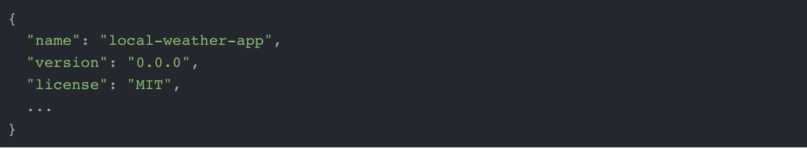

# Preface
* Who this book is for 
* What this book covers
* To get the most out of this book
   * Download the example code files
   * Download the color images
   * Conventions used
* Get in touch
   * Reviews

# Preface

¡Bienvenido al maravilloso mundo del desarrollo web! Este libro ha sido diseñado para enseñarle los fundamentos de la plataforma Angular y equiparlo con recetas útiles y ejemplos prácticos de código, para que pueda crear aplicaciones de línea de negocio enriquecidas y escalables. El libro enfatiza un enfoque minimalista, maximizando el uso de bibliotecas integradas y evitando la introducción de dependencias adicionales de terceros para lograr el resultado deseado. Como resultado de este enfoque, su código será más fácil de mantener y actualizar, ya que con frecuencia se lanzan nuevas versiones de Angular. Puede seguir utilizando este libro como recurso de aprendizaje, ya que los conceptos, tecnologías y ejemplos fundamentales incluidos en el libro seguirán siendo relevantes durante algún tiempo, aunque con ligeras modificaciones. Las herramientas y servicios recomendados en el libro se han actualizado a sus últimas versiones, alrededor de 2020; sin embargo, las herramientas y los servicios evolucionan, cambian y, a veces, desaparecen por completo. Si esto sucede, no dude en comunicarse conmigo para buscar alternativas.

Este libro también tendrá como objetivo inculcarle una mentalidad ágil y DevOps para que pueda crear con confianza soluciones confiables y flexibles. Ya sea que se considere un profesional independiente que desarrolla software para pequeñas empresas, un desarrollador full-stack, un desarrollador empresarial o un desarrollador web, lo que necesita saber para diseñar, diseñar, desarrollar, mantener, entregar e implementar una aplicación web y las mejores prácticas y patrones que necesita aplicar para lograr esas cosas, no varían tanto. Si está entregando una aplicación a una audiencia de usuarios, en cierto sentido, es un desarrollador full-stack, ya que debe conocer muchas tecnologías de servidor. De hecho, si domina cómo entregar aplicaciones angulares usando TypeScript, no será difícil para usted escribir sus propias API RESTful usando Node.js, Express.js y TypeScript, que se demuestra a través de una implementación concreta más adelante en el libro.

Según algunas definiciones, un desarrollador de pila completa necesita saber todo, desde el abastecimiento hasta la ley internacional de derechos de autor para crear y operar con éxito una aplicación en la web actual. Si eres un emprendedor, en cierto sentido, esto es cierto. Sin embargo, en este libro, no es necesario aplicar sus habilidades culinarias y sus títulos de derecho. Este libro asume que ya sabe cómo trabajar con los conceptos básicos del desarrollo web y que está familiarizado con las API RESTful con la pila tecnológica de su elección, y si no, no tema, simplemente siga las instrucciones prácticas paso a paso y usted podrá crear su primera aplicación Angular habilitada para API en poco tiempo.   
   
## Para quien es este libro

Este libro es para principiantes y desarrolladores experimentados que buscan aprender Angular o desarrollo web en general. Si es un desarrollador de Angular, estará expuesto a toda la gama de diseño e implementación de una aplicación Angular en producción. Aprenderá sobre patrones angulares que son fáciles de entender y enseñar a otros. Si es un profesional independiente, obtendrá herramientas y tecnologías efectivas para entregar su aplicación Angular de una manera segura, segura y confiable. Si es un desarrollador empresarial, aprenderá patrones y prácticas para escribir aplicaciones angulares con una arquitectura escalable.

## Que cubre este libro
*Capítulo 1, Introducción a Angular y sus conceptos*, presenta al lector el mundo de Angular y el desarrollo web.

*Capítulo 2, Configuración de su entorno de desarrollo*, repasa una forma programable de configurar su entorno.

*Capítulo 3, Creación de una aplicación angular básica*, presenta el método Kanban de desarrollo de software con herramientas de diseño fáciles de usar que se utilizan para comunicar ideas, repasar los fundamentos angulares y aprovechar las herramientas CLI para maximizar su impacto.

*Capítulo 4, Pruebas automatizadas, CI y lanzamiento a producción*, cubre las pruebas unitarias, la integración continua y las implementaciones rápidas en la nube.

*Capítulo 5, Entrega de UX de alta calidad con Material*, le presenta Angular Material y explica cómo usarlo para crear aplicaciones de gran apariencia.

*Capítulo 6, Forms, Observables y Subjects*, le enseña a familiarizarse con el uso de formas angulares y programación reactiva con RxJS.

*Capítulo 7, Router-First Line-of-Business App Creación de una aplicación de primera línea de negocio de enrutador*, se centra en la arquitectura de Router-first, un enfoque de siete pasos para el diseño y desarrollo de aplicaciones de línea de negocio de tamaño mediano a grande.

*Capítulo 8, Diseño de Autenticación y Autorización*, se sumerge en los patrones relacionados con la autenticación y autorización en aplicaciones Angular y RESTful.

*Capítulo 9, DevOps con Docker*, profundiza en la contenedorización con Docker para permitir el desarrollo repetible y los flujos de trabajo operativos en diversos ecosistemas.

*Capítulo 10, API RESTful e implementación Full-Stack*, lo guía a través de la implementación de una aplicación MEAN stack del mundo real para admitir aplicaciones de línea de negocio.

*Capítulo 11, Recipes – Reusability, Routing, and Caching Recetas: Reutilización, Enrutamiento y almacenamiento en caché*, contiene recetas sobre la captura y manipulación de datos de usuario comúnmente necesarios para aplicaciones de línea de negocio.

*Capítulo 12, Recipes – Master/Detail, Data Tables, and NgRx - Recetas - Maestro/Detalle, Tablas de datos y NgRx*, contiene recetas sobre la presentación de datos de usuario comúnmente necesarios para aplicaciones de línea de negocio y una introducción a la implementación del patrón Flux en Angular usando NgRx.

*Capítulo 13, Infraestructura en la nube de alta disponibilidad en AWS*, va más allá de las características de la aplicación para pasar al aprovisionamiento de una infraestructura en la nube de alta disponibilidad en AWS.

*Capítulo 14, Google Analytics y Advanced Cloud Ops*, repasa los matices de poseer, operar y optimizar su infraestructura en la nube y usar Google Analytics para capturar el comportamiento del usuario.

*Apéndice A, Depuración de Angular*, cubre cómo lidiar con errores comunes de Angular y la depuración de puntos de interrupción usando Chrome DevTools.

*Apéndice B, Hoja de referencia de Angular*, es una referencia rápida para los comandos de CLI de Angular, los principales componentes de Angular y los operadores RxJS comunes.

*Apéndice C, Mantener Angular y Tools Evergreen*, incluye información detallada sobre cómo mantener actualizado su entorno de desarrollo, Angular, y sus dependencias. Puede leer este apéndice en https://static.packt-cdn.com/downloads/9781838648800_Appendix_C_Keeping_Angular_and_Tools_Evergreen.pdf. Alternativamente, puede leer este apéndice en https://expertlysimple.io/stay-evergreen.

*Apéndice D, Respuestas de autoevaluación*, tiene las respuestas a las preguntas del examen al final de cada capítulo. Puede leer este apéndice en https://static.packt-cdn.com/downloads/9781838648800_Appendix_D_Self-Assessment_Answers.pdf. Alternativamente, puede leer este apéndice en https://expertlysimple.io/angular-self-assessment/.
## Para aprovechar al máximo este libro

* Siga las instrucciones al principio de cada capítulo y sección.
* Consulte los ejemplos de código más recientes en GitHub.
* Es útil estar familiarizado con el desarrollo web full-stack, pero no es un requisito previo.
* Si es un principiante, siga el libro en el orden publicado, codificando su solución junto con el contenido de cada capítulo.
* Puede comenzar a revisar cualquier capítulo, siempre que clone la implementación del capítulo anterior de GitHub y comprenda las suposiciones cubiertas en el Capítulo 2, Configuración de su entorno de desarrollo.

### Descarga los archivos de código de ejemplo

Puede obtener la última versión de los archivos de código de ejemplo para este libro en GitHub. Hay cuatro proyectos que apoyan directamente el contenido de este libro:

1. Scripts de configuración del entorno de desarrollo web en https://github.com/duluca/web-dev-environment-setup
2. Aplicación de clima local (Local Weather App) en https://github.com/duluca/local-weather-app
3. LemonMart en https://github.com/duluca/lemon-mart
4. LemonMart Server en https://github.com/duluca/lemon-mart-server

En cada capítulo puede encontrar instrucciones específicas para acceder a versiones específicas del capítulo de ejemplos de código. Al demostrar la integración continua y la configuración de implementación continua, las ramas de Git (Git branches) y las solicitudes de extracción de GitHub (GitHub pull requests ) se utilizan para demostrar elementos de configuración específicos.

Puede descargar una instantánea de archivos de código de ejemplo para este libro en el momento de la publicación desde su cuenta en http://www.packtpub.com. Si compró este libro en otro lugar, puede visitar http://www.packtpub.com/support y registrarse para recibir los archivos por correo electrónico directamente.

Puede descargar los archivos de código siguiendo estos pasos:

1. Inicie sesión o regístrese en http://www.packtpub.com.
2. Seleccione la pestaña SOPORTE.
3. Haga clic en Descargas de códigos y erratas.
4. Ingrese el nombre del libro en el cuadro de búsqueda y siga las instrucciones en pantalla.

Una vez descargado el archivo, asegúrese de descomprimir o extraer la carpeta con la última versión de:

* WinRAR/7-Zip para Windows
* Zipeg/iZip/UnRarX para Mac
* 7-Zip / PeaZip para Linux

El paquete de código para el libro también se encuentra alojado en GitHub en https://github.com/PacktPublishing/Angular-for-Enterprise-Ready-Web-Applications-Second-Edition. También tenemos otros paquetes de códigos de nuestro amplio catálogo de libros y videos disponibles en https://github.com/PacktPublishing/. ¡Échales un vistazo!

### Descargar las imágenes en color

También proporcionamos un archivo PDF que tiene imágenes en color de las capturas de pantalla/diagramas utilizados en este libro. Puedes descargarlo aquí:

http://www.packtpub.com/sites/default/files/downloads/9781838648800_ColorImages.pdf.

### Convenciones utilizadas

Hay una serie de convenciones de texto que se utilizan a lo largo de este libro.

`CodeInText`: indica palabras de código en el texto, nombres de tablas de bases de datos, nombres de carpetas, nombres de archivos, extensiones de archivos, nombres de rutas, URL ficticias, entradas de usuario y identificadores de Twitter. Por ejemplo; "Monte el archivo de imagen de disco `WebStorm-10*.dmg` descargado como otro disco en su sistema".

Un bloque de código se establece de la siguiente manera:



Cuando deseamos llamar su atención sobre una parte particular de un bloque de código, las líneas o elementos relevantes se establecen en negrita:


Cualquier entrada o salida de línea de comandos multiplataforma o específica de macOS se escribe de la siguiente manera:


La entrada o salida de la línea de comandos específica de Windows se escribe de la siguiente manera:

```sh
PS> Set-ExecutionPolicy AllSigned; iex ((New-Object System.Net.WebClient).DownloadString('https://chocolatey.org/install.ps1'))
```

**Bold**: Indica un término nuevo, una palabra importante o palabras que ves en la pantalla, por ejemplo, en menús o cuadros de diálogo, también aparecen en el texto así. Por ejemplo: "Se supone que los proveedores de navegadores implementan estas tecnologías tal como las define el **World Wide Web Consortium (W3C)**".

Las advertencias o notas importantes aparecen así.

Los consejos y trucos aparecen así.

## Ponerse en contacto

Los comentarios de nuestros lectores es siempre bienvenido.

Comentarios generales: envíe un correo electrónico a feedback@packtpub.com y mencione el título del libro en el asunto de su mensaje. Si tiene preguntas sobre cualquier aspecto de este libro, envíenos un correo electrónico a questions@packtpub.com.

Fe de erratas: aunque hemos tomado todas las precauciones para garantizar la precisión de nuestro contenido, se producen errores. Si ha encontrado un error en este libro, le agradeceríamos que nos lo informara. Visite http://www.packtpub.com/submit-errata, seleccione su libro, haga clic en el enlace Formulario de envío de erratas e ingrese los detalles.

Piratería: si encuentra copias ilegales de nuestros trabajos en cualquier forma en Internet, le agradeceríamos que nos proporcionara la dirección de ubicación o el nombre del sitio web. Por favor contáctenos en copyright@packtpub.com con un enlace al material.

Si está interesado en convertirse en autor: Si hay un tema en el que tiene experiencia y está interesado en escribir o contribuir a un libro, visite http://authors.packtpub.com.

### Reseñas

Por favor deje una reseña. Una vez que haya leído y utilizado este libro, ¿por qué no dejar una reseña en el sitio donde lo compró? Los lectores potenciales pueden ver y utilizar su opinión imparcial para tomar decisiones de compra, nosotros en Packt podemos entender lo que piensa sobre nuestros productos y nuestros autores pueden ver sus comentarios sobre su libro. ¡Gracias!

Para obtener más información sobre Packt, visite packtpub.com.
