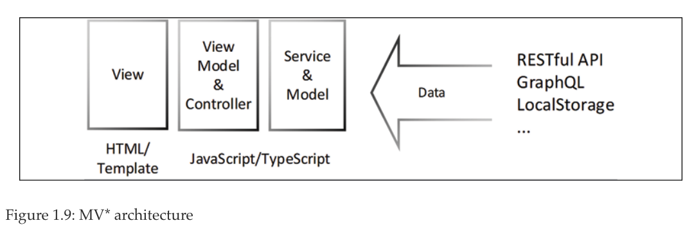

# 01. Introduction to Angular and Its Concepts

* A brief history of web frameworks
* Introduction to Angular
   * Angular's philosophy
   * Angular Evergreen
   * TypeScript
   * Basic Angular architecture
* The reactive development paradigm
   * RxJS
   * Reactive data streams
* Advanced Angular architecture
   * The Angular Router
   * Lazy loading
   * State management
      * The Flux pattern
      * NgRx
   * React.js architecture
* Notable Angular features
   * Angular 6
   * Angular 8
   * Angular 9
* Summary
* Further reading
* Questions

# 01. Introducción a Angular y sus Conceptos

Al principio, estaba HTML, luego DHTML. Los tecnólogos inventaron nuevas tecnologías como Java, JavaScript, PHP y muchas otras para ofrecer experiencias interactivas a través del navegador. El santo grial de la programación fue escribir un programa una vez y ejecutarlo en todas partes. En un instante, nació la era de las aplicaciones **Single-Page Applications (SPAs)**. Los SPA engañaron al navegador haciéndole creer que un solo `index.html` podría albergar aplicaciones completas que contienen muchas páginas. ***Backbone.js***, ***Knockout.js*** y ***Angular.js*** iban y venían. Todos los que se tambaleaban por la complejidad no gestionada y el síndrome del marco de la semana de JavaScript buscaban un salvador. Luego vinieron ***React***, ***Angular*** y ***Vue***. Prometieron solucionar todos los problemas, generar componentes web universalmente reutilizables y facilitar el aprendizaje, desarrollo y escalado de aplicaciones web. ¡Y así lo hicieron! Algunos mejores que otros. La historia adolescente de la web nos ha enseñado un par de lecciones esenciales. Primero, el cambio es inevitable, y segundo, la felicidad del desarrollador es un bien preciado que puede hacer o deshacer empresas enteras.

Este capítulo cubre:

* La historia de los frameworks web
* Angular y la filosofía detrás de él
* El paradigma del desarrollo reactivo
* Funciones Angular avanzadas, incluida la gestión del estado
* Principales versiones y características de Angular

Este primer capítulo está destinado a brindarle un trasfondo teórico e histórico para el resto del libro. Siéntase libre de usarlo como referencia a medida que lee el resto del libro. El Capítulo 2, Configuración de su entorno de desarrollo, cubre cómo puede configurar su entorno de desarrollo para una gran experiencia de desarrollo. Con el Capítulo 3, Creación de una aplicación Angular básica, comienza a implementar su primera aplicación Angular. Si ya tiene experiencia con Angular, puede comenzar con el Capítulo 7, Creación de una aplicación de primera línea de negocio de enrutador, para sumergirse en la creación de aplicaciones escalables listas para la empresa.

Cada capítulo del libro le presenta nuevos conceptos y refuerza las mejores prácticas mientras cubre las formas óptimas de trabajar con herramientas de código abierto y ampliamente utilizadas. En el camino, los recuadros de consejos e información cubren las bases para cerrar cualquier brecha de conocimiento que pueda tener sobre los conceptos básicos de desarrollo web y JavaScript moderno. A medida que revisa el contenido, preste atención a los pasos numerados o viñetas, ya que describen las acciones que debe realizar. Si omite una sección o un capítulo, es posible que se pierda cambios sutiles en la configuración o técnicas que pueden confundirlo más adelante.

:blue_book: *Los ejemplos de código que se proporcionan en este libro se han desarrollado utilizando Angular 9, que está previsto que esté en soporte a largo plazo (LTS) hasta agosto de 2021. Es probable que esté leyendo este libro después de que las nuevas versiones hayan reemplazado a Angular 9. Sin embargo, no te preocupes. Este libro adopta el lema imperecedero de Angular de mantener siempre actualizada la versión de Angular con la última versión. Mantenerse actualizado es posible al ceñirse a los fundamentos de la plataforma y evitar bibliotecas de terceros innecesarias. Los proyectos de ejemplo para el libro se escribieron inicialmente para Angular 5 y se actualizaron con el tiempo sin grandes reescrituras siguiendo un programa de actualización de Angular proactivo e incremental. Anticipo que estos proyectos sobrevivirán con modificaciones menores durante los próximos años. Esta confiabilidad es un testimonio del excelente trabajo de compatibilidad realizado por el equipo de Angular*.

El mundo de JavaScript, TypeScript y Angular cambia constantemente. Es normal que haya algunas diferencias entre los ejemplos de código del libro y el código que generan las herramientas que utiliza. Por esta razón, la mayoría de las mejores prácticas y elementos de configuración recomendados por este libro se aplican utilizando herramientas que creé, para que puedan actualizarse. A continuación se muestra una descripción general de alto nivel de la colección de bibliotecas, extensiones y proyectos de código abierto que respaldan el contenido del libro:

Figure 1.1: Code developed in support of this book

El diagrama anterior es para darle un vistazo rápido a algunas de las partes móviles. Cada componente se detalla en los próximos capítulos. Las versiones más actualizadas del código de muestra para el libro están en GitHub, en los repositorios vinculados a continuación. Estos repositorios contienen el estado final y completo del código. Para que sea más fácil verificar su progreso al final de un capítulo, la carpeta de proyectos en cada repositorio contiene instantáneas capítulo por capítulo que reflejan el estado actual del código:

* Para los *capítulos 2 a 6 y 12*, LocalCast Weather: https://github.com/duluca/local-weather-app
* Para los *capítulos 7 a 14*, Lemon Mart: https://github.com/duluca/lemon-mart
* Para el *Capítulo 10*, Lemon Mart Server: https://github.com/duluca/lemon-mart-server

:high_brightness: *Puede leer más sobre la actualización de Angular en el Apéndice C, Mantener Angular y Tools Evergreen. Puede encontrar este apéndice en línea en https://static.packt-cdn.com/downloads/9781838648800_Appendix_C_Keeping_Angular_and_Tools_Evergreen.pdf or at https://expertlysimple.io/stay-evergreen.*

Echemos un vistazo a los últimos 20 años de historia del desarrollo web, para que pueda contextualizar cómo surgió y evolucionó Angular.

## Una breve historia de los frameworks web

Es esencial considerar por qué usamos frameworks como Angular, React o Vue en primer lugar. Los frameworks web surgieron a medida que JavaScript se hizo más popular y capaz en el navegador. En 2004, la técnica **Asynchronous JavaScript and XML (AJAX)** se volvió muy popular en la creación de sitios web que no tenían que depender de actualizaciones de página completa para crear experiencias dinámicas utilizando tecnologías web estandarizadas como HTML, JavaScript/ECMAScript y CSS. Se supone que los proveedores de navegadores implementan estas tecnologías tal como las define el World Wide Web Consortium (W3C).

**Internet Explorer (IE)** era el navegador en el que confiaba la gran mayoría de los usuarios de Internet en ese momento. Microsoft utilizó su dominio del mercado para impulsar tecnologías patentadas y API para asegurar la ventaja de IE como el navegador de referencia. Las cosas empezaron a ponerse interesantes cuando el Firefox de Mozilla desafió el dominio de IE, seguido del navegador Chrome de Google. A medida que ambos navegadores obtuvieron una participación de mercado significativa, el panorama del desarrollo web se convirtió en un desastre. Las nuevas versiones del navegador aparecieron a una velocidad vertiginosa. Los intereses técnicos y corporativos en competencia llevaron a la implementación divergente de estándares web.

Esta fractura creó un entorno insostenible para que los desarrolladores ofrezcan experiencias consistentes en la web. Las diferentes calidades, versiones y nombres de las implementaciones de varios estándares crearon un desafío enorme, que consistía en escribir con éxito código que pudiera manipular el **Document Object Model (DOM)** de un navegador de manera consistente. Incluso la más mínima diferencia en las API y las capacidades de un navegador sería suficiente para romper un sitio web.

En 2006, jQuery se desarrolló para suavizar las diferencias entre las API y las capacidades de los navegadores. Entonces, en lugar de escribir código repetidamente para verificar las versiones del navegador, puede usar jQuery y ya está listo. Escondió todas las complejidades de las implementaciones específicas del proveedor y llenó con elegancia los vacíos cuando faltaban funciones. Durante unos buenos 5 a 6 años, jQuery se convirtió en el marco de desarrollo web. Era inimaginable escribir un sitio web interactivo sin usar jQuery.

Sin embargo, para crear experiencias de usuario vibrantes, jQuery por sí solo no fue suficiente. Las aplicaciones web nativas ejecutaban todo su código en el navegador, lo que requería computadoras rápidas para ejecutar el JavaScript interpretado dinámicamente y representar páginas web utilizando los complicados gráficos de objetos. En la década de 2000, muchos usuarios utilizaban navegadores obsoletos en computadoras relativamente lentas, por lo que la experiencia del usuario no fue excelente.

Tradicionalmente, la arquitectura de software se describe en tres capas principales, como se muestra en el diagrama siguiente:

La capa de presentación contiene código relacionado con la interfaz de usuario (UI), la capa empresarial contiene lógica empresarial y la capa de persistencia contiene código relacionado con el almacenamiento de datos. Es un objetivo general del diseño apuntar a un bajo acoplamiento y alta cohesión entre los componentes de nuestra arquitectura. El acoplamiento bajo significa que los fragmentos de código en estas capas no deben depender entre sí y deben ser reemplazables de forma independiente. Una alta cohesión significa que las piezas de código que están relacionadas entre sí, como el código relacionado con un dominio particular de la lógica empresarial, deben permanecer juntas. Por ejemplo, al crear una aplicación para administrar un restaurante, el código para el sistema de reservas debe estar junto y no extenderse a otros sistemas como el seguimiento de inventario o la administración de usuarios. El desarrollo web moderno tiene más partes móviles que una aplicación básica de tres niveles. El diagrama que sigue muestra capas adicionales que se ajustan a las capas de presentación, negocio y persistencia:

En el diagrama anterior, puede ver un diagrama de arquitectura expandido que incluye componentes esenciales del desarrollo web moderno, que incluyen una capa de API que generalmente transforma los datos entre las capas de presentación y de negocios, una capa de herramientas y mejores prácticas que define varias metodologías utilizadas para desarrollar el software y una capa de prueba automatizada que es crucial en los ciclos de desarrollo iterativos y rápidos de hoy.

En la década de 2000, muchas empresas de Internet confiaban en las páginas web renderizadas del lado del servidor. El servidor creó de forma dinámica todo el HTML, CSS y los datos necesarios para representar una página. El navegador actuó como un visor glorificado que mostraría el resultado. El siguiente es un diagrama que muestra una descripción general de la arquitectura de muestra de una aplicación web renderizada del lado del servidor en la pila ASP.NET MVC:

**Model-View-Controller (MVC)** es un patrón típico de código que tiene lógica de manipulación de datos en modelos, lógica de negocios en controladores y lógica de presentación en vistas. En el caso de ASP.NET MVC, el controlador y el modelo se codifican mediante C#, y las vistas se crean utilizando una versión con plantilla de HTML, JavaScript y C#. El resultado es que el navegador recibe HTML, JavaScript y los datos necesarios y, a través de jQuery y AJAX magic, las páginas web parecen interactivas. La representación del lado del servidor y los patrones MVC siguen siendo populares y se utilizan en la actualidad. Hay usos de nicho justificados, como Facebook.com. Facebook sirve a miles de millones de dispositivos que van desde los muy lentos hasta los muy rápidos. Sin la representación del lado del servidor, sería imposible para Facebook garantizar una **experiencia de usuario (UX)** consistente en toda su base de usuarios. Encuentro que la combinación de representación del lado del servidor y MVC es un patrón intrincado de ejecutar. Para garantizar el bajo acoplamiento de componentes, todos los miembros del equipo de ingeniería deben tener mucha experiencia. Es difícil encontrar equipos con una alta concentración de desarrolladores senior, y eso sería quedarse corto.

Para complicar aún más las cosas, C# (o cualquier otro lenguaje del lado del servidor) no se puede ejecutar de forma nativa en el navegador. Por lo tanto, los desarrolladores que trabajan en aplicaciones renderizadas del lado del servidor deben ser igualmente hábiles en el uso de tecnologías frontend y backend. Es fácil para los desarrolladores sin experiencia mezclar la presentación y la lógica empresarial en tales implementaciones sin querer. Cuando esto sucede, la inevitable modernización de la interfaz de usuario de un sistema que de otro modo funcionaría bien se vuelve imposible. En otras palabras, para reemplazar el fregadero de su cocina por uno nuevo, debe renovar toda su cocina. Debido a la arquitectura insuficiente, las organizaciones gastan rutinariamente millones de dólares cada 10 años escribiendo y reescribiendo las mismas aplicaciones.

Durante la década de 2000, fue posible crear aplicaciones web enriquecidas que se desacoplaron de las API de su servidor mediante ***Java Applets***, ***Flash*** o ***Silverlight***. Sin embargo, estas tecnologías dependían de complementos del navegador que necesitaban una instalación separada. La mayoría de las veces, estos complementos estaban desactualizados, creaban vulnerabilidades de seguridad críticas y consumían demasiada energía en las computadoras móviles. Tras la revolución del iPhone en 2008, estaba claro que tales complementos no se ejecutarían en teléfonos móviles, a pesar de los mejores intentos del sistema operativo Android. Además, el desdén del CEO de Apple, Steve Jobs, por soluciones tan poco elegantes marcó el principio del fin del soporte de tales tecnologías en el navegador.

A principios de la década de 2010, comenzaron a aparecer marcos como ***Backbone*** y ***AngularJS***, que demostraban cómo crear aplicaciones web ricas con una sensación y velocidad nativas y hacerlo de una manera aparentemente rentable. El siguiente diagrama muestra un cliente **Model-View-ViewModel (MVVM)** con una **Representational State Transfer (REST)** API de transferencia de estado representacional (REST). Cuando desacoplamos el cliente del servidor a través de una API, entonces podemos aplicar arquitectónicamente la implementación de la presentación y la lógica empresarial por separado. En teoría, este patrón de servicios web RESTful debería permitirnos reemplazar el fregadero de la cocina con la frecuencia que queramos sin tener que remodelar toda la cocina.

Observe la casi duplicación de cajas en el diagrama anterior. Solo porque separamos al cliente del servidor, no terminamos simplificando la arquitectura. En todo caso, la arquitectura que rodea a la lógica de presentación se vuelve mucho más complicada. Tanto el cliente como el servidor deben implementar sus capas de presentación/API, negocios y persistencia.

Desafortunadamente, muchos de los primeros esfuerzos de desarrollo que aprovechaban marcos como Backbone y AngularJS colapsaron por su propio peso porque no implementaron correctamente la arquitectura del lado del cliente.

Estos primeros esfuerzos de desarrollo también sufrieron de API web RESTful mal diseñadas. La mayoría de las API no versionaron sus URI, lo que dificulta la introducción de nuevas funcionalidades mientras se da soporte a los clientes existentes. Además, las API a menudo devuelven modelos de datos complicados que exponen sus modelos de datos relacionales internos a aplicaciones web. Esta falla de diseño crea un acoplamiento estrecho entre componentes/vistas aparentemente no relacionados escritos en HTML y modelos creados en SQL. Si no implementa capas adicionales de código para traducir o mapear la estructura de datos, entonces crea un acoplamiento no intencional y no controlado entre capas. Con el tiempo, lidiar con este tipo de acoplamiento se vuelve muy costoso muy rápidamente, en la mayoría de los casos necesita reescrituras significativas.

:blue_book: *Hoy en día, usamos la capa API para aplanar el modelo de datos antes de enviarlo al cliente para evitar tales problemas. Las tecnologías más nuevas como GraphQL van un paso más allá al exponer un modelo de datos bien definido y permitir al consumidor consultar los datos exactos que necesita. Con GraphQL, el número de solicitudes HTTP y la cantidad de datos transferidos por el cable son óptimos sin que los desarrolladores tengan que crear muchas API especializadas.*

Backbone y AngularJS demostraron que era viable crear aplicaciones web que se ejecutaran de forma nativa en el navegador. Todos los marcos de SPA en ese momento se basaban en jQuery para la manipulación de DOM. Mientras tanto, los estándares web continuaron evolucionando y los navegadores permanentes que admiten nuevos estándares comenzaron a convertirse en algo común. Sin embargo, el cambio es constante, y la evolución de las tecnologías web hizo que fuera insostenible evolucionar con gracia esta primera generación de marcos de SPA.

La próxima generación de frameworks web necesitaba resolver muchos problemas; necesitaban hacer cumplir una buena arquitectura; estar diseñado para evolucionar con los estándares web; y ser estable y escalable a las necesidades de la empresa sin colapsar. Además, estos nuevos marcos debían ganar la aceptación de los desarrolladores, que estaban agotados con demasiados cambios rápidos en el ecosistema. Recuerde, los desarrolladores descontentos no crean negocios exitosos. Alcanzar estos objetivos requería una ruptura clara con el pasado, por lo que ***Angular*** y ***React*** surgieron como plataformas para abordar los problemas del pasado de diferentes maneras.

## Introducción a Angular

Angular es un proyecto de código abierto mantenido por Google y una comunidad de desarrolladores. La nueva plataforma Angular es muy diferente del marco heredado que puede haber usado en el pasado. En colaboración con Microsoft, Google convirtió ***TypeScript en el lenguaje predeterminado para Angular***. TypeScript es un superconjunto de JavaScript que permite a los desarrolladores apuntar a navegadores heredados como Internet Explorer 11, mientras les permite escribir código JavaScript moderno que funciona en navegadores como Chrome, Firefox y Edge. Las versiones heredadas de Angular, versiones en el rango 1.x.x, se conocen como AngularJS. La versión 2.0.0 y las versiones superiores se denominan Angular. Donde *AngularJS es un marco SPA de JavaScript monolítico, Angular es una plataforma que es capaz de apuntar a navegadores, marcos híbridos móviles, aplicaciones de escritorio y vistas renderizadas del lado del servidor*.

La actualización al nuevo AngularJS fue arriesgada y costosa porque incluso las actualizaciones menores introdujeron nuevos patrones de codificación y características experimentales. Cada actualización introdujo depreciaciones o la refactorización de características antiguas, lo que requirió reescribir grandes porciones de código. Además, las actualizaciones se entregaron en intervalos inciertos, lo que hizo imposible que un equipo planificara los recursos para actualizar a una nueva versión. La metodología de lanzamiento eventualmente condujo a un marco impredecible y en constante evolución que aparentemente no tenía una guía para llevar adelante las bases del código. Si usó AngularJS, probablemente se quedó atascado en una versión en particular, porque la arquitectura específica de su base de código hizo que fuera muy difícil pasar a una nueva versión. *En 2018, el equipo de Angular lanzó la última actualización importante de AngularJS con la versión 1.7*. Esta versión marcó el comienzo del fin del marco heredado, con un fin de vida planificado en julio de 2021.

Angular mejora AngularJS en todas las formas imaginables. La plataforma sigue a semver, como se define en https://semver.org/, donde los incrementos de versiones menores denotan adiciones de nuevas funciones y posibles avisos de depreciación para la segunda próxima versión principal, pero sin cambios importantes. Además, el equipo de Angular en Google se ha comprometido con un calendario de lanzamiento determinista con versiones principales lanzadas cada 6 meses. Después de esta ventana de desarrollo de 6 meses, comenzando con Angular 4, todas las versiones principales reciben LTS con correcciones de errores y parches de seguridad durante 12 meses adicionales. Desde el lanzamiento hasta el final de su vida útil, cada versión principal recibe actualizaciones durante 18 meses. Consulte la siguiente tabla para ver la versión tentativa y el programa de soporte para AngularJS y Angular:

¿Entonces que significa esto para usted? Puede estar seguro de que su código Angular es compatible y compatible con versiones anteriores durante un período de tiempo aproximado de 24 meses, incluso si no realiza cambios en él. Por lo tanto, si escribió una aplicación Angular en la versión 9 en febrero de 2020, su código es compatible en tiempo de ejecución con Angular 10 y será compatible hasta octubre de 2021. Para actualizar su código de Angular 9 a Angular 11, debe asegurarse de que no está utilizando cualquiera de las API obsoletas que reciben un aviso de obsolescencia en Angular 10.

En la práctica, la mayoría de las depreciaciones son menores y fáciles de refactorizar. A menos que esté trabajando con API de bajo nivel para experiencias de usuario altamente especializadas, el tiempo y el esfuerzo necesarios para actualizar su base de código deberían ser mínimos. Sin embargo, esta es una promesa hecha por Google y no un contrato. El equipo de Angular tiene un incentivo significativo para garantizar la compatibilidad con versiones anteriores porque Google ejecuta alrededor de 1,000 aplicaciones Angular con una sola versión de Angular active en cualquier momento en toda la organización. Entonces, para cuando lea esto, todas las más de 1,000 aplicaciones de Google se ejecutarán en la última versión de Angular.

Puede pensar que Google tiene recursos infinitos para actualizar miles de aplicaciones con regularidad. Como cualquier organización, Google también tiene recursos limitados y no todas las aplicaciones son mantenidas activamente por un equipo dedicado. Por lo tanto, el equipo de Angular debe garantizar la compatibilidad a través de pruebas automatizadas y hacer que sea lo más sencillo posible avanzar a través de las principales versiones en el futuro. En Angular 6, el proceso de actualización se simplificó mucho con la introducción de `ng update`.

El equipo de Angular mejora continuamente su proceso de lanzamiento con herramientas CLI automatizadas para hacer que las actualizaciones de la funcionalidad obsoleta sean un esfuerzo razonable y en su mayoría automatizado. Los beneficios de esta estrategia fueron demostrados por Air France y KLM al poder reducir sus tiempos de actualización de 30 días en Angular 2 a 1 día en Angular 7.

Un proceso de actualización predecible y bien respaldado es una excelente noticia tanto para los desarrolladores como para las organizaciones. En lugar de quedarse atascado perpetuamente en una versión heredada de Angular, puede planificar y asignar los recursos necesarios para seguir moviendo su aplicación hacia el futuro sin costosas reescrituras. Como escribí en una publicación de blog de 2017, The Best New Feature of Angular 4, en bit.ly/NgBestFeature, el mensaje es claro:

> Para desarrolladores y gerentes: Angular llegó para quedarse, por lo que debería invertir su tiempo, atención y dinero en aprenderlo, incluso si actualmente está enamorado de algún otro marco.

> Para los responsables de la toma de decisiones (CIO, CTO, etc.): planifique comenzar su transición a Angular en los próximos 6 meses. Será una inversión que podrá explicar a las personas con mentalidad empresarial, y su inversión pagará dividendos durante muchos años, mucho después de que expire la ventana LTS inicial, con elegantes rutas de actualización a Angular vNext y más.

Entonces, ¿por qué Google (Angular) y Microsoft (TypeScript y Visual Studio Code) regalan estas tecnologías de forma gratuita? Hay varias razones:

* Un marco sofisticado que facilita el desarrollo de aplicaciones web es una demostración de destreza técnica, que retiene y atrae el talento de los desarrolladores.
* Un marco de código abierto permite probar y depurar nuevas ideas y herramientas con millones de desarrolladores a escala.
* Permitir a los desarrolladores crear excelentes experiencias web con mayor rapidez impulsa en última instancia más negocios para Google y Microsoft.

No veo ninguna intención nefasta aquí y doy la bienvenida a herramientas abiertas, maduras y de alta calidad que, si es necesario, puedo modificar y doblar a mi propia voluntad. No tener que pagar un contrato de soporte para una pieza de tecnología patentada es un bono de bienvenida.

:blue_book: *Cuidado, buscar ayuda de Angular en la web puede ser complicado. Observará que a veces se hace referencia a Angular como Angular 2 o Angular 4. En ocasiones, tanto Angular como AngularJS se conocen como AngularJS. Esto es incorrecto. La documentación de Angular está en angular.io. Si aterriza en angularjs.org, estará leyendo sobre el marco heredado de AngularJS.*

:high_brightness: *Para obtener las últimas actualizaciones sobre los próximos lanzamientos de Angular, consulte el calendario de lanzamientos oficial en https://angular.io/guide/releases.*

### Filosofía de Angular

Su tiempo es valioso y su felicidad es primordial, por lo que debe tener cuidado al elegir las tecnologías en las que invertir su tiempo. Con esto en mente, debemos responder a la pregunta de por qué aprender Angular, pero no React, Vue o algunos otro marco? Angular es un gran marco para comenzar a aprender. El marco y las herramientas lo ayudan a despegar rápidamente y continuar teniendo éxito con una comunidad vibrante y bibliotecas de IU de alta calidad que puede utilizar para ofrecer aplicaciones web excepcionales. React y Vue son excelentes marcos, con sus fortalezas y debilidades. Cada herramienta tiene su lugar y propósito.

En algunos casos, React es la opción correcta para un proyecto, y en otros casos, Vue es la correcta. Independientemente, llegar a ser algo competente en otros marcos web solo puede ayudarlo a comprender mejor Angular y convertirlo en un mejor desarrollador en general. Las SPA como Backbone y AngularJS captaron toda mi atención en 2012 cuando me di cuenta de la importancia de disociar las preocupaciones de frontend y backend. Las plantillas renderizadas del lado del servidor son casi imposibles de mantener y son la causa principal de muchas reescrituras costosas de los sistemas de software. Si le interesa crear software que se pueda mantener, debe cumplir con la directiva principal; Mantenga la lógica empresarial implementada detrás de la API desacoplada de la lógica de presentación implementada en la interfaz de usuario.

Angular encaja perfectamente con ***el principio de Pareto o la regla 80-20***. Se ha convertido en una plataforma madura y en evolución, lo que le ***permite lograr el 80% de las tareas con el 20% del esfuerzo***. Como se mencionó en la sección anterior, todas las versiones principales son compatibles durante 18 meses, lo que crea un continuo de aprendizaje, se mantiene actualizado y se desaprovechan las funciones antiguas. Desde la perspectiva de un desarrollador de pila completa, este continuo es invaluable, ya que sus habilidades y capacitación seguirán siendo relevantes y frescas durante muchos años.

La filosofía detrás de Angular es errar por el lado de la configuración sobre la convención. Los marcos basados en convenciones, aunque pueden parecer elegantes desde el exterior, dificultan que los recién llegados adopten el marco. Los marcos basados en configuración, sin embargo, tienen como objetivo exponer su funcionamiento interno a través de configuraciones y enlaces explícitos, donde puede adjuntar su comportamiento personalizado al marco. En esencia, donde AngularJS tenía toneladas de magia, que puede ser confusa, impredecible y desafiante de depurar, Angular intenta no ser mágico.

La configuración sobre la convención da como resultado una codificación detallada. La verbosidad es algo bueno. El código conciso es enemigo de la mantenibilidad y solo beneficia al autor original. Como lo expresaron Andy Hunt y David Thomas en The Pragmatic Programmer:

> Recuerde que usted (y otros después de usted) leerán el código cientos de veces, pero solo lo escribirán unas pocas veces.

Además, la Ley de diseño de Andy Hunt dicta:

> Si no puedes arrancar todas las piezas fácilmente, entonces el diseño apesta.

El código detallado, desacoplado, cohesivo y encapsulado es la clave para preparar su código para el futuro. Angular, a través de sus diversos mecanismos, permite la correcta ejecución de estos conceptos. Elimina muchas convenciones personalizadas inventadas en AngularJS, como `ng-click`, e introduce un lenguaje más natural que se basa en los elementos y propiedades HTML existentes. Como resultado, `ng-click` se convierte en `(click)`, extendiendo HTML en lugar de reemplazarlo.

A continuación, repasaremos la mentalidad imperecedera de Angular y el paradigma de programación reactiva, que son las últimas extensiones de la filosofía inicial de Angular.

### Angular Evergreen

Cuando está aprendiendo Angular, no está aprendiendo una versión específica de Angular, sino una plataforma que evoluciona continuamente. Desde los primeros borradores, diseñé este libro con la idea de restar importancia a la versión específica de Angular que estás usando. El equipo de Angular defiende esta idea. A lo largo de los años, he tenido muchas conversaciones con el equipo de Angular y los líderes de opinión dentro de la comunidad y he escuchado muchas presentaciones. Como resultado, puedo afirmar que puede confiar en Angular como una plataforma de desarrollo web madura. Angular recibe actualizaciones con frecuencia con gran atención a la compatibilidad con versiones anteriores. Además, cualquier código que sea incompatible con una nueva versión se presenta con la ayuda de herramientas automatizadas o una guía explícita sobre cómo actualizar su código a través de update.angular.io, por lo que nunca tendrá que adivinar o buscar respuestas en Internet. El equipo de Angular se compromete a garantizar que usted, el desarrollador, tenga la mejor experiencia de desarrollo web posible.

Para llevar esta idea al frente y al centro de los desarrolladores, varios colegas y yo hemos desarrollado y publicado una extensión de Visual Studio Code llamada Angular Evergreen.

Esta extensión detecta su versión actual de Angular y la compara con las últimas y próximas versiones de Angular. Las versiones que están etiquetadas a continuación están destinadas a los primeros usuarios y para probar la compatibilidad de su código con una próxima versión de Angular. No utilice las siguientes versiones etiquetadas para implementaciones de producción.

:high_brightness: *Encuentre más información, solicitudes de funciones e informes de errores sobre la extensión Angular Evergreen en https://AngularEvergreen.com.*

Uno de los componentes críticos de Angular que permite que la plataforma permanezca siempre verde (evergreen) es **TypeScript**. TypeScript permite implementar nuevas funciones de manera eficiente al mismo tiempo que brinda soporte para navegadores más antiguos, de modo que su código pueda llegar a la audiencia más amplia posible.

### TypeScript

Angular está codificado con TypeScript. TypeScript fue creado por Anders Hejlsberg de Microsoft para abordar varios problemas importantes con la aplicación de JavaScript a escala empresarial.

Anders Hejlsberg es el creador de Turbo Pascal y C#, y es el arquitecto principal de Delphi. Anders diseñó C# para ser un lenguaje amigable para desarrolladores construido sobre la sintaxis familiar de C y C++. Como resultado, C# se convirtió en el lenguaje detrás del popular .NET Framework de Microsoft. TypeScript comparte un pedigrí similar con Turbo Pascal y C# y sus ideales, lo que los convirtió en un gran éxito.

JavaScript es un lenguaje interpretado dinámicamente, donde el código que escribe es analizado y entendido por el navegador en tiempo de ejecución. Los lenguajes de tipado estático como Java o C# tienen un paso de compilación adicional, donde el compilador puede detectar errores de programación y lógica durante el tiempo de compilación. Es mucho más económico detectar y corregir errores en tiempo de compilación que en tiempo de ejecución. TypeScript aporta los beneficios de los lenguajes de tipado estático a JavaScript al introducir tipos y genéricos al lenguaje. Sin embargo, TypeScript no incluye un paso de compilación, sino un **paso de transpilación**. Un compilador crea código en lenguaje de máquina con C/C++ o lenguaje intermedio (IL) con Java o C#. ***Un transpilador, sin embargo, simplemente traduce el código de un dialecto a otro***. Entonces, cuando se crea, compila o transpila código TypeScript, el resultado es JavaScript puro.

:blue_book: *El nombre oficial de JavaScript es ECMAScript. El conjunto de características y la sintaxis del lenguaje son mantenidos por el Comité Técnico 39 de ECMA o TC39 para abreviar.*

La transpilación tiene otro beneficio significativo. La misma herramienta que convierte TypeScript a JavaScript se puede utilizar para reescribir JavaScript con una nueva sintaxis a una versión anterior que los navegadores más antiguos pueden analizar y ejecutar. Entre 1999 y 2009, el lenguaje JavaScript no vio ninguna característica nueva. ECMAScript abandonó la versión 4 debido a varias razones técnicas y políticas. Comenzando con la introducción de ES5 y luego ES2015 (también conocido como ES6), los proveedores de navegadores han tenido problemas para implementar nuevas funciones de JavaScript en sus navegadores. Como resultado, la adopción de estas nuevas funciones por parte de los usuarios se ha mantenido baja. Sin embargo, estas nuevas características significaron que los desarrolladores podían escribir código de manera más productiva. Esto creó una brecha conocida como la brecha de características de JavaScript, como lo demuestra el gráfico siguiente:

La brecha de funciones de JavaScript es variable, ya que TC39 se ha comprometido a actualizar JavaScript cada año en el futuro. Como resultado, TypeScript representa el pasado, presente y futuro de JavaScript. Puede utilizar las funciones futuras de JavaScript hoy y seguir siendo capaz de orientar sus anuncios a los navegadores del pasado para maximizar la audiencia a la que puede llegar.

Ahora, repasemos la arquitectura subyacente de Angular.

### Arquitectura angular básica

Angular sigue el patrón `MV*`, que es un híbrido de los patrones MVC y MVVM. Anteriormente, repasamos el patrón MVC. En un nivel alto, la arquitectura de ambos patrones es relativamente similar, como se muestra en el diagrama siguiente:

El nuevo concepto aquí es ViewModel, que representa el código de pegamento que conecta su vista con su modelo o servicio. En Angular, este pegamento se conoce como encuadernación (binding). Mientras que los frameworks MVC como Backbone o React tienen que llamar a un método de renderizado para procesar sus plantillas HTML, en Angular, este proceso es fluido y transparente para el desarrollador. La vinculación es lo que diferencia una aplicación MVC de una MVVM.

La unidad más básica de una aplicación Angular es un componente. Un componente es la combinación de una clase de JavaScript escrita en TypeScript y una plantilla angular escrita en HTML, CSS y TypeScript. La clase y la plantilla encajan como un rompecabezas a través de enlaces, de modo que puedan comunicarse entre sí, como se muestra en el diagrama siguiente:

Las clases son una construcción de **programación orientada a objetos (OOP) Object-Oriented Programming (OOP)**. Si invierte tiempo en profundizar en el paradigma OOP, mejorará enormemente su comprensión de cómo funciona Angular. El paradigma OOP permite la inyección de dependencia (DI) de servicios dependientes en sus componentes, por lo que puede realizar llamadas HTTP o activar un mensaje de brindis (toast message) para que se muestre al usuario sin introducir esa lógica en su componente o duplicar su código. DI facilita que los desarrolladores utilicen muchos servicios interdependientes sin tener que preocuparse por el orden de creación de instancias, inicialización o destrucción de dichos objetos de la memoria.

Las plantillas Angular también permiten una reutilización similar de código a través de directivas, pipes(tuberías), controles de usuario y otros componentes. Estos son fragmentos de código que encapsulan el código de usuario final altamente interactivo. Este tipo de código de interactividad a menudo es complicado y enrevesado y debe mantenerse aislado de la lógica de negocios o la lógica de presentación para que su código se pueda mantener.

Todos los componentes, servicios, directivas, pipes y controles de usuario de Angular están organizados en módulos. Cada aplicación de Angular es iniciada por un módulo raíz que procesa su primer componente e inyecta cualquier servicio y prepara las dependencias que pueda requerir. Puede introducir módulos secundarios para habilitar capacidades como la carga diferida, de modo que no tenga que entregar todos los componentes de su aplicación web al navegador de una vez. Por ejemplo, no sirve de nada enviar código para el panel de administración a un usuario sin privilegios de administrador.

Angular hace un uso intensivo de la biblioteca RxJS, que introduce patrones de desarrollo reactivos en Angular, a diferencia de los patrones de desarrollo imperativos más tradicionales.

## El paradigma del desarrollo reactivo

Angular admite múltiples estilos de programación. La pluralidad de estilos de codificación es una de las grandes razones por las que es accesible para programadores con diferentes antecedentes. Ya sea que tenga experiencia en programación orientada a objetos o sea un firme creyente de la programación funcional, puede crear aplicaciones viables con Angular. En el Capítulo 3, Creación de una aplicación angular básica, comenzará a aprovechar los conceptos de programación reactiva para crear la aplicación LocalCast Weather.

Como programador, lo más probable es que esté acostumbrado a la programación imperativa. La programación imperativa es cuando usted, como programador, escribe un código secuencial que describe todo lo que debe hacerse en el orden en que lo ha definido y el estado de su aplicación dependiendo de las variables correctas que se configurarán para funcionar correctamente. Escribe bucles, condicionales y funciones de llamada; usted dispara eventos y espera que sean manejados. La lógica imperativa y secuencial es la forma en que está acostumbrado a codificar.

La programación reactiva es un subconjunto de la programación funcional. En la programación funcional, no puede confiar en las variables que ha establecido anteriormente. Cada función que escriba debe sostenerse por sí sola, recibir su propio conjunto de entradas y devolver un resultado sin verse influenciado por el estado de una función o clase externa. ***La programación funcional es muy compatible con el desarrollo basado en pruebas (TDD)*** porque cada función es una unidad que se puede probar de forma aislada. Como tal, cada función que escribe se vuelve componible. Por lo tanto, puede mezclar, combinar y combinar cualquier función que escriba con cualquier otra y construir una serie de llamadas que produzcan el resultado que espera.

***La programación reactiva agrega un giro a la programación funcional. Ya no se trata de lógica pura, sino de un flujo de datos asincrónico que transforma y moldea en cualquier forma que necesite con un conjunto de funciones componibles***. Entonces, cuando se suscribe a un evento en un flujo reactivo, entonces está cambiando su paradigma de codificación de la programación reactiva a la programación imperativa.

:blue_book: *Más adelante en el libro, cuando implemente la aplicación LocalCast Weather, aprovechará la suscripción en acción en dos lugares, en los componentes CurrentWeather y CitySearch.*

Considere el siguiente ejemplo, acertadamente expresado por Mike Pearson en su presentación

***Pensar de manera reactiva***: lo más difícil es proporcionar instrucciones para obtener agua caliente del grifo para ayudar a comprender las diferencias entre la programación imperativa y reactiva:

Instrucciones para sacar agua caliente del grifo.

Paso | Imperativo | Reactivo
-----|------------|---------
0    | Estado inicial: el agua está apagada | Estado inicial: el agua está apagada
1    | Agarra una manguera | Abra el grifo de agua caliente
2    | Rocíe agua en el calentador | 
3    | Abra el grifo de agua caliente | 
4    | Envíe un mensaje de texto a la empresa de servicios públicos para obtener gas |
5    | Espera agua caliente
6    | Deshaga sus pasos para restaurar el estado inicial | Deshaga sus pasos para restaurar el estado inicial

Como puede ver, con la programación imperativa, debe definir cada paso de la ejecución del código. Cada paso depende del paso anterior, lo que significa que debe considerar el estado del medio ambiente para garantizar una operación exitosa. En un entorno así, es fácil olvidar un paso y muy difícil comprobar la exactitud de cada paso individual. En la programación reactiva funcional, se trabaja con flujos de datos asíncronos que dan como resultado un flujo de trabajo sin estado que es fácil de componer con otras acciones.

RxJS es la biblioteca que permite implementar su código en el paradigma reactivo.

### RxJS

RxJS son las siglas de Reactive Extensions, que es una biblioteca modular que permite la programación reactiva, que en sí misma es un paradigma de programación asincrónica y permite la manipulación de flujos de datos a través de funciones de transformación, filtrado y control. Puede pensar en la programación reactiva como una evolución de la programación basada en eventos.

### Reactive data streams

En la programación dirigida por eventos, debe definir un controlador de eventos y adjuntarlo a una fuente de eventos. En términos más concretos, si tuviera un botón **Save**, que expone un evento **onClick**, implementaría una función `confirmSave` que, cuando se activa, mostraría una ventana emergente para preguntarle al usuario **¿Está seguro?**. Mire el siguiente diagrama para ver una visualización de este proceso.

En resumen, tendría un evento que se activará una vez por acción del usuario. Si el usuario hace clic en el botón Guardar muchas veces, este patrón representará con gusto tantas ventanas emergentes como clics, lo que no tiene mucho sentido.

El patrón de publicación-suscripción (pub/sub) es un tipo diferente de programación impulsada por eventos. En este caso, podemos escribir múltiples manejadores para que todos actúen sobre el resultado de un evento dado simultáneamente. Digamos que su aplicación acaba de recibir algunos datos actualizados. El editor revisa su lista de suscriptores y transmite los datos actualizados a cada uno de ellos.

Consulte el siguiente diagrama sobre cómo el evento de datos actualizado activa múltiples funciones:

* Una función `updateCache` actualiza su caché local con nuevos datos
* Una función `fetchDetails` recupera más detalles sobre los datos del servidor
* Una función `showToastMessage` informa al usuario que la aplicación acaba de recibir nuevos datos

Todos estos eventos pueden ocurrir de forma asincrónica; sin embargo, las funciones `fetchDetails` y `showToastMessage` recibirán más datos de los que necesitan y puede resultar complicado intentar componer estos eventos de diferentes formas para modificar el comportamiento de la aplicación.

En la programación reactiva, todo se trata como un flujo. Una transmisión contendrá eventos que suceden con el tiempo y estos eventos pueden contener algunos datos o ningún dato. El siguiente diagrama visualiza un escenario en el que su aplicación está escuchando los clics del mouse del usuario. Los flujos incontrolados de clics de los usuarios no tienen sentido. Usted ejerce cierto control sobre esta secuencia aplicándole la función de aceleración, por lo que solo obtiene actualizaciones cada 250 milisegundos(ms). Si se suscribe a este nuevo evento, cada 250 ms, recibirá una lista de eventos de clic. Puede intentar extraer algunos datos de cada evento de clic, pero en este caso, solo le interesa la cantidad de eventos de clic que ocurrieron. Podemos dar forma a los datos del evento sin procesar en varios clics utilizando la función `map`.

Más adelante, es posible que solo estemos interesados en escuchar eventos con dos o más clics, por lo que podemos usar la función `filter` para actuar solo en lo que es esencialmente un evento de doble clic. Cada vez que se activa nuestro evento de filtro, significa que el usuario tenía la intención de hacer doble clic, y usted puede actuar sobre esa información mostrando una alerta.

El verdadero poder de las transmisiones proviene del hecho de que puede elegir actuar sobre el evento en cualquier momento a medida que pasa por varias funciones de control, transformación y filtro. Puede elegir mostrar los datos de clic en una lista HTML usando `*ngFor` y la `async` pipe de Angular, para que el usuario pueda monitorear los tipos de datos de clic que se capturan cada 250 ms.

Ahora consideremos algunos patrones arquitectónicos Angular más avanzados.

## Arquitectura Angular Avanzada

Como se mencionó anteriormente, en la sección Arquitectura básica Angular, los componentes, servicios y dependencias de Angular se organizan en módulos. Las aplicaciones Angular se inician a través de su módulo raíz, como se muestra en el siguiente diagrama:

El módulo root puede importar otros módulos y también declarar componentes y proporcionar servicios. A medida que su aplicación crece, necesita crear submódulos que contengan sus componentes y servicios. Organizar su aplicación de esta manera le permite implementar la carga diferida, lo que le permite controlar qué partes de su aplicación se envían al navegador y cuándo. A medida que agrega más funciones a su aplicación, importa módulos de otras bibliotecas, como Angular Material o NgRx. Implementa el enrutador para permitir experiencias de navegación enriquecidas entre sus componentes, lo que permite que su configuración de enrutamiento orquesta la creación de componentes.

:high_brightness: *El Capítulo 7, Creación de una aplicación de primera línea de negocio de enrutador, presenta la arquitectura de enrutador primero, donde le animo a comenzar el desarrollo de su aplicación creando todas sus rutas con anticipación.*

En Angular, los servicios se proporcionan como singleton a un módulo de forma predeterminada. Te acostumbrarás rápidamente a este comportamiento. Sin embargo, debe tener en cuenta que si proporciona el mismo servicio en varios módulos, cada módulo tiene su propia instancia del servicio proporcionado. En el caso de un servicio de autenticación, donde deseamos tener solo una instancia en toda nuestra aplicación, debe tener cuidado de proporcionar solo esa instancia del servicio de autenticación en el nivel del módulo raíz. Cualquier servicio, componente o módulo proporcionado en el nivel raíz de su aplicación estará disponible en el módulo de funciones.

Más allá de los módulos, el router es la siguiente tecnología más poderosa que debe dominar en Angular.

### El Angular Router

El Router Angular, incluido en el paquete `@angular/router`, es una parte central y crítica de la creación de aplicaciones **single-page applications (SPAs)** que actúan y se comportan como sitios web normales que son fáciles de navegar mediante los controles del navegador o los controles de zoom o micro zoom. .

El enrutador angular tiene características avanzadas como carga diferida (lazy loading), salidas de enrutador (router outlets), rutas auxiliares, seguimiento de enlace activo inteligente(smart active link tracking) y la capacidad de expresarse como un `href`, lo que permite una arquitectura Router-first app altamente flexible que aprovecha los componentes controlados por datos sin estado utilizando RxJS `BehaviorSubject`.

Los equipos grandes pueden trabajar con una única base de código, y cada equipo es responsable del desarrollo de un módulo, sin pisar los dedos de los demás, al tiempo que permite una fácil integración continua. Google, con sus miles de millones de líneas de código, trabaja con una única base de código por una muy buena razón: la integración a posteriori es muy cara.

Los equipos pequeños pueden remezclar sus diseños de IU sobre la marcha para responder rápidamente a los cambios sin tener que volver a diseñar su código. Es fácil subestimar la cantidad de tiempo perdido debido a cambios tardíos en el diseño o la navegación del juego. Estos cambios son más fáciles de absorber por equipos más grandes, pero un esfuerzo costoso para equipos pequeños.

Considere el diagrama que sigue, donde `app.ts` contiene el módulo. Tiene un `rootRouter`; componentes `a`, `master`, `detail` y `c`; `services`; `pipes`; y `directives` proporcionadas y declaradas para ello. Todos estos componentes serán analizados y cargados con entusiasmo por el navegador cuando un usuario navegue por primera vez a su aplicación.

Si tuviera que implementar una ruta `/b` con carga diferida, necesitaría crear un módulo de funciones llamado `b`, que tendría su propio `childRouter`; componentes `d`, `e` y `f`; `services`; `pipes`; y `directives` proporcionadas y declaradas para ello. Durante el transpile-time, Angular empaquetará estos componentes en un archivo o paquete separado y este paquete solo se descargará, analizará y cargará si el usuario alguna vez navega a una ruta en `/b`.

Analicemos la carga diferida con más detalle.

### Lazy loading

La línea discontinua que conecta `/b/...` a `rootRouter` demuestra cómo funciona la carga diferida. La carga diferida permite a los desarrolladores lograr rápidamente una primera pintura significativa en menos de un segundo. Al aplazar la carga de módulos adicionales, podemos mantener al mínimo el tamaño del paquete entregado al navegador. El tamaño de un módulo afecta las velocidades de descarga y carga, porque cuanto más tiene que hacer un navegador, más tiempo tarda un usuario en ver la primera pantalla de la aplicación. Al definir módulos de carga diferida, cada módulo se empaqueta como archivos separados, que se pueden descargar y cargar individualmente y bajo demanda.

El Router Angular proporciona un seguimiento inteligente de enlaces activos, lo que da como resultado una experiencia superior para el desarrollador y el usuario, lo que facilita la implementación de funciones de resaltado para indicar al usuario la pestaña actual o la parte de la aplicación que está actualmente activa. Las rutas auxiliares maximizan la reutilización de componentes y ayudan a realizar transiciones de estado complicadas con facilidad. Con las rutas auxiliares, puede renderizar múltiples vistas maestras y de detalles usando solo una plantilla externa. También puede controlar cómo se muestra la ruta al usuario en la barra de URL del navegador y componer rutas usando `routerLink`, en templates, y `Router.navigate`, en código, conduciendo escenarios complicados.

En el Capítulo 7, Creación de una aplicación de primera línea de negocio de enrutador, cubro la implementación de los conceptos básicos del enrutador, y las recetas avanzadas se tratan en el Capítulo 11, Recipes – Reusability, Routing, y Caching.

Más allá del routing, la administración(management) del estado es otro concepto crucial que debe dominar si desea crear aplicaciones angulares sofisticadas.

### State management (Administración del Estado)

Una clase respalda cada componente y servicio en Angular. Cuando se crea una instancia, una clase se convierte en un objeto en la memoria. Mientras trabaja con un objeto, si almacena valores en las propiedades del objeto, entonces está introduciendo el estado en su aplicación Angular. Si no se administra, el estado se convierte en una responsabilidad importante para el éxito y la capacidad de mantenimiento de su aplicación.

Soy fanático del diseño sin estado tanto en el backend como en el frontend. Desde mi perspectiva, el estado es malo y debes prestar mucha atención para no introducir el estado en tu código. Anteriormente, discutimos cómo los servicios en Angular son singletons por defecto. Esta es una terrible oportunidad para introducir el estado en su aplicación. Debe evitar almacenar información en sus servicios. En el Capítulo 7, Creación de una aplicación de primera línea de negocio de enrutador, le presento `BehaviorSubjects`, que actúan como anclajes de datos para su aplicación. En este caso, almacenamos estos anclajes en servicios, para que puedan compartirse entre componentes para sincronizar datos.

En los componentes angulares, la clase es un `ViewModel` que actúa como el código de unión entre su código y la plantilla. En comparación con los servicios, los componentes tienen una vida relativamente corta y está bien usar propiedades de objeto en este contexto.

Sin embargo, más allá del diseño, existen casos de uso específicos para introducir mecanismos robustos para mantener modelos de datos complicados en el estado de su aplicación. Las aplicaciones web progresivas y las aplicaciones móviles son un caso de uso en el que la conectividad no está garantizada. En estos casos, poder guardar y reanudar todo el estado de su aplicación es imprescindible para brindar una excelente experiencia de usuario (UX) para su usuario final.

La biblioteca NgRx para Angular aprovecha el patrón Flux para permitir una gestión de estado sofisticada para sus aplicaciones. En el Capítulo 6, Formularios, Observables y Temas y en el Capítulo 12, Recetas - Maestro/Detalle, Tablas de datos y NgRx, proporciono implementaciones alternativas para varias características que usan NgRx para demostrar las diferencias en la implementación entre métodos más ligeros.

#### The Flux pattern (EL PATRÓN DE FLUJO)

Flux es la arquitectura de la aplicación que fue creada por Facebook para ayudar en la construcción de aplicaciones web del lado del cliente. El patrón Flux define una serie de componentes que administran una tienda que almacena el estado de su aplicación a través de distribuidores que trigger/handle(activan/manejan) acciones y ven funciones que leen valores de la tienda. Con el patrón Flux, mantiene el estado de su aplicación en una tienda donde el acceso a la tienda solo es posible a través de funciones bien definidas y desacopladas, lo que da como resultado una arquitectura que escala bien porque, de forma aislada, las funciones desacopladas son fáciles de razonar y escribir pruebas unitarias automatizadas para.

Considere el diagrama que se muestra a continuación para comprender el flujo de información entre estos componentes:

NgRx implementa el patrón Flux en Angular usando RxJS.

#### NgRx

La biblioteca NgRx trae la administración de estado reactivo similar a Redux (una biblioteca popular de React.js) a Angular basada en RxJS. La gestión de estado con NgRx permite a los desarrolladores escribir piezas de código atómicas, autocontenidas y componibles que crean acciones, reductores y selectores. Este tipo de programación reactiva permite aislar los efectos secundarios en los cambios de estado y se siente como en casa con los patrones generales de codificación de React.js. NgRx termina creando una capa de abstracción sobre herramientas ya complejas y sofisticadas como RxJS.

Hay excelentes razones para usar NgRx, como si maneja más de 3 flujos de entrada en su aplicación. En tal escenario, la sobrecarga de lidiar con tantos eventos hace que valga la pena introducir un nuevo paradigma de codificación en su proyecto. Sin embargo, la mayoría de las aplicaciones solo tienen dos flujos de entrada: API REST y entrada de usuario. En menor medida, NgRx puede tener sentido si está escribiendo primero aplicaciones web progresivas (PWA) sin conexión, donde es posible que tenga que conservar información de estado complicada o diseñar una aplicación empresarial de nicho con necesidades similares.

Aquí hay una descripción general de la arquitectura de NgRx:

Considere la parte superior del diagrama como un flujo de acción observable, donde las acciones se pueden enviar y actuar según lo indicado por los círculos. Los efectos y componentes pueden enviar una acción. Los reductores y los efectos pueden actuar sobre estas acciones para almacenar valores en la tienda o activar una interacción con el servidor. Los componentes aprovechan los selectores para leer valores de la tienda.

Dada mi actitud positiva hacia las herramientas mínimas y la falta de una necesidad definida de NgRx más allá de las audiencias de nicho mencionadas anteriormente, no recomiendo NgRx como una opción predeterminada. RxJS/BehaviorSubjects son lo suficientemente potentes y capaces para desbloquear patrones sofisticados y escalables para ayudarlo a construir excelentes aplicaciones Angular, como se demuestra en los capítulos que conducen al Capítulo 12, Recetas - Maestro / Detalle, Tablas de datos y NgRx.

Puede leer más sobre NgRx en https://ngrx.io.

### React.js architecture

A diferencia de Angular, React.js, en su conjunto, implementa el patrón Flux. A continuación se muestra una vista centrada en el enrutador de una aplicación de React, donde los componentes/contenedores y los proveedores se representan de una manera estricta en forma de árbol.

En las versiones iniciales de React, había que pasar laboriosamente valores up/down arriba/abajo del árbol de herencia de cada componente para que incluso la funcionalidad más básica funcionara. Más tarde, se introdujo react-redux, por lo que cada componente puede leer/escribir valores directamente en la tienda sin tener que atravesar el árbol.

Esta descripción general básica debería darle una idea de las diferencias arquitectónicas significativas entre Angular y React. Sin embargo, tenga en cuenta que, al igual que Angular, React, su comunidad, patrones y prácticas están evolucionando continuamente y mejorando con el tiempo.

Puede obtener más información sobre React en https://reactjs.org.

## Notable Angular features (Características notables de Angular)

Las versiones específicas de Angular introducen cambios notables para avanzar en la filosofía de la plataforma y hacerla más fluida y completa. Recomiendo comprobar los cambios únicos que han introducido estos lanzamientos fundamentales.

### Angular 6

La mayoría, si no todos, del contenido, los patrones y las prácticas de este libro son compatibles con Angular 4 y versiones posteriores. Sin embargo, Angular 6 fue un lanzamiento fundamental de Angular, que trajo muchas mejoras ocultas a la plataforma y la estabilidad y cohesión generales en todo el ecosistema. La experiencia de desarrollo ha mejorado enormemente con herramientas CLI adicionales que facilitan la actualización de versiones de paquetes y tiempos de compilación más rápidos para mejorar su ciclo de comentarios de vista de compilación de código. Con Angular 6, todas las herramientas de la plataforma están sincronizadas con la versión 6.0, lo que facilita el razonamiento sobre el ecosistema. En la siguiente tabla, puede ver cómo esto hace que sea más fácil comunicar la compatibilidad de herramientas:

Angular CLI 6.0 viene con importantes capacidades nuevas, como los comandos `ng update` y `ng add`; `ng update` hace que sea mucho más fácil actualizar su versión de Angular, npm dependencies, RxJS y Angular Material, incluidas algunas capacidades de reescritura de código determinista para aplicar cambios de nombre a API o funciones. El tema de la actualización de su versión de Angular se trata en profundidad en el *Apéndice C, Mantener Angular y Herramientas Evergreen*. Puede encontrar este apéndice en línea en https://static.packt-cdn.com/downloads/9781838648800_Appendix_C_Keeping_Angular_and_Tools_Evergreen.pdf o en https://expertlysimple.io/stay-evergreen. `ng add` brinda soporte de esquemas a la CLI de Angular. Con los esquemas, puede escribir código personalizado para agregar nuevas capacidades a una aplicación Angular, agregando cualquier dependencia, código de configuración repetitivo o andamio. Un gran ejemplo es poder agregar material angular a su proyecto ejecutando `ng add @angular/material`. El tema de agregar material angular a su proyecto se trata en profundidad en el Capítulo 5, Entrega de UX de alta calidad con material. Una herramienta de actualización de material independiente tiene como objetivo hacer que las actualizaciones de material angular sean menos dolorosas, que se encuentra en Github.com/angular/material-update-tool, pero se espera que esta funcionalidad se fusione en `ng update`. Más esquemas pueden traer sus propios comandos `generate` a la CLI, facilitando su vida y haciendo que su base de código sea más consistente con el tiempo. Además, la versión 4 del paquete web está configurada para construir su aplicación Angular en módulos más pequeños con alojamiento de alcance, acortando el tiempo de primera pintura de su aplicación.

El tema principal de Angular 6 son las mejoras de rendimiento internas y la compatibilidad con elementos personalizados. La versión 6 mejora la v5 en términos del tamaño del paquete básico en un 12% a 65 KB, lo que mejora los tiempos de carga en un 21-40% desde conexiones rápidas de 3G a fibra. A medida que sus aplicaciones crecen, Angular aprovecha una mejor técnica de agitación de árboles para eliminar aún más el código no utilizado de su entrega final. La velocidad es una característica de UX en Angular 6. Esto se logra con un mejor soporte para Angular **Component Development Kit (CDK)**, Angular Material, Animations e i18n. Angular Universal permite tiempos de inicio rápidos asistidos del lado del servidor, y la compatibilidad con Angular PWA aprovecha las características de la plataforma nativa, como el almacenamiento en caché y fuera de línea, por lo que en visitas posteriores, su aplicación se mantiene rápida. La compatibilidad con RxJS 6 permite el comando de tubería ree-shakeable pipe, lo que reduce el tamaño de los paquetes con más frecuencia y corrige el comportamiento del acelerador como le advierto en el Capítulo 6, Formularios, Observables y Temas, entre numerosas correcciones de errores y mejoras de rendimiento. TypeScript 2.7 ofrece un mejor soporte para importar diferentes tipos de paquetes de JavaScript y funciones más avanzadas para detectar errores de codificación durante el tiempo de compilación.

Angular Material 6 agregó nuevos controles de usuario, como el tree y badge, al tiempo que hace que la biblioteca sea mucho más estable con una gran cantidad de correcciones de errores, funcionalidad completa y temas en los componentes existentes. Angular Flex Layout 6 incorporó polyfills, lo que permite que Internet Explorer 11 admita CSS Flexbox. Esto hace que las aplicaciones de Angular que usan Material y Flex Layout sean totalmente compatibles con la última gran tecnología de navegador heredada que aún persiste en empresas y gobiernos a pesar de dejar el soporte general en enero de 2018 junto con Windows 8.1 y ser reemplazada 18 veces por Microsoft Edge. Angular 6 en sí se puede configurar para que sea compatible con IE9 utilizando polyfills. Esto es excelente para los desarrolladores que deben admitir esos navegadores heredados y aún poder utilizar tecnologías modernas para crear sus soluciones.

También se lanzaron algunas herramientas auxiliares nuevas y emocionantes para permitir casos de uso de alta frecuencia, alto rendimiento o grandes empresas. El ecosistema Angular dio la bienvenida a la biblioteca NgRx, trayendo la administración de estado reactivo similar a Redux a Angular basada en RxJS. La herramienta Nx CLI, creada por ex miembros del equipo de Angular, brinda una configuración de entorno de desarrollo obstinada a Angular, adecuada para consultores y grandes organizaciones que deben garantizar un entorno coherente. Este libro sigue un patrón similar y tiene como objetivo educarlo para establecer una arquitectura y un patrón de diseño coherentes para aplicar en todas sus aplicaciones. La herramienta de compilación Bazel de Google permite compilaciones incrementales, por lo que las partes de su aplicación que no han cambiado no necesitan reconstruirse, lo que mejora enormemente los tiempos de compilación para proyectos grandes y permite que el empaquetado de bibliotecas se comparta entre aplicaciones de Angular.

### Angular 8

Como se menciona en el Prefacio de este libro, este libro ha sido diseñado para ser efectivo con cualquier nueva versión de Angular. Esta es una idea defendida por el equipo de Angular, que desea restar importancia a la versión específica de Angular que estás usando actualmente, en lugar de enfocarte e invertir en estar continuamente actualizado con cada lanzamiento menor y mayor de Angular. El equipo de Angular está invirtiendo una energía y un esfuerzo considerables para garantizar que la mayor parte del código que ha escrito siga siendo compatible, así como el rendimiento y las características.

El conjunto de Angular mejora con el tiempo. Cualquier cambio importante está respaldado por herramientas automatizadas, lo que lo ayuda a reescribir partes de su código, o desaprobaciones planificadas, lo que le brinda tiempo suficiente para eliminar gradualmente el código no compatible.

Angular 7 trajo actualizaciones de rendimiento, accesibilidad y dependencia para TypeScript, RxJS y Node, junto con una actualización significativa y la expansión de los controles de Angular Material; Angular 8 continúa estas tendencias. Angular 8 introduce carga diferencial y soporte para polyfills mínimos para navegadores de hoja perenne, ahorrando entre el 7 y el 20% de la carga útil entregada al cliente.

### Angular 9

Angular 9 y su posterior actualización 9.1 trae algunas de las actualizaciones más significativas al marco hasta la fecha al brindar el motor de renderizado Ivy y compatibilidad con TypeScript 3.8. Esta actualización aborda una gran cantidad de eliminación de deudas tecnológicas, trae 100 correcciones de errores y características, y expande enormemente la cobertura de prueba automatizada del marco. El motor de renderizado Ivy da como resultado tamaños de paquete más pequeños y tiempos de carga más rápidos para sus aplicaciones. Además, Angular 9.1 ofrece tiempos de compilación un 40% más rápidos, tiempos de ejecución de pruebas unitarias mejorados entre un 40% y un 50% y mejores capacidades de depuración con seguimientos de pila más simples y enlace de plantillas. TypeScript 3.8 trae nuevos beneficios sintácticos como el encadenamiento opcional y el operador nullish para que sea mucho más fácil lidiar con valores nulos o indefinidos en el modo estricto de Angular.

Los beneficios completos del motor de renderizado Ivy se sentirán con futuras actualizaciones. Ivy permitirá la creación de aplicaciones angulares pequeñas y esbeltas. Antes de Ivy, los metadatos necesarios para describir un componente angular se almacenaban dentro de un módulo. Con Ivy, los componentes implementan el principio de localidad, por lo que pueden ser autodescriptivos. Esto le permite a Ivy cargar componentes individuales de forma perezosa y crear componentes independientes. Imagine una biblioteca Angular que puede representar componentes con una sola llamada de función y tener solo unos pocos kilobytes de tamaño. Esta miniaturización hace que sea factible implementar elementos angulares utilizando los elementos personalizados, parte de la especificación de componentes web.

Angular Elements, introducido en la versión 6, le permite codificar un componente Angular y reutilizar ese componente en cualquier otra aplicación web utilizando cualquier tecnología web, en esencia declarando su propio elemento HTML personalizado. Estos elementos personalizados son compatibles con cualquier cadena de herramientas basada en HTML, incluidas otras bibliotecas o marcos de aplicaciones web. Para que esto funcione, todo el marco Angular debe empaquetarse junto con su nuevo elemento personalizado. Esto no era factible en Angular 6, porque eso significaba agregar al menos 65 KB cada vez que creaba un nuevo control de usuario.

A principios de 2020, Chrome, Edge y Firefox admiten elementos personalizados de forma nativa, un cambio significativo con respecto al status que a principios de 2018. Angular 9 habilita el motor de renderizado Ivy de forma predeterminada, y las actualizaciones futuras de Angular deberían impulsar los tamaños de los paquetes básicos a ser tan pequeños como 2,7 KB, el uso generalizado de elementos personalizados basados en Angular pronto podría convertirse en realidad. En 2020, todos los principales navegadores admiten elementos personalizados de forma nativa, dejando a Safari como el último navegador que implementó el estándar.

:high_brightness: *Siempre consulte https://caniuse.com antes de entusiasmarse demasiado con una nueva tecnología web para asegurarse de que realmente puede usar esa función en los navegadores que debe admitir.*

Angular.io aprovecha los elementos personalizados para demostrar la viabilidad de la tecnología. El sitio de documentación atrae más de 1 millón de visitantes únicos por mes, por lo que debería ayudar a resolver algunos de los problemas a medida que madura. Los elementos personalizados son excelentes para alojar muestras de código interactivo junto con contenido estático. Por ejemplo, a principios de 2018, Angular.io comenzó a usar StackBlitz.io para muestras de código interactivo.

:high_brightness: *StackBlitz.io es una herramienta increíble, un IDE enriquecido directamente en el navegador, por lo que puede experimentar con diferentes ideas o ejecutar repositorios de GitHub sin necesidad de extraer o ejecutar ningún código localmente.*

Otras actualizaciones importantes incluyen la carga diferencial de paquetes de JavaScript para mejorar los tiempos de carga y el **time-to-interactive (TTI)** para los navegadores modernos. Angular Router agrega compatibilidad con versiones anteriores para que sea factible realizar actualizaciones parciales de proyectos heredados de AngularJS.

Google exige que los más de 2000 proyectos de Angular que tienen deben estar todos en la misma versión de Angular. Esto significa que cada nueva actualización de Angular está bien probada y no hay sorpresas de compatibilidad con versiones anteriores.

Con todo el trabajo preliminar establecido en la versión 9, podemos esperar un marco más ágil y capaz con Angular 10. Espero que esté tan emocionado como yo con Angular y las posibilidades futuras que abre. Abróchate el cinturón de seguridad Dorothy, porque Kansas se va adiós.

## Resumen

En resumen, las tecnologías web han evolucionado hasta un punto en el que es posible crear aplicaciones web nativas, ricas y rápidas que pueden funcionar bien en la gran mayoría de los navegadores de escritorio y móviles que se implementan en la actualidad. Angular ha evolucionado para convertirse en una plataforma madura y estable, aplicando lecciones aprendidas del pasado. Permite sofisticas metodologías de desarrollo que permiten a los desarrolladores crear aplicaciones rápidas, interactivas y fáciles de mantener. Tecnologías como TypeScript, RxJS y NgRx permitieron patrones de programación orientada a objetos, programación reactiva y el patrón Flux.

Angular está diseñado para ser reactivo de principio a fin y, por lo tanto, debe ajustar su estilo de programación para que se ajuste a este patrón. Además, Angular está destinado a ser consumido de manera imperecedera, por lo que es una gran idea mantener siempre actualizado tu Angular.

:blue_book: *Aprovechar las promesas en una aplicación Angular, en lugar de observables y la async pipe, equivale a ignorar todos los consejos y documentación que el equipo de Angular y los líderes de opinión de la comunidad han comunicado. Es fácil caer en malas prácticas y hábitos siguiendo consejos superficiales o muy fuera de contexto que puede obtener de sitios de autoayuda o publicaciones de blogs escritos con una mentalidad experimental. La documentación oficial debe ser su Biblia, que se encuentra en https://angular.io/docs.*

En el próximo capítulo, configurará su entorno de desarrollo para optimizarlo para una experiencia de desarrollo angular excelente y consistente en los sistemas operativos macOS y Windows. En los siguientes capítulos, aprenderá cómo crear una aplicación Angular básica, implementarla en Internet, luego aprenderá sobre patrones arquitectónicos avanzados para crear aplicaciones escalables, aprenderá cómo crear una aplicación TypeScript de pila completa usando Minimal MEAN y aprovechar las Técnicas de DevOps e Integración Continua. El libro concluye presentándole Amazon Web Services y Google Analytics.

## Otras lecturas

* Patrones de diseño: elementos de software reutilizable orientado a objetos, Erich Gamma, Richard Helm, Ralph Johnson, John Vlissides, 1994, Addison Wesley, ISBN 0-201-63361-2.
* JavaScript humano, Henrik Joreteg, 2013, http://read.humanjavascript.com.
* Novedades de TypeScript x MS Build 2017, Anders Hejlsberg, 2017, https://www.youtube.com/watch?v=0sMZJ02rs2c.
* El programador pragmático, edición del vigésimo aniversario, David Thomas y Andrew Hunt, 2019, Addison Wesley, ISBN 978-0135957059.
* Pensar de forma reactiva: lo más difícil, Mike Pearson, 2019, https://www.youtube.com/watch?v=-4cwkHNguXE.
* Composición de datos con RxJS, Deborah Kurata, 2019, https://www.youtube.com/watch?v=Z76QlSpYcck.
* Descripción general detallada del patrón de flujo, Facebook, 2019, https://facebook.github.io/flux/docs/in-depth-overview.

## Preguntas

Responda las siguientes preguntas lo mejor que pueda para asegurarse de que ha entendido los conceptos clave de este capítulo sin buscar en Google. ¿Necesitas ayuda para responder las preguntas? Consulte el Apéndice D, Respuestas de autoevaluación en línea en https://static.packt-cdn.com/downloads/9781838648800_Appendix_D_Self-Assessment_Answers.pdf o visite https://expertlysimple.io/angular-self-assessment.

1. ¿Cuál es el concepto detrás de Angular Evergreen?
2. Usando el ejemplo de doble clic para flujos reactivos, implemente los siguientes pasos usando RxJS: Escuche los eventos de clic de un destino HTML con la función `fromEvent`. Determine si se hizo doble clic en el mouse dentro de un período de tiempo de 250 ms utilizando los operadores `throttleTime`, `asyncScheduler`, `buffer` y `filter`. Si se detecta un doble clic, muestra una alerta en el navegador. Sugerencia: use https://stackblitz.com o implemente su código y use https://rxjs.dev/ para obtener ayuda.
3. ¿Qué es NgRx y qué papel juega en una aplicación Angular?
4. ¿Cuál es la diferencia entre un módulo, un componente y un servicio en Angular?

