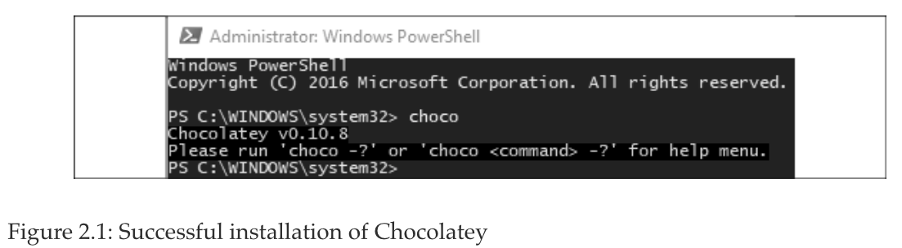
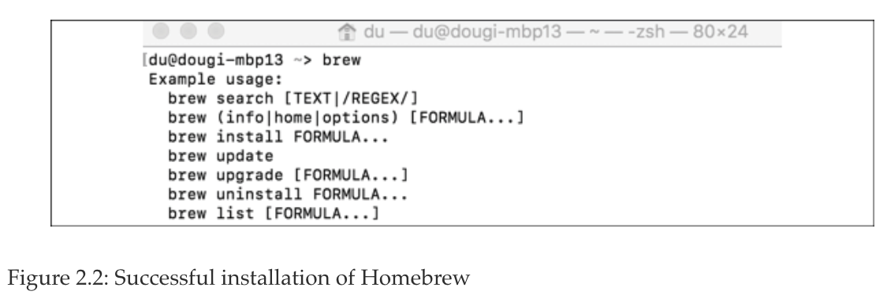
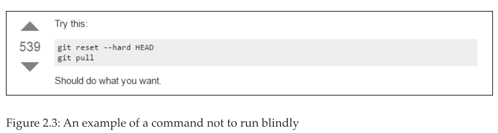
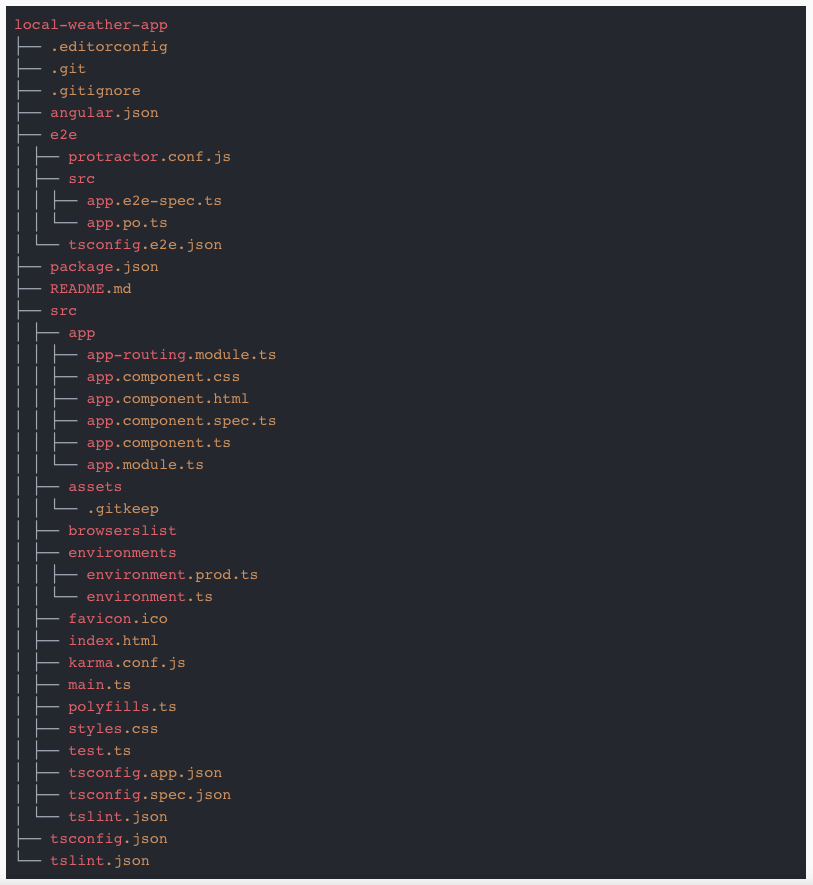
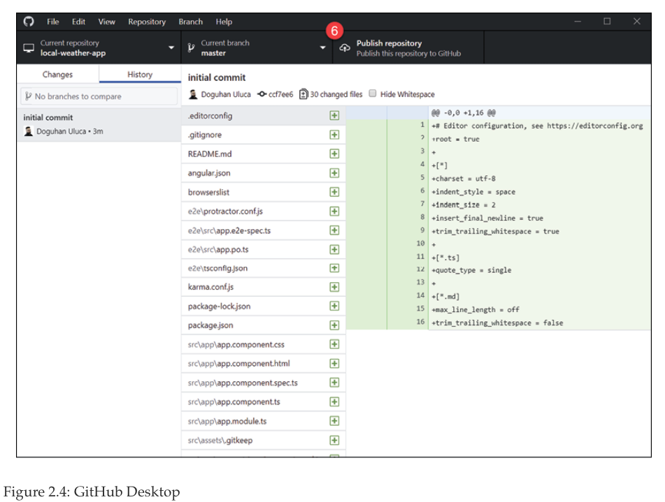
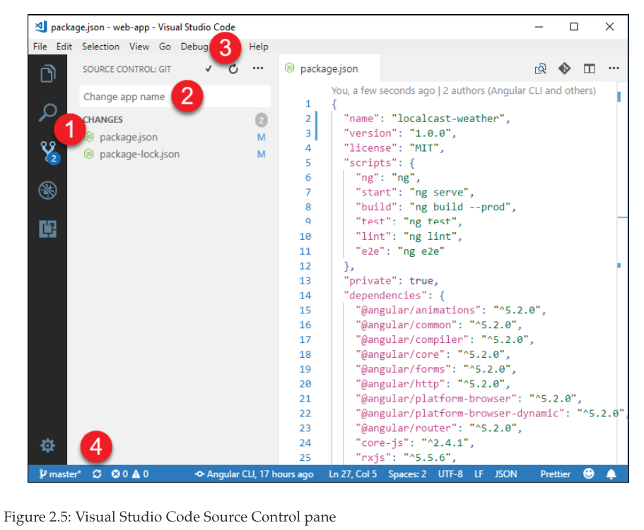
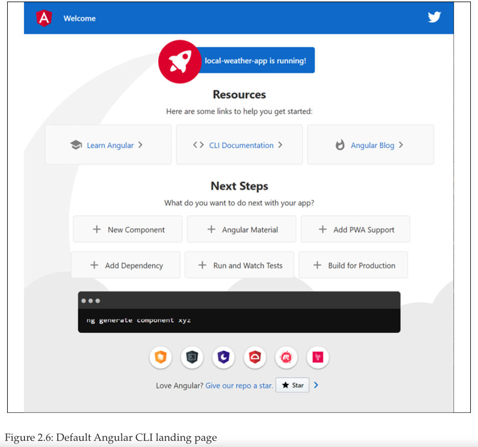
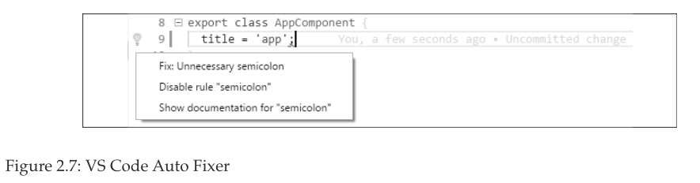

# 02. Setting Up Your Development Environment
* CLI package managers
   * Installing Chocolatey for Windows
   * Installing Homebrew for macOS
* Installing development tools
   * Git and GitHub Desktop
      * Why use GitHub?
      * Why use GitHub Desktop?
      * Installing Git and GitHub Desktop
      * Using your GitHub credentials in Git
   * Node.js
   * Existing Node.js installation
   * Installing Node.js
      * Global npm packages
   * Visual Studio Code
      * Installing Visual Studio Code
   * Docker
      * Installing Docker
   * Cloud services
      * Vercel Now
      * Google Firebase
      * Google Cloud
      * Amazon Web Services
* Setup automation for Windows and macOS
   * PowerShell script
   * Bash script
* The Angular CLI
   * Setting up your development directory
   * Generating your Angular application
      * Installing the Angular CLI
      * Initializing your Angular app
      * Publishing a Git repository using GitHub Desktop
      * Inspecting and updating package.json
      * Committing code using VS Code
   * Running your Angular app
   * Verifying your code
* Optimizing VS Code for Angular
   * Configuring your project automatically
      * VS Code auto save
      * IDE settings
      * IDE extensions
   * Scripting code styling and linting
      * Configuring tooling
      * Implementing a style checker and fixer
      * Implementing a lint checker and fixer
   * Configuring Angular CLI autocomplete
   * VS Code Auto Fixer
* Summary
* Further reading
* Questions

# 02. Configuración de su Entorno de Desarrollo

Este capítulo demuestra cómo usted y los miembros de su equipo pueden crear un entorno de desarrollo coherente para que todo su equipo tenga la misma gran experiencia de desarrollo web, cuya importancia se destaca en el prefacio del libro. Puede ser difícil para los principiantes crear el entorno de desarrollo adecuado, que es esencial para una experiencia de desarrollo sin frustraciones. Para los desarrolladores y equipos experimentados, lograr un entorno de desarrollo mínimo y consistente sigue siendo un desafío. Una vez logrado, dicho entorno de desarrollo ayuda a evitar muchos problemas relacionados con la TI, incluidos los costos continuos de mantenimiento, licencias y actualización.

Las instrucciones sobre la instalación de GitHub Desktop, Node.js, Angular CLI y Docker son una referencia útil para aquellos desde principiantes absolutos hasta equipos experimentados, junto con estrategias sobre cómo automatizar y garantizar la configuración correcta y consistente de su entorno de desarrollo.

> :blue_book: No dude en omitir este capítulo si ya tiene configurado un entorno de desarrollo sólido; sin embargo, tenga en cuenta que algunas de las suposiciones medioambientales declaradas en este capítulo pueden hacer que algunas instrucciones no le funcionen en capítulos posteriores. Vuelva a este capítulo como referencia si tiene problemas o necesita ayudar a un colega, alumno o amigo a configurar su entorno de desarrollo. Los scripts de instalación automatizados para configurar su entorno de desarrollo se pueden encontrar en https://github.com/duluca/web-dev-environment-setup.

Para aprovechar al máximo este libro, debe estar familiarizado con JavaScript ES2015+, los conceptos básicos del desarrollo de frontend y las API RESTful.

Los sistemas operativos recomendados son Windows 10 Pro v1903+ con PowerShell v7+ o macOS Sierra v10.15+ con Terminal (Bash o Oh My Zsh). La mayor parte del software sugerido en este libro también funciona en sistemas Linux, pero su experiencia puede variar según su configuración particular.

> :high_brightness: *Es una práctica estándar que los desarrolladores utilicen Google Chrome 80+ al desarrollar aplicaciones web. Sin embargo, también puede utilizar el navegador Microsoft Edge 80+ basado en Chromium. Definitivamente debería instalar PowerShell multiplataforma en Windows desde https://github.com/PowerShell/PowerShell/releases, que le da acceso a los operadores de cadena `&&` y `||`. Además, obtenga la nueva Terminal de Windows en Microsoft Store para una experiencia superior de línea de comandos en Windows.*

En este capítulo, aprenderá a hacer lo siguiente:

* Trabaje con los administradores de paquetes CLI Chocolatey y Homebrew para instalar y actualizar software
* Use esos administradores de paquetes para instalar GitHub, Node.js y otros programas esenciales
* Utilice secuencias de comandos para automatizar la instalación mediante PowerShell o Bash
* Genere una aplicación Angular usando la CLI Angular
* Consiga un entorno de desarrollo coherente y multiplataforma utilizando herramientas automatizadas

Comencemos por aprender acerca de los administradores de paquetes basados en CLI que puede usar para instalar sus herramientas de desarrollo. En la siguiente sección, verá que usar herramientas CLI es un método superior en comparación con tratar con instaladores individuales. Es mucho más fácil automatizar las herramientas CLI, lo que hace que las tareas de configuración y mantenimiento sean repetibles y rápidas.

## CLI package managers (Administradores de paquetes CLI)

La instalación de software a través de una **Graphical User Interface (GUI)** es lenta y difícil de automatizar. Como desarrollador full-stack, ya sea que sea un usuario de Windows o Mac, debe confiar en los administradores de paquetes de la interfaz de línea de comandos (CLI) para instalar y configurar de manera eficiente el software del que depende.

> :high_brightness: *Recuerde, cualquier cosa que pueda expresarse como un comando CLI también puede automatizarse.*

### Instalación de Chocolatey  para Windows
Chocolatey es un administrador de paquetes basado en CLI para Windows que se puede utilizar para la instalación automatizada de software. Para instalar Chocolatey en Windows, debe ejecutar un shell de comandos elevado:

1. Inicie el menú **Start**
2. Empiece a escribir en `PowerShell`
3. Debería ver la aplicación de escritorio **Windows PowerShell Desktop App** como resultado de la búsqueda
4. Haga clic con el botón derecho en **Windows PowerShell** y seleccione **Run as Administrator**
5. Esto dispara una advertencia de **User Account Control (UAC)** (Control de cuentas de usuario (UAC)); seleccione **Yes** para continuar
6. Ejecute el comando de instalación que se encuentra en https://chocolatey.org/install en **PowerShell** para instalar el administrador de paquetes de Chocolatey:

```sh
PS> Set-ExecutionPolicy Bypass -Scope Process -Force; [System.Net.ServicePointManager]::SecurityProtocol = [System.Net.ServicePointManager]::SecurityProtocol -bor 3072; iex ((New-Object System.Net.WebClient).DownloadString('https://chocolatey.org/install.ps1'))
```

7. Verifique su instalación de Chocolatey ejecutando `choco`
8. Debería ver una salida similar a la que se muestra en la siguiente captura de pantalla:



> :high_brightness: *Todos los comandos de Chocolatey posteriores también deben ejecutarse desde un shell de comandos elevado. Alternativamente, es posible instalar Chocolatey en una configuración que no sea de administrador y que no requiera un shell de comandos elevado. Sin embargo, esto da como resultado un entorno de desarrollo no estándar y menos seguro, y es posible que ciertas aplicaciones instaladas a través de la herramienta aún requieran elevación.*

> :blue_book: *Scoop es una alternativa a Chocolatey que proporciona una experiencia más similar a Unix. Si prefiere las herramientas y los comandos de estilo Unix, puede instalar Scoop en https://scoop.sh/ o ejecutando:*

```sh
$ iwr -useb get.scoop.sh | iex
```

Para obtener más información sobre Chocolatey, consulte https://chocolatey.org/install.

### Instalación de Homebrew para macOS

Homebrew es un administrador de paquetes basado en CLI para macOS que se puede utilizar para la instalación automatizada de software. Para instalar Homebrew en macOS, debe ejecutar un shell de comandos:

1. Inicie la búsqueda de Spotlight con  Gato + Space
2. Escriba `terminal`
3. Ejecute el siguiente comando en la Terminal para instalar el administrador de paquetes Homebrew:

```sh
$ /usr/bin/ruby -e "$(curl -fsSL https://raw.githubusercontent.com/Homebrew/install/master/install)"
```

4. Verifique su instalación de Homebrew ejecutando `brew`
5. Debería ver un resultado similar al siguiente:



6. Para habilitar el acceso a software adicional, ejecute el siguiente comando:

```sh
$ brew tap caskroom/cask
```

En mi ordenador me indica que pulse el comando:

```sh
$ brew tap homebrew/cask
```

En macOS, si tiene problemas de permisos al instalar paquetes brew, relacionados con chown'ing `/usr/local`, debe ejecutar el comando `sudo chown -R $(whoami) $(brew --prefix)/*`. Este comando restablece la propiedad a nivel de usuario para preparar paquetes, que es más seguro que el acceso amplio a nivel de superusuario.

> :blue_book: *Para obtener más información, consulte https://brew.sh/.*

## Instalación de Herramientas de Desarrollo

En esta sección, instalará todas las herramientas de desarrollo que necesita para comenzar a desarrollar una aplicación web. ***Git*** y ***GitHub Desktop*** establecen un repositorio de código fuente en su máquina y le permiten sincronizar su código con un repositorio remoto. ***Node.js*** es un JavaScript runtime para su PC e incluye **Node Package Manager** o **npm** que gestiona el código fuente de terceros, incluido Angular. ***Visual Studio Code*** es un entorno de desarrollo integrado o IDE.

> :blue_book: *Para instalar automáticamente todas las herramientas de desarrollo web necesarias para este libro, ejecute los siguientes comandos para que su sistema operativo configure su entorno. En Windows PowerShell, ejecute:*

```sh
PS> Install-Script -Name setup-windows-dev-env
PS> setup-windows-dev-env.ps1
```
> *En MacOS Terminal, ejecute:*
```sh
$> bash <(wget -O - https://git.io/JvHi1)
```
> *Para más información refierase a https://github.com/duluca/web-dev-environment-setup.*

Una vez que instale su IDE, estará listo para comenzar el desarrollo. Esta sección también contiene instrucciones para instalar Docker, una plataforma de contenedorización liviana, y configurar varios servicios en la nube. Estas herramientas serán relevantes en capítulos posteriores. Si desea un comienzo más rápido para su aventura Angular, puede omitirlos por ahora.

### Git y GitHub Desktop

Esta sección tiene como objetivo establecer una configuración de Git de mejores prácticas que sea adecuada para la audiencia más amplia posible. Para hacer el mejor uso de esta sección y los capítulos posteriores de este libro, supongo que cumple con los siguientes requisitos previos:

* Comprensión de lo que realmente son la gestión de código fuente y Git
* Una cuenta gratuita creada en GitHub.com

#### ¿POR QUÉ USAR GITHUB?

Si eres un usuario de Git, es probable que también uses un repositorio en línea, como ***GitHub, Bitbucket o GitLab***. Cada repositorio tiene un nivel gratuito para proyectos de código abierto, junto con sitios web sólidos con diferentes conjuntos de funciones, incluidas las opciones empresariales en las instalaciones por las que puede pagar. GitHub, con más de 38 millones de repositorios alojados en 2016, es, con mucho, el repositorio en línea más popular. En general, se considera una utilidad básica que la comunidad nunca deja de estar fuera de línea.

Con el tiempo, GitHub ha agregado muchas características que lo han transformado de un mero repositorio a una plataforma en línea. A lo largo de este libro, haré referencia a las características y funcionalidades de GitHub para que pueda aprovechar sus capacidades para transformar la forma en que desarrolla, mantiene y lanza software.


#### ¿POR QUÉ USAR GITHUB DESKTOP?

La herramienta Git CLI es realmente poderosa, y estará bien si se apega a ella. Sin embargo, los desarrolladores full-stack estamos preocupados por una variedad de preocupaciones. Con prisa por completar la tarea en cuestión, puede arruinar fácilmente su día, y en ocasiones el de su equipo, si sigue un consejo incorrecto o incompleto.

Consulte la siguiente captura de pantalla para ver un ejemplo de dichos consejos de Stack Overflow (http://stackoverflow.com/questions/1125968/force-git-to-overwrite-local-files-on-pull):



Si ejecuta el comando anterior, esté preparado para perder los cambios locales no confirmados. Desafortunadamente, los usuarios novatos tienden a seguir las instrucciones más sencillas y directas, lo que puede provocar la pérdida de trabajo. Si cree que sus compromisos anteriores son seguros, ¡piénselo dos veces! Cuando se trata de Git, si puede imaginarlo, puede hacerlo a través de la CLI.

Afortunadamente, con GitHub, puede proteger las ramas e implementar el flujo de trabajo de GitHub, lo que implica ramificar, confirmar, fusionar, actualizar y enviar solicitudes de extracción. Las protecciones y el flujo de trabajo ayudan a evitar que los comandos de Git dañinos realicen cambios irreversibles y permiten un nivel de control de calidad para que su equipo siga siendo productivo. Realizar todas estas acciones a través de la CLI, especialmente cuando hay conflictos de fusión, puede resultar complicado y tedioso.

> :high_brightness: *Tenga en cuenta que Git se envía con una herramienta CLI llamada Git Bash, que es un shell basado en Unix que puede usar para ejecutar git y otros comandos. Bash está disponible en computadoras Linux y macOS. Windows 10 está mejorando rápidamente su soporte de terminal con el Subsistema de Windows para Linux (WSL) y alias para comandos Unix en PowerShell, por lo que la necesidad de usar Git Bash en Windows está desapareciendo rápidamente. Si desea obtener más información sobre Git Bash, consulte el tutorial en el sitio web de Atlassian en https://www.atlassian.com/git/tutorials/git-bash.*

Para una comprensión más profunda de los beneficios y las trampas de Git y GitHub, puede leer mi artículo de 2016 sobre el tema en Bit.ly/InDepthGitHub.

#### INSTALACIÓN DE GIT Y GITHUB DESKTOP

GitHub Desktop proporciona una GUI fácil de usar para ejecutar el flujo de trabajo de GitHub de forma coherente en Windows y macOS. La coherencia es muy valiosa al incorporar miembros nuevos o jóvenes al equipo, o si no es un colaborador frecuente de la base de código. Le recomendamos que instale GitHub Desktop 2.2+.

1. Ejecute el comando de instalación:

Para Windows:

```sh
PS> choco install git github-desktop -y
```

Para macOS:

```sh
$ brew install git && brew cask install github
```

2. Verifique su instalación de Git ejecutando `git --version` y observe el número de versión devuelto

> :high_brightness: *Debe reiniciar su Terminal después de la instalación de una nueva herramienta CLI. Sin embargo, puede evitar reiniciar su Terminal y ahorrar algo de tiempo al actualizar o obtener sus variables de entorno. En Windows, ejecute `refreshenv`; en macOS, ejecute `source ~/.bashrc` o `source ~/.zshrc`.

3. Verifique su instalación de GitHub Desktop iniciando la aplicación
4. Inicie sesión en https://github.com/ en GitHub Desktop
5. Una vez que haya creado un repositorio, puede iniciar la aplicación desde su Terminal ejecutando esto:

```sh
$ github path/to/repo
```
6. Si ya se encuentra en la carpeta correcta, puede escribir el siguiente comando en su lugar:

```sh
$ github .
```

Para Windows, en el inicio de GitHub Desktop, si se queda atascado en la pantalla de inicio de sesión, cierre la aplicación, vuelva a iniciarla como administrador, complete la configuración y luego podrá usarla normalmente, sin tener que volver a iniciarla como administrador. Para obtener más información, consulte https://desktop.github.com/.

A continuación, repasaremos varias estrategias para tener una experiencia más fluida con Git al registrar correctamente sus credenciales de GitHub.


#### USANDO SUS CREDENCIALES DE GITHUB EN GIT

Cuando interactúas con tu repositorio en GitHub, el comando git es aprovechado por las herramientas que estás usando, como tu IDE, para push o pull contenido. Para tener una experiencia fluida con Git, es una buena idea registrar sus credenciales de GitHub con Git correctamente.

Hay tres estrategias principales para lograr esto:

1. **Configure SSH**, que es la mejor y más segura forma de interactuar con cualquier sistema informático remoto, porque no se intercambian contraseñas. Puede seguir la guía más reciente de GitHub para configurar SSH en https://help.github.com/articles/connecting-to-github-with-ssh.

2. **Cache your GitHub password in Git**(Almacene en caché su contraseña de GitHub en Git); a veces, SSH no será compatible con la herramienta que usa, por lo que es posible que deba almacenar en caché su contraseña. Puede hacerlo ejecutando el siguiente comando:

Para Windows:

```sh
PS> git config --global credential.helper wincred
```

Para macOS:

```sh
$ git credential-osxkeychain
$ git config --global credential.helper osxkeychain
```

Para obtener más orientación, consulte la guía de GitHub en https://help.github.com/articles/caching-your-github-password-in-git.

3. **Crear un personal access token**: esta es una estrategia que se ubica entre SSH y el uso de contraseñas desde una perspectiva de seguridad porque las claves SSH y los tokens se pueden revocar en cualquier momento desde GitHub, pero una vez que su contraseña se filtra o se ve comprometida, puede perder el control de todo.

Si está utilizando autenticación de dos factores, que es absolutamente necesario, entonces, en lugar de almacenar en caché su contraseña, debe crear un token de acceso personal en https://github.com/settings/tokens y usar el token en lugar de su contraseña . En el Capítulo 3, Creación de una aplicación angular básica, cubrimos cómo puede configurar un token para que funcione con Visual Studio Code, el IDE preferido para este libro.

> :blue_book: *Consulte la herramienta git-extras de TJ Holowaychuk, que puede proporcionar un resumen del repositorio, la población del registro de cambios, el porcentaje de confirmación del autor y más información útil sobre sus repositorios en https://github.com/tj/git-extras.*

### Node.js

Esta sección tiene como objetivo establecer un entorno de desarrollo de JavaScript de mejores prácticas. Supongo que tiene conocimiento del ecosistema y las herramientas modernas de JavaScript. Como mínimo, asegúrese de familiarizarse con los siguientes recursos:

* Sitio web de Node.js: https://nodejs.org
* Sitio web de Npm: https://www.npmjs.com
* Sitio web de Angular: https://angular.io
* El sitio web heredado de AngularJS: https://angularjs.org/
* Sitio web de Yarn: https://yarnpkg.com
* Sitio web de React: https://facebook.github.io/react

Node.js es JavaScript que se ejecuta en cualquier lugar. Es un proyecto de código abierto que tiene como objetivo ejecutar JavaScript en el servidor, construido sobre el motor JavaScript V8 de Google Chrome. A finales de 2015, Node.js estabilizó y anunció ciclos LTS de 18 meses para empresas que aportaron previsibilidad y estabilidad a la plataforma, junto con una última rama actualizada con mayor frecuencia, pero más experimental.

Node también se incluye con npm, el Node Package Manager, y a partir de 2018, ***npm es el repositorio de paquetes JavaScript más grande del mundo***.

Para obtener una visión más detallada del historial de Node, lea mi artículo de dos partes sobre Node en Bit.ly/NodeJSHistory.

> :blue_book: *Es posible que haya oído hablar de Yarn y de que es más rápido o mejor que npm. A partir de npm 5, que se envía con el Nodo 8, npm tiene más funciones, es más fácil de usar y está a la par con Yarn en términos de rendimiento. Yarn es una publicación de Facebook, que también creó React. Debe tenerse en cuenta que Yarn se basa en el repositorio npm, por lo que sea cual sea la herramienta que use, obtendrá acceso a la misma biblioteca de paquetes.*

### Instalación existente de Node.js

Si ha instalado Node.js antes, cuando instale una nueva versión de Node usando choco o brew, asegúrese de leer los resultados del comando con atención. Su administrador de paquetes puede devolver advertencias o instrucciones adicionales a seguir para que pueda completar con éxito la instalación.

También es muy probable que los permisos de su sistema o carpeta se hayan editado manualmente en el pasado, lo que puede interferir con el funcionamiento sin frustraciones de Node. Si los siguientes comandos no resuelven sus problemas, use el instalador de GUI del sitio web de Node como último recurso.

> :high_brightness: *Para ver una lista de sus paquetes de instalación globales, ejecute `npm list -g --depth=0`. Para desinstalar un paquete global, ejecute `npm uninstall -g package-name`. Le recomendaría que desinstale todos los paquetes instalados globalmente y reinicie desde cero con las sugerencias que se proporcionan en la siguiente sección.*

Independientemente, debe tener cuidado de desinstalar todas las herramientas globales que se instalaron con `npm -g` anteriormente. Con todas las versiones principales de Node, existe la posibilidad de que se hayan invalidado los enlaces nativos entre su herramienta y Node. Además, las herramientas globales quedan obsoletas rápidamente y las herramientas específicas del proyecto se desincronizan rápidamente. Como resultado, la instalación de herramientas globalmente es ahora un anti-patrón que ha sido reemplazado con mejores técnicas, que se tratan en la siguiente sección y en la sección CLI angular en el Capítulo 3, Creación de una aplicación angular básica.


### Instalación de Node.js

Este libro asume que está usando Node 12.13 o una versión posterior. Las versiones impares de Node no están diseñadas para ser de larga duración. 8.x.x, 10.x.x, 12.x.x, etc. están bien, pero evite 9.x.x, 11.x.x, etc., a toda costa, ya que están destinados a ser experimentales.

1. Ejecute el comando de instalación:
   Para Windows:

```sh
PS> choco install nodejs-lts -y
```

Para macOS:

```sh
$ brew install node@10
```

2. Verifique la instalación de Node ejecutando `node -v`
3. Verifique npm ejecutando `npm -v`

> :blue_book: *Tenga en cuenta que en Windows, nunca debe actualizar su versión de npm usando `npm install -g npm`, como se destaca en el Apéndice C, Manteniendo Angular y Herramientas Evergreen. Puede encontrar este apéndice en línea en https://static.packt-cdn.com/downloads/9781838648800_Appendix_C_Keeping_Angular_and_Tools_Evergreen.pdf o en https://expertlysimple.io/stay-evergreen. Se recomienda encarecidamente que utilice el paquete npm-windows-upgrade npm.

Para este libro, asegúrese de tener npm v.6.12 +. Ahora, repasemos algunos paquetes prácticos de npm que quizás desee instalar globalmente.
   
#### PAQUETES GLOBALES DE NPM

El repositorio npm contiene numerosos comandos CLI útiles y maduros que a menudo son multiplataforma. A continuación se enumeran los en los que confío con frecuencia y elijo instalarlo globalmente por razones de rendimiento:

* `npx`: Ejecuta las herramientas CLI descargando la última versión bajo demanda o la carpeta `node_modules` local específica del proyecto. Npx se envía con npm 5+ y le permite ejecutar generadores de código que se actualizan con frecuencia sin una instalación global.

* `rimraf`: El comando de Unix `rm -rf` también funciona en Windows. Es muy útil para eliminar la carpeta `node_modules`, especialmente cuando Windows no puede hacerlo debido a la estructura de carpetas anidadas.

* `npm-check-updates`: Analiza la carpeta de tu proyecto e informa sobre qué paquete tiene versiones más nuevas o no, con la opción de poder actualizarlas todas si así lo deseas. `ncu` para abreviar.

* `n`: Una herramienta muy fácil de usar para cambiar entre versiones de Node rápidamente, sin tener que recordar el número de versión específico, que funciona en macOS/Linux. Para Windows, puede usar el paquete choco, `nvs`; tanto `n` como `nvs` se tratan en el Apéndice C, Manteniendo Angular y Tools Evergreen.

* `n`: Una herramienta muy fácil de usar para cambiar entre versiones de Node rápidamente, sin tener que recordar el número de versión específico, que funciona en macOS/Linux. Para Windows, puede usar el paquete choco, `nvs`; tanto `n` como `nvs` se tratan en el Apéndice C, Manteniendo Angular y Tools Evergreen.

* `http-server`: un servidor HTTP de línea de comandos simple, sin configuración, que es una excelente manera de probar localmente páginas HTML/CSS estáticas o incluso la carpeta `dist` de su proyecto Angular o React.

* `npm-windows-upgrade`: necesario para actualizar npm en Windows.

* `npkill`: encuentre y elimine fácilmente carpetas de `node_modules` viejas y pesadas y recupere gigabytes de espacio en disco.

> :high_brightness: *Puede usar npm-check-updates para mantener actualizados todos sus paquetes globales ejecutando `ncu -g`.*

Si se encuentra con errores de permisos EACCES al instalar paquetes globales en macOS, consulte la guía de npm en https://docs.npmjs.com/getting-started/fixing-npm-permissions.


   
### Visual Studio Code

**Visual Studio Code (VS Code)** es uno de los mejores editores de código/IDE que existen, creado y mantenido por Microsoft. Es gratuito y multiplataforma. Lo notable es que VS Code tiene el rendimiento ultrarrápido de un editor de código, piense en NotePad ++ o Sublime Text, pero el conjunto de características y la conveniencia de los IDE costosos, piense en Visual Studio o WebStorm. Para el desarrollo de JavaScript, esta velocidad es esencial y es una tremenda mejora en la calidad de vida para un desarrollador que cambia con frecuencia entre diferentes proyectos. VS Code reúne un terminal integrado, un sistema de extensión fácil de usar, configuraciones transparentes, excelentes funcionalidades de búsqueda y reemplazo y, en mi opinión, el mejor depurador de Node.js que existe.

> :high_brightness: *Este libro no requiere que use VS Code. Si desea utilizar otro IDE como WebStorm, puede hacerlo. WebStorm es un producto pago y ofrece una gran experiencia de desarrollo lista para usar, mientras que VS Code requiere mucha personalización. Este libro ofrece scripts automatizados para configurar VS Code para una experiencia de desarrollo angular óptima.*

> *Puede encontrar más información sobre WebStorm en https://www.jetbrains.com/webstorm.*

#### INSTALACIÓN DEL CÓDIGO DE ESTUDIO VISUAL

Para el desarrollo angular, este libro aprovecha VS Code v1.42 +. Le recomiendo que también use la última versión de VS Code.

1. Ejecute el comando de instalación:

Para Windows:

```sh
PS> choco install VisualStudioCode -y
```

Para macOS:

```sh
$ brew cask install visual-studio-code
```

> :high_brightness: *Una de las mejores características de VS Code es que también puede iniciarlo desde la CLI. Si está en una carpeta que le gustaría editar, simplemente ejecute `code .` o un archivo en particular ejecutando el `code ~/.bashrc` o `code readme.md`.

2. Verifique la instalación iniciando VS Code
3. Navegue a una carpeta y ejecute `code`
4. Esto abre una nueva ventana de Código VS con el **Explorador** mostrando el contenido de la carpeta actual

Para obtener más información, consulte https://code.visualstudio.com.

> :high_brightness: *Con VS Code instalado, está listo para comenzar el desarrollo. Si desea un comienzo más rápido para su aventura Angular, salte a la sección CLI de Angular y consulte esta sección cuando necesite Docker y las herramientas para varios servicios en la nube.*

### Docker

Docker es una plataforma de virtualización de contenedores liviana con flujos de trabajo y herramientas que ayudan a administrar e implementar aplicaciones.


#### INSTALACIÓN DE DOCKER

Para poder construir y ejecutar contenedores, primero debe instalar el entorno de ejecución de Docker en su computadora.

El soporte de Windows para Docker puede ser un desafío. Debe tener una PC con una CPU que admita extensiones de virtualización, lo cual no es una garantía en las computadoras portátiles. También debe tener una versión Pro de Windows con Hyper-V habilitado. Por otro lado, Windows Server tiene soporte nativo para Docker, que es una cantidad sin precedentes de soporte mostrado por Microsoft hacia la iniciativa de la industria para adoptar Docker y la contenedorización.

1. Instale Docker ejecutando el siguiente comando:
Para Windows:

```sh
PS> choco install docker docker-for-windows -y
```

Para macOS:

```sh
$ brew install docker
```

Ejecute `docker -v` para verificar la instalación


### Cloud services

A lo largo del libro, usaremos varios proveedores de nube para realizar implementaciones de las aplicaciones que va a crear. Cada servicio se envía con una herramienta CLI que facilita la implementación de su aplicación desde su Terminal o un **entorno de integración continua (CI) - continuous integration (CI)** en la nube.

#### VERCEL NOW

***Vercel Now*** es una plataforma en la nube para sitios estáticos y funciones sin servidor. Con un simple comando CLI, puede alojar sitios web e implementar servicios web al instante. Este libro aprovecha una cuenta Vercel Now de nivel gratuito.

1. Cree una cuenta de Vercel Now en https://vercel.com.
2. Instale la herramienta CLI ejecutando:

```sh
$ npm i -g now
```

3. Verifique la instalación ejecutando:

```sh
$ now login
```

4. Siga las instrucciones para completar el proceso de inicio de sesión. Debería ver un mensaje similar al siguiente:

```sh
> We sent an email to xxxxx@gmail.com. Please follow the steps provided inside it and make sure the security code matches Classical Slow Worm
√ Email confirmed
> Congratulations! You are now logged in. In order to deploy something, run `now`
```

Para obtener más información, consulte https://vercel.com.


#### Google Firebase

Firebase es la plataforma en la nube de Google diseñada para alojar aplicaciones móviles y web con autenticación, notificaciones push, funciones en la nube, bases de datos, aprendizaje automático y soporte de análisis. Este libro aprovecha una cuenta de Firebase de nivel gratuito.

1. Cree una cuenta de Firebase en https://firebase.google.com/.
2. Instale la herramienta CLI ejecutando:

```sh
$ npm i -g firebase-tools
```
3. Verifique la instalación ejecutando:

```sh
$ firebase login
```

4. Siga las instrucciones para completar el proceso de inicio de sesión. Debería ver un mensaje similar al siguiente:

```sh
Waiting for authentication...
+  Success! Logged in as xxxxxx@gmail.com
```

Para obtener más información, consulte https://firebase.google.com/.


#### Google Cloud

Google Cloud es la infraestructura de nube de clase mundial de Google para empresas. Este libro aprovecha Google Cloud Run para implementaciones administradas de contenedores en la nube. Cuando se registra por primera vez, puede recibir créditos gratuitos para usar Google Cloud. Sin embargo, este es un ejercicio opcional, ya que puede incurrir en cargos por utilizar este servicio si se olvida de down su implementación.

1. Cree una cuenta de Google Cloud en https://cloud.google.com/
2. Ejecute el comando de instalación:

Para Windows:

```sh
PS> choco install gcloudsdk -y
```

> :high_brightness: *Si tiene problemas para instalar `gcloudsdk` desde choco, pruebe `scoop`, como se mencionó anteriormente en el capítulo. Ejecute los comandos que siguen:*

```sh
$ scoop bucket add extras
$ scoop install gcloud
```

Para macOS:

```sh
$ brew install google-cloud-sdk
```

3. Verifica la instalación ejecutando `gcloud --version`
4. Ejecute `gcloud init` para finalizar la configuración

Para obtener más información, consulte https://cloud.google.com/run/.

#### Amazon Web Services

**Amazon Web Services (AWS)** es una infraestructura de nube implementada globalmente proporcionada por Amazon. AWS es una herramienta muy popular entre empresas y gobiernos, lo que la convierte en un servicio lucrativo para los profesionales de TI. El Capítulo 13, Infraestructura en la nube de alta disponibilidad en AWS, profundiza en cómo trabajar con AWS y realizar una implementación escalable basada en contenedores.

1. Ejecute el comando de instalación:
Para windows:


```sh
PS> choco upgrade awscli -y
```

Para macOS:

```sh
$ brew install awscli
$ brew upgrade awscli
```

> :high_brightness: *Tenga en cuenta que ejecutar el comando de actualización en choco y brew garantiza que tenga la última versión de cualquier herramienta dada si se instalaron previamente en su entorno.*

2. Verifique la instalación ejecutando `aws --version`

Para obtener más información, consulte https://aws.amazon.com/.

## Setup automation for Windows and macOS

Al comienzo del capítulo, proclamé que cualquier cosa que pueda expresarse como un comando CLI también puede automatizarse. A lo largo del proceso de configuración, nos hemos asegurado de que todas las herramientas que se utilizan estén configuradas y su funcionalidad se pueda verificar mediante un comando CLI. Esto significa que podemos crear fácilmente un script de PowerShell o bash para encadenar estos comandos y facilitar la tarea de configurar y verificar nuevos entornos.

Implementemos scripts rudimentarios pero efectivos para ayudar a configurar su entorno de desarrollo.

### PowerShell script

Para entornos de desarrollo basados en Windows, debe crear un script de PowerShell.

1. Cree un archivo llamado `setup-windows-dev-env.ps1`
2. Inserte el siguiente texto, también disponible en https://github.com/duluca/web-dev-environment-setup, en el archivo:

```sh
setup-windows-dev-env.ps1
# This script is intentionally kept simple to demonstrate basic automation techniques.
Write-Output "You must run this script in an elevated command shell, using 'Run as Administrator'"
$title = "Setup Web Development Environment"
$message = "Select the appropriate option to continue (Absolutely NO WARRANTIES or GUARANTEES are provided):"
$yes = New-Object System.Management.Automation.Host.ChoiceDescription "&Install Software using Chocolatey", `
"Setup development environment."
$no = New-Object System.Management.Automation.Host.ChoiceDescription "&Exit", `
"Do not execute script."
$options = [System.Management.Automation.Host.ChoiceDescription[]]($yes, $no)
$result = $host.ui.PromptForChoice($title, $message, $options, 1)
switch ($result) {
  0 {
    Write-Output "Installing chocolatey"
    Set-ExecutionPolicy Bypass -Scope Process -Force; Invoke-Expression ((New-Object System.Net.WebClient).DownloadString('https://chocolatey.org/install.ps1'))
    Write-Output "Refreshing environment variables. If rest of the script fails, restart elevated shell and rerun script."
    $env:Path = [System.Environment]::GetEnvironmentVariable("Path", "Machine") + ";" + [System.Environment]::GetEnvironmentVariable("Path", "User")
    Write-Output "Assuming chocolatey is already installed"
    Write-Output "Installing Git & GitHub Desktop"
    choco.exe upgrade git github-desktop -y
    Write-Output "Installing NodeJS and NVS"
    choco.exe upgrade nodejs-lts nvs -y
    Write-Output "Installing Docker"
    choco.exe upgrade docker docker-for-windows -y
    Write-Output "Installing AWS"
    choco.exe upgrade awscli -y
    Write-Output "Installing VS Code"
    choco.exe upgrade VisualStudioCode -y
    RefreshEnv.cmd
    Write-Output "Results:"
    Write-Output "Verify installation of AWS, Docker, GitHub Desktop and VS Code manually."
    $gitVersion = git.exe --version
    Write-Output "git: $gitVersion"
    $nodeVersion = node.exe -v
    Write-Output "Node: $nodeVersion"
    $npmVersion = npm.cmd -v
    Write-Output "npm: $npmVersion"
  }
  1 { "Aborted." }
}
```

3. Para ejecutar el script, ejecute

```sh
PS> Set-ExecutionPolicy Unrestricted; .\setup-windows-dev-env.ps1
```

Alternativamente, puede instalar y ejecutar el script directamente desde la Galería de PowerShell, ubicada en https://www.powershellgallery.com, ejecutando el siguiente comando:

```sh
PS> Install-Script -Name setup-windows-dev-env 
PS> setup-windows-dev-env.ps1
```

Al ejecutar este script, ha configurado correctamente su entorno de desarrollo en Windows.

> :high_brightness: *Si está interesado en publicar sus propios scripts en la Galería de PowerShell o, en general, está interesado en mejorar sus habilidades en PowerShell, le sugiero que instale PowerShell Core, una versión multiplataforma de PowerShell. desde https://github.com/PowerShell/PowerShell.*

Ahora, veamos cómo puede lograr una configuración similar en Mac.

### Bash script

Para entornos de desarrollo basados en Mac, debe crear un script bash.

1. Cree un archivo llamado `setup-mac-dev-env.sh`
2. Ejecute `chmod a+x setup-mac-dev-env.sh` para hacer que el archivo sea ejecutable
3. Inserte el siguiente texto, también disponible en https://github.com/duluca/web-dev-environment-setup, en el archivo:

```sh
setup-mac-dev-env.sh
#!/bin/bash
echo "Execute Installation Script"
read -r -p "Absolutely NO WARRANTIES or GUARANTEES are provided. Are you sure you want to continue? [y/N] " response
if [[ "$response" =~ ^([yY][eE][sS]|[yY])+$ ]]
then
    echo "Installing brew"
    
    /usr/bin/ruby -e "$(curl -fsSL https://raw.githubusercontent.com/Homebrew/install/master/install)"
    
    echo "Installing git"
    brew install git
    brew upgrade git
    echo "Installing GitHub Desktop"
    brew cask install github
    brew cask upgrade github
    echo "Installing NodeJS"
    brew install node@12
    brew upgrade node@12
    echo "Installing Docker"
    brew cask install docker
    brew cask upgrade docker
    echo "Installing AWS"
    brew install awscli
    brew upgrade awscli
    echo "Installing VS Code"
    brew cask install visual-studio-code
    brew cask upgrade visual-studio-code
    echo "Results:"
    echo "Verify installation of AWS, Docker, GitHub Desktop and VS Code manually."
    gitVersion=$(git --version)
    echo "git: $gitVersion"
    nodeVersion=$(node -v)
    echo "Node: $nodeVersion"
    npmVersion=$(npm -v)
    echo "npm: $npmVersion"
else
    echo "Aborted."
fi
```

4. Para ejecutar el script, ejecute

```sh
$ ./setup-mac-dev-env.sh
```

Al ejecutar este script, ha configurado correctamente su entorno de desarrollo en Mac. Aquí hay un ejemplo de una rutina de instalación y verificación más sofisticada, donde puede verificar si un programa en particular, como brew o node, ya está instalado, antes de intentar instalarlos:

```sh
echo "Checking if brew is installed"
which -s brew
if [[ $? != 0 ]] ; then
    echo "Installing brew"
    /usr/bin/ruby -e "$(curl -fsSL https://raw.githubusercontent.com/Homebrew/install/master/install)" < /dev/null
else
    echo "Found brew"
fi
echo "Checking for Node version ${NODE_VERSION}"
node -v | grep ${NODE_VERSION}
if [[ $? != 0 ]] ; then
    echo "Installing Node version ${NODE_VERSION}"
    brew install nodejs
else
    echo "Found Node version ${NODE_VERSION}"
fi
```

Ahora, tiene una idea bastante clara de cómo se ve automatizar la ejecución de sus scripts. La dura realidad es que estos scripts no representan una solución muy capaz o resistente. Los scripts no se pueden ejecutar ni administrar de forma remota, y no pueden recuperarse rápidamente de los errores ni sobrevivir a los ciclos de arranque de la máquina. Además, sus requisitos de TI pueden estar más allá de lo que se cubre aquí.

Si trata con equipos grandes y tiene una rotación frecuente de personal, una herramienta de automatización paga generosamente dividendos, mientras que si está solo o forma parte de un equipo más pequeño y estable, es una exageración. Te animo a explorar herramientas como ***Puppet, Chef, Ansible y Vagrant*** para ayudarte a decidir cuál se adapta mejor a tus necesidades o si un guión simple es lo suficientemente bueno.

## El Angular CLI

La herramienta Angular CLI, **ng**, es un proyecto oficial de Angular para garantizar que las aplicaciones Angular recién creadas tengan una arquitectura uniforme, siguiendo las mejores prácticas perfeccionadas por la comunidad a lo largo del tiempo. Esto significa que cualquier aplicación Angular que encuentre en el futuro debe tener la misma forma general.

### Configurando su Directorio de Desarrollo

Configurar un directorio de desarrollo `dev` dedicado es un salvavidas. Dado que todos los datos de este directorio se respaldan mediante GitHub, puede configurar de manera segura su antivirus, sincronización en la nube o software de respaldo para ignorarlos. Esto ayuda a reducir significativamente la utilización de la CPU, el disco y la red. Como desarrollador full-stack, es probable que realice muchas tareas múltiples, por lo que evitar la actividad innecesaria tiene un impacto neto positivo en el rendimiento, la energía y el consumo de datos a diario, especialmente si su entorno de desarrollo es una computadora portátil que carece de recursos o desea aprovechar al máximo la duración de la batería cuando está en movimiento.

> :blue_book: *Crear una carpeta de desarrollo `dev` en la unidad `c:\` es muy importante en Windows. Las versiones anteriores de Windows, o más bien NTFS, no pueden manejar rutas de archivo de más de 260 caracteres. Esto puede parecer adecuado al principio, pero cuando instala paquetes npm en una estructura de carpetas que ya está en la jerarquía, la estructura de carpetas de `node_modules` puede llegar a ser lo suficientemente profunda como para alcanzar este límite con mucha facilidad. Con npm 3+, se introdujo una nueva estrategia de instalación de paquetes más plana, que ayuda con los problemas relacionados con npm, pero estar lo más cerca posible de la carpeta raíz ayuda enormemente con cualquier herramienta.*

Crea tu carpeta `dev` usando los siguientes comandos:

Para Windows:

```sh
PS> mkdir c:\dev 
PS> cd c:\dev
```

Para macOS:

```sh
$ mkdir ~
$  ~
```

> :high_brightness: *En los sistemas operativos basados en Unix, `~` (tilde) es un acceso directo al directorio de inicio del usuario actual, que se encuentra en `/Users/your-user-name`.*

Ahora que su directorio de desarrollo está listo, comencemos con la generación de su aplicación Angular.

### Generando su Aplicación Angular

Angular CLI es un proyecto oficial de Angular para garantizar que las aplicaciones Angular recién creadas tengan una arquitectura uniforme, siguiendo las mejores prácticas perfeccionadas por la comunidad a lo largo del tiempo. Esto significa que cualquier aplicación Angular que encuentre en el futuro debe tener la misma forma general. La CLI de Angular va más allá de la generación de código inicial; lo usará con frecuencia para crear nuevos components, directives, pipes, services, modules y más. La CLI de Angular también ayuda durante el desarrollo, con funciones de recarga en vivo para que pueda ver rápidamente los resultados de sus cambios. La CLI de Angular también puede probar, filtrar y crear versiones optimizadas de su código para una versión de producción. Además, a medida que se lanzan nuevas versiones de Angular, la CLI de Angular lo ayuda a actualizar su código reescribiendo automáticamente partes de él para que siga siendo compatible con posibles cambios importantes.

#### INSTALACIÓN DEL CLI ANGULAR

La documentación en https://angular.io/guide/quickstart lo guía sobre cómo instalar `@angular/cli` como un paquete npm global. No hagas esto. Con el tiempo, a medida que se actualiza la CLI de Angular, es un irritante constante tener que mantener sincronizadas la versión global y la del proyecto. Si no lo hace, la herramienta se queja sin cesar. Además, si está trabajando en varios proyectos, terminará con diferentes versiones de Angular CLI a lo largo del tiempo. Como resultado, es posible que sus comandos no devuelvan los resultados que espera o los resultados que obtienen los miembros de su equipo.

La estrategia detallada en la siguiente sección hace que la configuración inicial de su proyecto Angular sea un poco más complicada de lo que debería ser; sin embargo, compensará con creces este dolor si tiene que volver a un proyecto unos meses o un año después. En ese caso, podría utilizar la versión de la herramienta que utilizó por última vez en el proyecto, en lugar de alguna versión futura que pueda requerir actualizaciones que no está dispuesto a realizar. En la siguiente sección, utilizará esta práctica recomendada para inicializar su aplicación Angular.

#### INICIALIZANDO SU APLICACIÓN ANGULAR

La forma principal de inicializar su aplicación es mediante la CLI de Angular. Inicialicemos la aplicación para el desarrollo usando `npx`, que ya está instalada en su sistema desde que instaló la última versión de Node LTS, desde PowerShell/Terminal:

1. En su carpeta `dev`, ejecute `npx @angular/cli new local-weather-app`
2. Seleccione **No**, cuando se le pregunte **Would you like to add Angular routing?**
3. Seleccione **CSS**, cuando se le pregunte **Which stylesheet format would you like to use?**
4. En su terminal, debería ver un mensaje de éxito similar a este

```sh
$ npx @angular/cli new local-weather-app
...
CREATE local-weather-app/src/environments/environment.ts (662 bytes)
CREATE local-weather-app/src/app/app-routing.module.ts (245 bytes) CREATE local-weather-app/src/app/app.module.ts (393 bytes)
CREATE local-weather-app/src/app/app.component.html (1152 bytes) CREATE local-weather-app/src/app/app.component.spec.ts (1086 bytes) CREATE local-weather-app/src/app/app.component.ts (207 bytes) CREATE local-weather-app/src/app/app.component.css (0 bytes)
CREATE local-weather-app/e2e/protractor.conf.js (752 bytes) CREATE local-weather-app/e2e/tsconfig.e2e.json (213 bytes) CREATE local-weather-app/e2e/src/app.e2e-spec.ts (632 bytes) CREATE local-weather-app/e2e/src/app.po.ts (251 bytes)
added 1076 packages from 1026 contributors and audited 42608 packages in 62.832s
found 0 vulnerabilities Successfully initialized git.
Project 'local-weather-app' successfully created.
```

La carpeta de tu proyecto, `local-weather-app`, se ha inicializado como un repositorio de Git y se ha modificado con la estructura inicial de archivos y carpetas, que debería verse así:



El alias de `@angular/cli` es `ng`. Si instalara Angular CLI globalmente, ejecutaría `ng new local-weather-app`, pero no hicimos esto. Por lo tanto, es esencial recordar que, en el futuro, ejecuta el comando `ng`, pero esta vez en el directorio `local-weather-app`. La última versión de Angular CLI se ha instalado en el directorio `node_modules/.bin` para que pueda ejecutar comandos `ng` como `npx ng generate component my-new-component` y continuar trabajando de manera eficiente.

> :high_brightness: *Si está en macOS, puede mejorar aún más su experiencia de desarrollo implementando shell auto-fallback, lo que elimina la necesidad de tener que usar el comando `npx`. Si se encuentra un comando desconocido, `npx` se hace cargo de la solicitud. Si el paquete ya existe localmente en `node_modules/.bin`, npx pasa su solicitud al binario correcto. Por lo tanto, puede ejecutar comandos como `ng g c my-new-component` como si estuvieran instalados globalmente. Consulte el archivo Léame de npx sobre cómo configurar esto, en npmjs.com/package/npx#shell-auto-fallback.*

#### PUBLICAR UN REPOSITORIO GIT CON GITHUB DESKTOP

GitHub Desktop te permite crear un nuevo repositorio directamente dentro de la aplicación:

1. Abrir GitHub para escritorio
2. **File | Add local repository...**
3. Busque la carpeta `local-weather-app` haciendo clic en **Choose...**
4. Haga clic en **Add repository**
5. Tenga en cuenta que Angular CLI ya creó la primera confirmación (commit) para usted en la pestaña Historial **History tab**
6. Finalmente, haga clic en **Publish repository**, marcado en la siguiente captura de pantalla como **6**:



#### INSPECCIÓN Y ACTUALIZACIÓN DEL PAQUETE.JSON

**`Package.json` es el archivo de configuración más importante que debe conocer en todo momento**. Los scripts, el tiempo de ejecución y las dependencias de desarrollo de su proyecto se almacenan en este archivo.

1. Abra `package.json` y busque el nombre y las propiedades de la versión.

```sh
package.json
{
  "name": "local-weather-app", 
  "version": "0.0.0",
  "license": "MIT",
...
```

2. Cambie el nombre de su aplicación a lo que desee; Usé `localcast-weather`
3. Establezca su número de versión en `1.0.0`

> :blue_book: *`npm` utiliza el control de versiones semántico (semver), donde los dígitos del número de versión representan incrementos Major.Minor.Patch. Semver inicia los números de versión en `1.0.0` para cualquier API publicada, aunque no evita el control de versiones `0.x.x`. Como autor de una aplicación web, el control de versiones de su aplicación no tiene un impacto real en usted, fuera de las herramientas internas, el equipo o los propósitos de comunicación de la empresa. Sin embargo, el control de versiones de sus dependencias es fundamental para la confiabilidad de su aplicación. En resumen, las versiones de parches deberían ser solo correcciones de errores. Las versiones secundarias agregan funcionalidad sin romper las características existentes, y los incrementos de versiones principales son gratuitos para realizar cambios de API incompatibles. Sin embargo, cualquier actualización es peligrosa para el comportamiento probado de su aplicación. Por lo tanto, el archivo `package-lock.json` almacena todo el árbol de dependencias de su aplicación, por lo que el estado exacto de su aplicación puede ser replicado por otros desarrolladores o servidores de CI. Para obtener más información, visite: https://semver.org/.*

En el siguiente bloque de código, observe que la propiedad de `scripts` contiene una colección de útiles scripts de inicio que puede ampliar. Los comandos `start` y `test` son valores predeterminados de npm, por lo que solo pueden ejecutarse mediante `npm start` o `npm test`. Sin embargo, los otros comandos son comandos personalizados que deben ir precedidos de la palabra clave `run`. Por ejemplo, para construir su aplicación, debe usar `npm run build`:

```sh
package.json
...
"scripts": { 
  "ng": "ng",
  "start": "ng serve",
  "build": "ng build",
  "test": "ng test",
  "lint": "ng lint",
  "e2e": "ng e2e"
},
...
```

Antes de la introducción de npx, si deseaba utilizar la CLI de Angular sin una instalación global, tendría que ejecutarla con `npm run ng -- g c my-new-component`. Los guiones dobles son necesarios para que npm sepa dónde termina el nombre de la herramienta de línea de comandos y dónde comienzan las opciones. Por ejemplo, para iniciar su aplicación Angular en un puerto que no sea el `4200` predeterminado, debe ejecutar `npm start -- --port 5000`.

4. Actualice su archivo `package.json` para ejecutar su versión de desarrollo de la aplicación desde un puerto poco utilizado como `5000` como el nuevo comportamiento predeterminado:

```sh
package.json
...
  "start": "ng serve --port 5000",
...
```

En la propiedad de dependencias, puede observar sus dependencias en tiempo de ejecución. Estas son bibliotecas que se empaquetan junto con su código y se envían al navegador del cliente. Es esencial mantener esta lista al mínimo:

```sh
package.json
...
  "dependencies": { 
    "@angular/animations": "~9.0.0",
    "@angular/common": "~9.0.0",
    "@angular/compiler": "~9.0.0",
    "@angular/core": "~9.0.0",
    "@angular/forms": "~9.0.0",
    "@angular/platform-browser": "~9.0.0",
    "@angular/platform-browser-dynamic": "~9.0.0",
    "@angular/router": "~9.0.0",
    "rxjs": "~6.5.3",
    "tslib": "^1.10.0",
    "zone.js": "~0.10.2"
  },
...
```

> :blue_book: *En el ejemplo anterior, todos los componentes de Angular están en la misma versión. A medida que instale componentes Angular adicionales o actualice los individuales, es aconsejable mantener todos los paquetes Angular en la misma versión. Esto es especialmente fácil de hacer ya que npm ya no requiere la opción `--save` para actualizar permanentemente la versión del paquete. Por ejemplo, basta con ejecutar `npm install @angular/router` para actualizar la versión en `package.json`. Este es un cambio positivo en general, ya que lo que ve en `package.json` coincide con lo que realmente está instalado. Sin embargo, debe tener cuidado, porque npm también actualiza automáticamente `package-lock.json`, que propaga sus cambios, potencialmente no deseados, a los miembros de su equipo.*

Sus dependencias de desarrollo se almacenan en la propiedad `devDependencies`. Al instalar nuevas herramientas para su proyecto, debe tener cuidado de agregar el comando con `--save-dev` para que su dependencia esté categorizada correctamente. Las dependencias de desarrollo solo se utilizan durante el desarrollo y no se envían al navegador del cliente. Debe familiarizarse con cada uno de estos paquetes y su propósito específico. Si no está familiarizado con un paquete que se muestra a medida que avanzamos, su mejor recurso para obtener más información sobre ellos es https://www.npmjs.com/:

```sh
package.json
...
  "devDependencies": {
    "@angular-devkit/build-angular": "~0.900.0",
    "@angular/cli": "~9.0.0",
    "@angular/compiler-cli": "~9.0.0",
    "@angular/language-service": "~9.0.0",
    "@types/node": "^12.11.1",
    "@types/jasmine": "~3.4.0",
    "@types/jasminewd2": "~2.0.3",
    "codelyzer": "^5.1.2",
    "jasmine-core": "~3.5.0",
    "jasmine-spec-reporter": "~4.2.1",
    "karma": "~4.3.0",
    "karma-chrome-launcher": "~3.1.0",
    "karma-coverage-istanbul-reporter": "~2.1.0",
    "karma-jasmine": "~2.0.1",
    "karma-jasmine-html-reporter": "^1.4.2",
    "protractor": "~5.4.2",
    "ts-node": "~8.3.0",
    "tslint": "~5.18.0",
    "typescript": "~3.6.4"
  }
...
```

Los caracteres delante de los números de versión tienen significados específicos en semver:

* La tilde, `~`, habilita rangos de tilde cuando se definen los tres dígitos del número de versión, lo que permite que las actualizaciones de la versión del parche se apliquen automáticamente.
* El carácter up-caret, `^`, habilita rangos de intercalación, lo que permite que las actualizaciones de versiones menores se apliquen automáticamente.
* La falta de cualquier carácter indica a npm que instale esa versión exacta de la biblioteca en su máquina.

Puede notar que no se permite que las actualizaciones de versiones principales se realicen automáticamente. En general, la actualización de paquetes puede ser peligrosa. Para asegurarse de que ningún paquete se actualice sin su conocimiento explícito, puede instalar paquetes de la versión exacta utilizando la opción `--save-exact` de npm. Experimentemos con este comportamiento instalando un paquete npm que publiqué llamado `dev-norms`, una herramienta CLI que genera un archivo de rebajas con normas predeterminadas sensibles para que su equipo tenga una conversación, como se muestra aquí:

1. En el directorio `local-weather-app`, ejecute `npm install dev-norms --save-dev --save-exact`. Tenga en cuenta que "`dev-norms`": "`1.7.0`" o similar se ha agregado a `package.json` con `package-lock.json` actualizado automáticamente para reflejar los cambios en consecuencia.
2. Una vez instalada la herramienta, ejecute `npx dev-norms create`. Se ha creado un archivo llamado `dev-norms.md` que contiene las normas para desarrolladores mencionadas anteriormente.
3. Guarde sus cambios en `package.json`.

Trabajar con paquetes obsoletos conlleva sus riesgos. Con npm 6, se ha introducido el comando `npm audit` para informarle de las vulnerabilidades descubiertas en los paquetes que está utilizando. Durante `npm install`, si recibe algún aviso de vulnerabilidad, puede ejecutar `npm audit` para conocer detalles sobre cualquier riesgo potencial.

En la siguiente sección, confirmará los cambios que ha realizado en Git.

#### COMMITTING EL CÓDIGO USANDO EL VSC

Para confirmar sus cambios en Git y luego sincronizar sus confirmaciones en GitHub, puede usar VS Code:

1. Cambie al panel **Source Control**, marcado como **1** aquí:



2. Ingrese un mensaje de confirmación (commit message) en el cuadro marcado como **2**
3. Haga clic en el icono de marca de verificación(check-mark), marcado como **3**, para confirmar sus cambios
4. Finalmente, sincronice sus cambios con su repositorio de GitHub haciendo clic en el ícono de actualización (refresh icon), marcado como **4**

Si tiene habilitada la autenticación de dos factores, como debería, GitHub puede solicitar sus credenciales. En este caso, debe crear un token de acceso personal. Siga las instrucciones a continuación para hacer esto:

1. Vaya a la página https://github.com/settings/tokens
2. Genere un nuevo token y cópielo
3. Intente volver a sincronizar su cambio dentro de VS Code
4. Ignore la ventana de autenticación de GitHub, que le presenta la barra de entrada de credenciales de VS Code
5. Ingrese su nombre de usuario (username) de GitHub, no su correo electrónico
6. Pega el token como password
7. La sincronización debería tener éxito y las sincronizaciones posteriores no deberían solicitar una contraseña

> :high_brightness: *Consulte la sección Git y Github Desktop anteriormente en este capítulo para obtener una discusión más amplia de los diversos métodos que puede usar para conectar su cliente Git a GitHub.*

En el futuro, puede realizar la mayoría de las operaciones de Git desde VS Code.

### Ejecutando su aplicación Angular

Ejecute su aplicación Angular para comprobar si funciona. Durante el desarrollo, puede ejecutar `npm start` mediante el comando `ng serve`; esta acción transpila, empaqueta y entrega el código en localhost con la recarga en vivo (live-reloading) habilitada:

1. Ejecutar `npm start`
2. Navegue a `http://localhost:5000`
3. Debería ver una página renderizada similar a esta:



4. Detenga su aplicación presionando `Ctrl + C` en el terminal integrado

¡Felicidades! Está listo para comenzar a desarrollar su aplicación web. Si tuvo algún problema durante la configuración, consulte la siguiente sección sobre cómo puede verificar su código con el proyecto de muestra en GitHub.

### Verificando su Código

Las versiones más actualizadas del código de muestra para el libro están en GitHub en el repositorio vinculado a continuación. El repositorio contiene el estado final y completo del código. Puede verificar su progreso al final de un capítulo buscando la instantánea del código al final del capítulo en la carpeta `projects`.

Para el Capítulo 2:

1. Clona el repositorio https://github.com/duluca/local-weather-app
2. Ejecute `npm install` en la carpeta raíz para instalar dependencias
3. El ejemplo de código de este capítulo se encuentra en la subcarpeta:

```sh
projects/ch2
```

4. Para ejecutar la aplicación Angular para este capítulo, ejecute:

```sh
npx ng serve ch2
```

5. Para ejecutar pruebas de unidades Angular(Angular Unit Tests) para este capítulo, ejecute:

```sh
npx ng test ch2 --watch=false
```

> :blue_book: *Tenga en cuenta que es posible que el código fuente en el libro o en GitHub no siempre coincida con el código generado por Angular CLI. También puede haber pequeñas diferencias en la implementación entre el código del libro y lo que hay en GitHub porque el ecosistema está en constante evolución. Es natural que el código de muestra cambie con el tiempo. También en GitHub, espere encontrar correcciones, correcciones para admitir versiones más nuevas de bibliotecas o implementaciones en paralelo de múltiples técnicas para que el lector las observe. Solo se espera que el lector implemente la solución ideal recomendada en el libro. Si encuentra errores o tiene preguntas, cree un problema o envíe una solicitud de extracción en GitHub para beneficio de todos los lectores.*

En la siguiente sección, cubriré cómo puede optimizar VS Code para Angular para obtener la mejor experiencia de desarrollo posible.

## Optimización del VS Code para Angular

Es fundamental optimizar tu IDE para tener una gran experiencia de desarrollo. Si aprovecha las herramientas automatizadas que presento en esta sección, puede configurar rápidamente su IDE y su proyecto Angular con docenas de configuraciones que funcionan bien juntas.

### Configurando su Proyecto Automáticamente

Para aplicar rápidamente los pasos de configuración que se tratan en los próximos capítulos, ejecute los siguientes comandos:

1. Instale Angular VS Code task:

```sh
npm i -g mrm-task-angular-vscode
```

2. Aplicar la configuración de Angular VS Code:

```sh
npx mrm angular-vscode
```

3. Instale los scripts npm para la tarea de Docker:

```sh
npm i -g mrm-task-npm-docker
```

4. Aplicar los scripts npm para la configuración de Docker:

```sh
npx mrm npm-docker
```

> :high_brightness: *Estas configuraciones se modifican continuamente para adaptarse al panorama en constante evolución de extensiones, complementos, Angular y VS Code. Asegúrese siempre de instalar una versión nueva de la tarea volviendo a ejecutar el comando de instalación para obtener la última versión.*

5. Ejecutar `npm run style:fix`
6. Ejecute `npm run lint:fix`

Para obtener más información sobre las tareas de mrm, consulte:

* https://github.com/expertly-simple/mrm-task-angular-vscode
* https://github.com/expertly-simple/mrm-task-npm-docker
* https://github.com/expertly-simple/mrm-task-npm-aws

> :blue_book: *Tenga en cuenta que `mrm-task-npm-aws` configura scripts npm para AWS ECS, que se utiliza en el Capítulo 13, Infraestructura en la nube de alta disponibilidad en AWS.*

> :high_brightness: *Puede verificar su configuración con los proyectos de muestra en GitHub. Sin embargo, tenga en cuenta que las piezas de configuración se aplicarán en la raíz del repositorio y no en la carpeta `projects`.*

Las siguientes tres secciones cubren las configuraciones que se aplicaron automáticamente anteriormente. Si tiene alguna pregunta, no dude en seguir adelante y volver a consultar.


#### VS Code auto save

Guardar archivos todo el tiempo puede resultar tedioso. Puede habilitar el guardado automático haciendo lo siguiente:

1. Abra VS Code
2. Cambie la configuración en **File | Auto Save**

Puede personalizar aún más muchos aspectos del comportamiento de VS Code iniciando **Preferences**. El atajo de teclado para iniciar **Preferences** es [`Ctrl +`,] en Windows y [`Gato + ,`] en macOS.

#### IDE SETTINGS

Puede compartir dicha configuración con sus compañeros de trabajo creando una carpeta `.vscode` en la raíz del directorio de su proyecto y colocando un archivo `settings.json` en ella. Si envía este archivo al repositorio, todos compartirán la misma experiencia IDE. Desafortunadamente, las personas no pueden anular estas configuraciones con sus preferencias locales, así que asegúrese de que las configuraciones compartidas sean mínimas y se acuerden como una norma del equipo.

Estas son las personalizaciones que utilizo para una experiencia de desarrollo angular óptima y consciente de la duración de la batería:

```sh
.vscode/settings.json
{
  "debug.openExplorerOnEnd": true,
  "editor.tabSize": 2,
  "editor.rulers": [90],
  "editor.autoIndent": "full",
  "editor.cursorBlinking": "solid",
  "editor.formatOnType": false,       // Adjust the intensity of
  "editor.formatOnPaste": false,         auto-formatting to taste
  "editor.formatOnSave": true,
  "editor.minimap.enabled": false,
  "editor.codeActionsOnSave": {
    "source.organizeImports": false,
    "source.fixAll.tslint": true,
  },
  "explorer.openEditors.visible": 0,
  "files.trimTrailingWhitespace": true,
  "files.autoSave": "onFocusChange",
  "git.confirmSync": false,
  "git.enableSmartCommit": true,
  "npm.enableScriptExplorer": true,
  "typescript.tsdk": "node_modules/typescript/lib",
  "workbench.iconTheme": "material-icon-theme",     // Requires 
                                                  Material Icon 
                                                Theme Extension 
  "auto-close-tag.SublimeText3Mode": true,          // Requires Auto 
                                              Close Tag Extension 
  "html.autoClosingTags": false, 
  "peacock.affectActivityBar": true,               // Requires Peacock 
  "peacock.affectStatusBar": true,                           Extension
  "peacock.affectTitleBar": false,
  "workbench.colorCustomizations": {
    "activityBar.background": "#d04649",
    "activityBar.activeBorder": "#37cb34",
    "activityBar.foreground": "#e7e7e7",
    "activityBar.inactiveForeground": "#e7e7e799",
    "activityBarBadge.background": "#37cb34",
    "activityBarBadge.foreground": "#15202b",
    "statusBar.background": "#b52e31",
    "statusBarItem.hoverBackground": "#d04649",
    "statusBar.foreground": "#e7e7e7"
  },
  "peacock.color": "#b52e31",
  "gitlens.menus": {                              // Requires GitLens 
    "editorGroup": false                               Extension 
  }, 
  "ng-evergreen.upgradeChannel": "Latest"            // Requires Angular 
                                                  Evergreen Extension 
}
```

En secciones posteriores, a medida que agreguemos herramientas que refuercen nuestro estilo de codificación, tenga cuidado de no introducir nuevas configuraciones que se superpongan o se contradigan.

#### IDE EXTENSIONS

Para una experiencia de desarrollo mágica con VS Code y Angular, debe instalar el paquete de extensión ***Angular Essentials*** creado y curado por John Papa. John Papa es uno de los principales campeones y líderes de opinión de la comunidad Angular. Él busca de manera continua e incansable la mejor experiencia de desarrollo posible que pueda obtener para que sea más productivo y feliz como desarrollador. Para obtener más información sobre Angular Essentials, consulte esta publicación de blog en https://johnpapa.net/rec-ng-extensions y el repositorio de GitHub en https://github.com/johnpapa/vscode-angular-essentials.

> :high_brightness: *Te recomiendo que sigas a John Papa en Twitter en `@john_papa`.*

De manera similar a la configuración, también puede compartir extensiones recomendadas a través de un archivo JSON. Estas son las extensiones que utilizo para el desarrollo Angular:

```sh
.vscode/extensions.json
{
  "recommendations":[
    "johnpapa.angular-essentials",
    "PKief.material-icon-theme",
    "formulahendry.auto-close-tag",
    "ms-azuretools.vscode-docker",
    "eamodio.gitlens",
    "WallabyJs.quokka-vscode",
    "amatiasq.sort-imports",
    "DSKWRK.vscode-generate-getter-setter",
    "esbenp.prettier-vscode",
    "HookyQR.beautify",
    "expertly-simple.ng-evergreen",
    "msjsdiag.debugger-for-edge"
  ]
}
```

VS Code también recomienda algunas extensiones para que las instale. Yo advertiría contra la instalación de demasiadas extensiones, ya que estas comienzan a ralentizar notablemente el rendimiento de lanzamiento y el funcionamiento óptimo de VS Code.

> :high_brightness: *El ecosistema de VS Code es un ecosistema rico, dinámico y en constante evolución. Como tal, ciertas extensiones o configuraciones pueden desaparecer, dejar de funcionar o tener errores. Si tiene algún problema o simplemente tiene curiosidad, puede encontrar las últimas versiones de mis archivos de configuración de VS Code preferidos en GitHub en http://bit.ly/ngCodeSettings.*

### Scripting code styling and linting

Puede personalizar la aplicación de estilo de código y el comportamiento de generación de código en VS Code y Angular CLI. El objetivo más importante de automatizar la aplicación del estilo de código y las reglas de borrado es establecer un terreno común entre los desarrolladores. Si el equipo no puede ponerse de acuerdo sobre qué estilo seguir, es mejor lanzar una moneda que no llegar a un acuerdo. Los equipos de desarrollo deben centrarse en la calidad del código y dejar que las herramientas automatizadas se preocupen por la sangría de su código, la ubicación de los corchetes y los espacios entre paréntesis. En equipos grandes, cualquier desviación en el estilo puede causar importantes dolores de cabeza con conflictos de fusión. Se recomienda encarecidamente que implemente mecanismos para hacer cumplir los estándares.

Prefiero la configuración de **StandardJS para JavaScript**, que codifica un enfoque mínimo para escribir código mientras mantiene una alta legibilidad. Esto significa dos espacios para tabulaciones y ningún punto y coma. Además de las pulsaciones de teclas reducidas, StandardJS también ocupa menos espacio horizontal, lo que es especialmente valioso cuando su IDE solo puede utilizar la mitad de la pantalla, mientras que el navegador ocupa la otra mitad. Puede leer más sobre StandardJS en: https://standardjs.com/.

Con la configuración predeterminada, su código se ve así:

```sh
import { AppComponent } from "./app.component";
```

Con la configuración de StandardJS, su código se ve así:

```sh
import { AppComponent } from './app.component'
```

Si no te gusta este estilo, está bien. Si bien compartiré mis configuraciones preferidas a continuación, siéntase libre de modificarlas a su gusto. El mecanismo que implementamos para hacer cumplir las reglas sigue siendo el mismo independientemente.

Para aplicar y hacer cumplir las reglas de estilo de código, utilizamos algunas herramientas que proporcionan una herramienta CLI y una extensión de VS Code:

* Prettier: se utiliza para formatear archivos `.ts`
* ImportSort/SortImports: se utiliza para organizar TypeScript import statements
* Beautify: se utiliza para formatear archivos `.html`,
* `TSLint`: se utiliza como una herramienta de análisis de código estático para comprobar la legibilidad, el mantenimiento y los errores de funcionalidad del código.

Nuestro objetivo es terminar con cuatro guiones:

1. `style`: para verificar si nuestro código se adhiere a las reglas de estilo
2. `style: fix` - para formatear automáticamente los archivos de código según las reglas de estilo
3. `lint`: para comprobar si nuestro código tiene algún error linting
4. `lint:fix`: para corregir automáticamente errores auto-fixable linting errors

Nuestro servidor de CI utilizará los comandos style y lint para garantizar que todos los miembros del equipo se adhieran a los mismos estándares de codificación. Los comandos `style:fix` y `lint:fix` ayudarían a los desarrolladores a adherirse a los estándares de codificación con el menor esfuerzo posible.

> :high_brightness: *Estas herramientas se actualizan constantemente. El comportamiento de estas herramientas puede cambiar con el tiempo, así que esté atento y no dude en experimentar con la adición/eliminación de herramientas a esta mezcla para lograr la configuración que más le convenga.*

Antes de configurar nuestras dependencias y archivos de configuración, asegúrese de que estén instaladas todas las extensiones recomendadas en la sección de extensiones IDE.


#### CONFIGURING TOOLING

Puede comenzar a realizar los cambios de configuración siguiendo estos pasos:

1. Asegúrese de que las extensiones **Prettier – Code formatter, TSLint, sort-imports, Beautify** estén instaladas (ya incluidas en `extensions.json` de la sección anterior)
2. Instale las herramientas CLI ejecutando el siguiente comando:

```sh
npm i -D prettier tslint-config-prettier tslint-plugin-prettier
npm i -D js-beautify
npm i -D import-sort import-sort-cli import-sort-parser-typescript import-sort-style-module
npm i -D tslint tslint-etc
```

> :high_brightness: *Con `npm`, puede usar `i` como un alias para `install` y `-D` en lugar de la opción más detallada `--save- dev`. Sin embargo, si escribe mal `-D` como `-d`, termina guardando el paquete como una dependencia de producción.*

3. Edite `package.json` agregando un atributo `importSort` al final del archivo

```sh
package.json
...
  "importSort": {
    ".ts, .tsx": {
      "parser": "typescript",
      "style": "module",
      "options": {}
    }
  }
...
```

4. Actualice las reglas `tslint.json` para la integración con Prettier y `tslint-etc`:

```sh
tslint.json
{
  : [
    ,
    ,
    ,
    
  ],
  : {
    : ,
    : ,

: [, , ],

: [ , ],

: [ ,90],

}
```

5. Agregue un nuevo archivo a la raíz de su proyecto, llamado .jsbeautifyrc

```sh
.jsbeautifyrc
{
  "indent_size": 2,
  "wrap_line_length": 90,
  "language": {
    "html": [
      "html"
    ]
  }
}
```

6. Agregue un nuevo archivo a la raíz de su proyecto, llamado `.prettierrc`:

```sh
. prettierrc
{
  "tabWidth": 2,
  "useTabs": false,
  "printWidth": 90,
  "semi": false,
  "singleQuote": true,
  "trailingComma": "es5",
  "jsxBracketSameLine": true
}
```

7. Agregue un nuevo archivo a la raíz de su proyecto, llamado `.prettierignore`. Tenga en cuenta que este archivo no tiene corchetes:

```sh
. prettierignore
**/*.html
```

Ahora hemos terminado de configurar todas las herramientas necesarias para implementar nuestros scripts de estilo y lint.

#### IMPLEMENTANDO UN VERIFICADOR Y FIJADOR DE ESTILO

Implementemos scripts npm para estilo y comandos `style:fix`. Los scripts de Npm son una excelente manera de documentar los scripts de CLI que su equipo necesita ejecutar en diferentes plataformas e incluso en un servidor de CI.

Ahora, agreguemos nuestro primer script:

1. Edite el atributo de scripts `package.json` para agregar comandos `style` y `style:fix`:

```sh
package.json
...
  "scripts": {
    "style:fix": "import-sort --write \"**/{src,tests,e2e}/*.ts\" && prettier --write \"**/{src,tests,e2e}/*.{*css,ts}\" && js-beautify \"src/**/*.html\"",
    "style": "import-sort -l \"**/{src,tests,e2e}/*.ts\" && prettier --check \"**/{src,tests,e2e}/*.{*css,ts}\"",  ...
  }
...
```

2. Ejecute `npm run style` para ver los archivos que no cumplen con las reglas de estilo
3. Ejecute `npm run style:fix` para actualizar todos sus archivos al nuevo estilo
4. Observe todos los cambios de archivo en GitHub Desktop
5. Confirma tus cambios

> :high_brightness: *Cuando utiliza plantillas en línea en Angular, **Prettier** da formato a la parte en línea de HTML en lugar de **Beautify**. En la mayoría de estos casos, su código se verá bien, pero si sus elementos HTML tienen demasiados atributos, su código se formateará de una manera muy detallada. Para evitar que esto suceda, puede seleccionar el código HTML relevante y ejecutar el comando **Beautify selection** dentro de VS Code. Si agrega `// prettier-ignore` encima de la propiedad de la plantilla, Prettier dejará de estropear su HTML embellecido.

Ahora, configuremos nuestros scripts de linting.

#### IMPLEMENTACIÓN DE UN LINT CHECKER Y FIXER

Ya existe un comando `lint` en `package.json`. Sobrescribimos el comando `lint` existente con el nuestro e implementamos un comando adicional `lint:fix`.

Agregue los nuevos scripts:

1. Edite en el scripts `package.json` el atributo, reemplazar `lint` y agregar el comandos `lint:fix`:  
```sh
package.json

  : {
  
    : ,
    : ,  
  }
```

> :high_brightness: *Tenga en cuenta que, a diferencia de los scripts de estilo, excluimos `test.ts` y `polyfills.ts` para que no sean linkeados. Estos archivos se envían con errores linting; es poco probable que se editen con frecuencia y, dado que no influyen en la calidad de nuestro código, podemos ignorarlos con seguridad.*

2. Ejecute `npm run lint` para ver los archivos que tienen errores de linting.
3. Ejecute `npm run lint:fix` para corregir cualquier error auto-reparable(auto-fixable).
4. Si hay más errores, presione `Ctrl/cmd + clic` en los archivos y corrija manualmente los errores
5. Observe todos los cambios de archivo en GitHub Desktop
6. Confirma(Commit) tus cambios
7. ¡No olvide enviar sus cambios a su repositorio!

A veces, a medida que ingresa un nuevo código o genera nuevos componentes usando la CLI de Angular, puede encontrar comillas dobles o punto y coma subrayados con una línea roja ondulada para indicar un problema. Hemos configurado VS Code para formatear automáticamente los archivos al guardar, lo que ocurre automáticamente cuando la ventana pierde el foco. Cuando se activa el formateo automático, el archivo se actualiza y los errores relacionados con el formato desaparecen.

> :high_brightness: *Cuando cubramos CI en el Capítulo 4, Pruebas automatizadas, CI y Versión para producción, vamos a ejecutar nuestro comprobador de estilo y lint como parte de nuestra pipeline.*

A continuación, configure la herramienta ng para obtener la funcionalidad de autocompletar en la terminal.

### Configuración del Autocompletado de CLI angular

Puede obtener una experiencia de autocompletar en su terminal cuando usa la CLI de Angular. Ejecute el comando apropiado para su entorno `*nix`:

Para el bash shell:

```sh
$ ng completion --bash >> ~/.bashrc
$ source ~/.bashrc
```

Para el zsh shell:

```sh
$ ng completion  >> ~
$ source ~
```

Para usuarios de Windows que utilizan el shell de bash de Git:

```sh
$ ng completion --bash >> ~/.bash_profile
$ source ~/.bash_profile
```

A continuación, aprendamos sobre VS Code Auto Fixer.

### VS Code Auto Fixer

A veces, aparece un icono de bombilla amarilla junto a una línea de código. Esto puede suceder porque ha escrito un código que viola una regla definida en `tslint.json`. Si hace clic en la bombilla, verá una acción etiquetada como **Fix**. Puede aprovechar estos arreglos automáticos para permitir que VS Code corrija su código automáticamente. La captura de pantalla que sigue muestra un ejemplo de un problema de punto y coma innecesario:



Enhorabuena, ha terminado de configurar su entorno de desarrollo.

## Resumen

En este capítulo, dominó el uso de administradores de paquetes basados en CLI para Windows y macOS para acelerar y automatizar la configuración de entornos de desarrollo para usted y sus colegas. También creó su primer proyecto Angular y optimizó su configuración para el desarrollo usando Visual Studio Code. Luego implementó correctores y correctores de estilo automatizados (automated style checkers and fixers ) para hacer cumplir los estándares de codificación y el estilo en todo su equipo. El lint checker y fixer que implementó detectará automáticamente posibles errores de codificación y problemas de mantenimiento.

Los scripts automatizados que ha creado codifican las normas de su equipo y las documentan tanto para miembros nuevos como existentes. Al reducir la variación de un entorno de desarrollador a otro, su equipo puede superar cualquier problema de configuración individual de manera más eficiente y permanecer enfocado en la ejecución de la tarea en cuestión. Con una comprensión colectiva de un entorno común, ninguna persona del equipo tiene la carga de tener que ayudar a solucionar los problemas de los demás. La misma idea se aplica a la forma y el estilo de sus archivos de código.

Cuando un miembro del equipo mira el código de otro miembro del equipo, se ve estilísticamente idéntico, lo que facilita la resolución de problemas y la depuración de un problema. Como resultado, su equipo es más productivo. Al aprovechar herramientas más sofisticadas y resistentes, las organizaciones de tamaño mediano a grande pueden lograr ahorros considerables en sus presupuestos de TI.

En el próximo capítulo, aprenderá más sobre la plataforma Angular, aprovechará Kanban usando proyectos de GitHub y problemas de GitHub, aprenderá los fundamentos de Angular para crear una aplicación web simple con una arquitectura de pila completa en mente y conocerá la programación reactiva con RxJS.

## Otras lecturas

El artículo sobre Automatización de la configuración de la máquina del desarrollador local de Vishwas Parameshwarappa es un excelente lugar para comenzar a usar Vagrant, que se encuentra en https://www.vagrantup.com. Puede encontrar el artículo en https://Red-gate.com/simple-talk/sysadmin/general/automating-setup-local-developer-machine.

Otras herramientas incluyen **Chef**, que se encuentra en https://www.chef.io/, y **Puppet**, que se encuentra en https://puppet.com. Algunos desarrolladores prefieren trabajar dentro de los contenedores de **Docker** durante la codificación, que se encuentran en https://www.docker.com. Esto se hace para aislar diferentes versiones de SDK entre sí. ***Las herramientas de desarrollo específicas no pueden ajustarse a una carpeta determinada y deben instalarse globalmente o en todo el sistema operativo, lo que dificulta mucho trabajar en varios proyectos al mismo tiempo.*** Recomiendo mantenerse alejado de este tipo de configuración si puede evitarlo. En el futuro, espero que dichos quehaceres sean automatizados por IDE, a medida que aumente el número de núcleos de CPU y la tecnología de virtualización tenga una mejor aceleración de hardware.

Aprovecharemos Docker un poco más adelante en este libro, pero lo usaremos para aislar nuestras dependencias de software de producción de sus elementos circundantes, como nuestro entorno de desarrollo local o un servidor en la nube.

## Preguntas

Responda las siguientes preguntas lo mejor que pueda para asegurarse de que ha entendido los conceptos clave de este capítulo sin buscar en Google. ¿Necesitas ayuda para responder las preguntas? Consulte el Apéndice D, Respuestas de autoevaluación en línea en https://static.packt-cdn.com/downloads/9781838648800_Appendix_D_Self-Assessment_Answers.pdf o visite https://expertlysimple.io/angular-self-assessment.

1. ¿Cuáles son las motivaciones para usar una herramienta CLI en lugar de una GUI?
2. Para su sistema operativo específico, ¿cuál es el administrador de paquetes sugerido para usar?
3. ¿Cuáles son algunos de los beneficios de utilizar un administrador de paquetes?
4. ¿Cuáles son los beneficios de mantener los entornos de desarrollo de los miembros de su equipo de desarrollo lo más similares posible entre sí?
